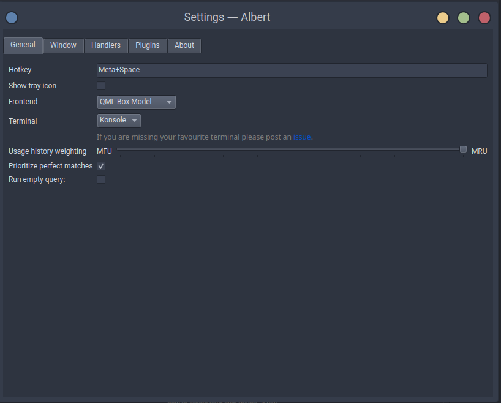
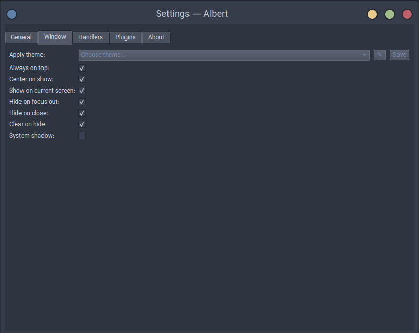
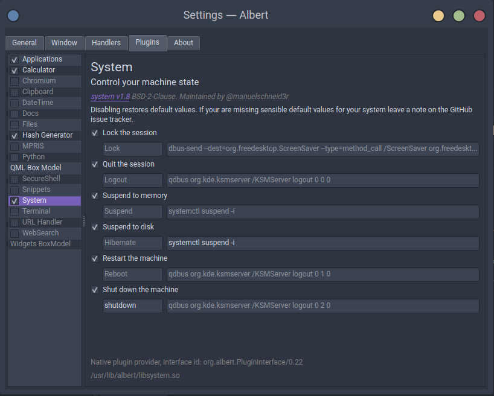
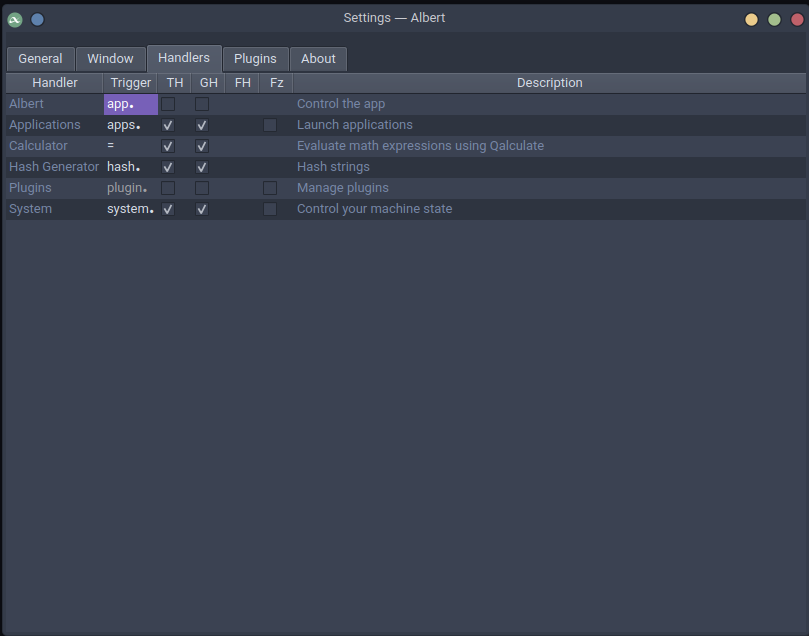

# Essential Applications Guide

In this guide, I'll walk you through the installation process of essential applications that I personally use and recommend for enhancing your daily workflow. Feel free to review and install the ones that best suit your needs. Let's dive in!

## Table of Contents

- [Essential Applications Guide](#essential-applications-guide)
	- [Table of Contents](#table-of-contents)
	- [Installing bat](#installing-bat)
	- [Installing eza](#installing-eza)
	- [Installing duf](#installing-duf)
	- [Installing gdu](#installing-gdu)
	- [Installing yt-dlp](#installing-yt-dlp)
	- [Installing python-spotdl](#installing-python-spotdl)
	- [Installing Neovim](#installing-neovim)
		- [Setting Up Neovim Configuration](#setting-up-neovim-configuration)
		- [Installing and Using `vim-plug` for Neovim](#installing-and-using-vim-plug-for-neovim)
		- [Installing Nordic Theme](#installing-nordic-theme)
	- [Installing Zsh](#installing-zsh)
		- [Installing Oh My Zsh](#installing-oh-my-zsh)
			- [Installing Zsh Plugins](#installing-zsh-plugins)
				- [zsh-autosuggestions](#zsh-autosuggestions)
				- [zsh-syntax-highlighting](#zsh-syntax-highlighting)
				- [zsh-completions](#zsh-completions)
				- [Enabling Plugins](#enabling-plugins)
		- [Custom Alias](#custom-alias)
		- [ZSH History Configuration](#zsh-history-configuration)
	- [Installing direnv](#installing-direnv)
		- [Setup](#setup)
		- [Quick demo](#quick-demo)
		- [Key Notes](#key-notes)
	- [Installing Git](#installing-git)
		- [Create SSH Key and Add it to GitHub](#create-ssh-key-and-add-it-to-github)
	- [sshuttle VPN](#sshuttle-vpn)
	- [Installing LibreOffice](#installing-libreoffice)
	- [Installing GIMP](#installing-gimp)
		- [Change Gimp's Look](#change-gimps-look)
	- [Installing VLC Media Player](#installing-vlc-media-player)
		- [Change VLC's Look](#change-vlcs-look)
	- [Installing qBittorrent](#installing-qbittorrent)
		- [Change qBittorrent's Look](#change-qbittorrents-look)
	- [Installing OBS Studio](#installing-obs-studio)
	- [Video Editor](#video-editor)
		- [Installing Kdenlive](#installing-kdenlive)
		- [Installing DaVinci Resolve](#installing-davinci-resolve)
	- [Installing Discord](#installing-discord)
	- [Installing Telegram Desktop](#installing-telegram-desktop)
	- [Installing lazygit](#installing-lazygit)
	- [Installing Docker](#installing-docker)
		- [Installing Docker Compose](#installing-docker-compose)
		- [Installing Portainer](#installing-portainer)
	- [Installing RabbitMQ](#installing-rabbitmq)
	- [Installing Databases](#installing-databases)
		- [Installing Redis](#installing-redis)
			- [Installing RedisInsight](#installing-redisinsight)
		- [Installing MongoDB](#installing-mongodb)
			- [Installing MongoDB Tools](#installing-mongodb-tools)
			- [Installing MongoDB Compass](#installing-mongodb-compass)
		- [MySQL and phpMyAdmin](#mysql-and-phpmyadmin)
		- [Installing Elasticsearch and Kibana](#installing-elasticsearch-and-kibana)
		- [installing Postgres and pgAdmin](#installing-postgres-and-pgadmin)
	- [Installing CPUFetch](#installing-cpufetch)
	- [Installing Neofetch](#installing-neofetch)
	- [Installing Google Chrome](#installing-google-chrome)
	- [Installing Visual Studio Code (VS Code)](#installing-visual-studio-code-vs-code)
		- [Recommended Plugins](#recommended-plugins)
		- [Custom JS Snippets](#custom-js-snippets)
		- [Custom TS Snippets](#custom-ts-snippets)
		- [Theme](#theme)
		- [Custom Color Schema](#custom-color-schema)
		- [Recommended Settings](#recommended-settings)
		- [VSCode Custom CSS \& JS](#vscode-custom-css--js)
			- [Steps to Enable Custom CSS \& JS in VS Code](#steps-to-enable-custom-css--js-in-vs-code)
			- [Example Files](#example-files)
		- [Custom Shortcuts](#custom-shortcuts)
	- [Installing Postman](#installing-postman)
	- [Installing Amberol Music Player](#installing-amberol-music-player)
	- [Image Viewer](#image-viewer)
		- [Installing qview (Recomended)](#installing-qview-recomended)
		- [Installing Loupe](#installing-loupe)
		- [Installing nomacs](#installing-nomacs)
	- [Installing GNOME Boxes](#installing-gnome-boxes)
	- [Installing Blanket](#installing-blanket)
	- [Installing HandBrake](#installing-handbrake)
	- [Installing Albert Application Launcher](#installing-albert-application-launcher)
		- [Albert Recommended Configs](#albert-recommended-configs)
	- [Installing Rclone \& Rclone Browser](#installing-rclone--rclone-browser)
	- [Installing AnyDesk](#installing-anydesk)
	- [Installing Droidcam](#installing-droidcam)
	- [Install Spot Player](#install-spot-player)
	- [Installing Flatpak](#installing-flatpak)
	- [Setting Up Timeshift for System Snapshots](#setting-up-timeshift-for-system-snapshots)

## Installing bat

`bat` is a modern alternative to the classic `cat` command, with syntax highlighting and Git integration. Here's how to install it on your Linux system:

1. **Update System Repositories**:

   Ensure your system's package repositories are up-to-date by running the following command in the terminal:

   ```bash
   sudo pacman -Syu
   ```

2. **Install bat**:

   You can install `bat` directly from the Arch Linux repositories using the following command:

   ```bash
   sudo pacman -S bat
   ```

3. **Verify Installation**:

   Once the installation is complete, you can verify that `bat` is installed correctly by checking its version:

   ```bash
   bat --version
   ```

## Installing eza

`eza` is a modern replacement for the traditional `ls` command, providing more features and a more visually appealing output. Here's how to install it on your system:

```bash
sudo pacman -S eza
```

Once installed, you can use `eza` just like you would use `ls`, but with additional features and options. For example, to list files and directories in the current directory, simply type:

```bash
eza
```

But if you want to improce the visually appealing you can add `--icon` option to it:

```bash
eza --icon
```

You can also make it to show directories first:

```bash
eza --icons --group-directories-first
```

`eza` provides many more options and features. You can explore them further by checking out the official documentation or by running `eza --help` in your terminal.

## Installing duf

`duf` is a modern replacement for the traditional `df` command, offering enhanced features and a more user-friendly interface for disk usage analysis. Here's how to install it on your system:

```bash
sudo pacman -S duf
```

Once installed, you can use `duf` to quickly and easily check disk usage information. For example, to display disk usage for all mounted filesystems, simply type:

```bash
duf
```

You can also specify a specific directory or filesystem to analyze. For instance, to check disk usage for the `/home` directory, use:

```bash
duf /home
```

Additionally, `duf` provides various options and flags for customizing its output. To explore these options, you can run `duf --help` in your terminal.

With `duf`, managing disk space and analyzing storage usage becomes more intuitive and efficient.

## Installing gdu

gdu (Go Disk Usage) is a command-line disk usage analyzer written in Go. It provides a fast and efficient way to visualize disk usage on your system. Here's how to install gdu:

```bash
sudo pacman -S gdu
```

## Installing yt-dlp

`yt-dlp` is a command-line program to download videos from YouTube and other video platforms. It's an enhanced version of `youtube-dl` with additional features and improvements. Here's how to install it on your system:

```bash
sudo pacman -S yt-dlp
```

Once installed, you can use `yt-dlp` to download videos by providing the video URL as an argument. For example:

```bash
yt-dlp https://www.youtube.com/watch?v=your_video_id
```

This command will download the video specified by the URL to your current directory.

`yt-dlp` offers many options and features for customizing your downloads. You can explore these options further by running `yt-dlp --help` in your terminal or by checking out the official documentation.

## Installing python-spotdl

python-spotdl is a command-line tool that allows you to download music from various streaming platforms such as Spotify. Here's how to install python-spotdl:

```bash
paru -S python-spotdl
```

## Installing Neovim

`Neovim` is a modern, extensible, and highly customizable text editor, serving as an enhanced version of Vim. It is perfect for developers and system administrators who seek efficiency and flexibility in text editing. Here's how to install it on your system:

```bash
sudo pacman -S neovim
```

After installation, you can start Neovim by typing `nvim` in your terminal.

### Setting Up Neovim Configuration

After installing Neovim, you'll want to customize it to suit your preferences. The primary configuration file for Neovim is located at `~/.config/nvim/init.vim`. Here's how to set it up with some essential configurations:

**Step 1**: Create the `init.vim` File

Create the configuration directory and file:

```bash
mkdir -p ~/.config/nvim
touch ~/.config/nvim/init.vim
```

**Step 2**: Add Custom Configurations

Open the `init.vim` file with Neovim:

```bash
nvim ~/.config/nvim/init.vim
```

Add the following configurations to the file:

```vim
" Highlight search matches
set hlsearch

" Set the width of a tab character
set tabstop=4

" Set the width of a soft tab (used for editing)
set softtabstop=4

" Set the number of spaces for auto-indent
set shiftwidth=4

" Enable automatic indentation
set autoindent

" Show line numbers
set number

" Enable file type detection, plugins, and indentation
filetype plugin indent on

" Enable syntax highlighting
syntax on

" Enable mouse support in all modes
set mouse=a

" Use the system clipboard for copy-paste
set clipboard=unnamedplus

" Highlight the line under the cursor
set cursorline
```

**Step 3**: Save and Apply

Save the changes in Neovim by typing `:wq`. The configurations will be applied the next time you open Neovim.

### Installing and Using `vim-plug` for Neovim

`vim-plug` is a lightweight and fast plugin manager for Vim and Neovim. It allows you to easily install, update, and manage plugins.

**Step 1**: Install `vim-plug`

To install `vim-plug`, run the following command:

```bash
curl -fLo ~/.local/share/nvim/site/autoload/plug.vim --create-dirs \
https://raw.githubusercontent.com/junegunn/vim-plug/master/plug.vim
```

This command downloads the `plug.vim` script and places it in the appropriate directory for Neovim.

**Step 2**: Configure `vim-plug` in `init.vim`

Open your `~/.config/nvim/init.vim` file and add the following lines to set up `vim-plug`:

```vim
" Specify the directory where plugins will be installed
call plug#begin('~/.local/share/nvim/plugged')

" Example plugins (feel free to add your own)
Plug 'preservim/nerdtree'      " File explorer
Plug 'vim-airline/vim-airline' " Status bar

" Initialize plugin system
call plug#end()
```

**Step 3**: Install Plugins

1. Save the changes to `init.vim` and restart Neovim.
2. In Neovim, enter the following command to install the specified plugins:

```vim
:PlugInstall
```

### Installing Nordic Theme

**Step 1**: Add Nord Theme to Neovim plugins in Configuration file

```vim
" Specify the directory where plugins will be installed
call plug#begin('~/.local/share/nvim/plugged')

" Add Nord theme plugin
Plug 'arcticicestudio/nord-vim'

" Initialize plugin system
call plug#end()

" Enable Nord theme
colorscheme nord
```

**Step 2**: Install Plugins

1. Save the changes to `init.vim` and restart Neovim.
2. In Neovim, enter the following command to install the specified plugins:

```vim
:PlugInstall
```

**Step 3**: Verify and Apply the Nord Theme

1. Restart Neovim after the installation completes.
2. If the theme doesn’t load automatically, you can manually set it with:

   ```vim
   :colorscheme nord
   ```

## Installing Zsh

Zsh, or Z Shell, is a powerful and highly customizable shell that can be used as an interactive login shell and as a command interpreter for shell scripting. Here's how to install Zsh on your system:

```bash
sudo pacman -S zsh
```

### Installing Oh My Zsh

Oh My Zsh is a delightful, open-source, community-driven framework for managing your Zsh configuration. It comes bundled with a vast number of helpful functions, plugins, and themes to enhance your command-line experience. Here's how to install Oh My Zsh on your system:

You can install Oh My Zsh by running the following command in your terminal:

```bash
sh -c "$(curl -fsSL https://raw.github.com/ohmyzsh/ohmyzsh/master/tools/install.sh)"
```

Alternatively, if you prefer using `wget`:

```bash
sh -c "$(wget https://raw.github.com/ohmyzsh/ohmyzsh/master/tools/install.sh -O -)"
```

During Installation process of Oh My Zsh you will be prompted to set `zsh` as your main shell choose yes.

#### Installing Zsh Plugins

[zsh-autosuggestions](https://github.com/zsh-users/zsh-autosuggestions), [zsh-syntax-highlighting](https://github.com/zsh-users/zsh-syntax-highlighting) and [zsh-completions](https://github.com/zsh-users/zsh-completions) are popular plugins for Zsh that enhance your command-line experience by providing autosuggestions as you type, syntax highlighting for commands and extending Zsh's command completion capabilities. Here's how to install them:

##### zsh-autosuggestions

1. Clone the zsh-autosuggestions repository into the Oh My Zsh plugins directory:

   ```bash
   git clone https://github.com/zsh-users/zsh-autosuggestions ~/.oh-my-zsh/custom/plugins/zsh-autosuggestions
   ```

2. Activate the plugin by adding it to the list of plugins in your `~/.zshrc` configuration file:

   ```bash
   plugins=(... zsh-autosuggestions)
   ```

##### zsh-syntax-highlighting

1. Clone the zsh-syntax-highlighting repository into the Oh My Zsh plugins directory:

   ```bash
   git clone https://github.com/zsh-users/zsh-syntax-highlighting.git ~/.oh-my-zsh/custom/plugins/zsh-syntax-highlighting
   ```

2. Activate the plugin by adding it to the list of plugins in your `~/.zshrc` configuration file:

   ```bash
   plugins=(... zsh-syntax-highlighting)
   ```

##### zsh-completions

1. Clone the zsh-completions repository into the Oh My Zsh custom plugins directory:

   ```bash
     git clone https://github.com/zsh-users/zsh-completions ${ZSH_CUSTOM:-${ZSH:-~/.oh-my-zsh}/custom}/plugins/zsh-completions
   ```

2. Add it to FPATH in your `.zshrc` by adding the following line before `source $ZSH/oh-my-zsh.sh`:

   ```bash
   fpath+=${ZSH_CUSTOM:-${ZSH:-~/.oh-my-zsh}/custom}/plugins/zsh-completions/src
   ```

   **Note:** adding it as a regular Oh My ZSH! plugin will not work properly

##### Enabling Plugins

After adding the plugins to your `~/.zshrc` file, reload the Zsh configuration:

```bash
source ~/.zshrc
```

### Custom Alias

Here's a simple guide on how to create a `~/.zprofile` file, define some alias in it, and then add it to your `~/.zshrc` file:

1. **Create `~/.zprofile` file:**

   - Open your terminal.
   - Navigate to your home directory by typing: `cd ~`.
   - Use a text editor of your choice to create the `~/.zprofile` file. For example, you can use neovim by typing: `nvim ~/.zprofile`.

2. **Define alias in `~/.zprofile`:**

   - Inside the `~/.zprofile` file, you can define aliases using the following syntax:

     ```bash
     alias alias_name='command_to_execute'
     ```

     Replace `alias_name` with the name you want to give to your alias, and `command_to_execute` with the command you want the alias to execute.

   - For example, you can add the following aliases to the `~/.zprofile`:

     - Replace `ls` command with `exa` command:

       ```bash
       alias ls='eza --icons --group-directories-first -G --no-quotes'
       alias ll='eza --icons --group-directories-first -lG --no-quotes'
       alias lt='eza --icons --group-directories-first --no-quotes -RTL'
       ```

     - Replace `cat` command with `bat` command:

       ```bash
       alias cat='bat'
       ```

     - Create a new alias for `yt-dlp` command:

       ```bash
       alias ytdl='yt-dlp'
       ```

     - Create a new alias for `spotdl` command:

       ```bash
       alias spdl='spotdl'
       ```

3. **Save and exit the `~/.zprofile` file:**

   - If you're using nvim, you can save and exit the file by pressing `Esc`, then type `:wq` and press `Enter` to confirm saving and exit.

4. **Add `~/.zprofile` to `~/.zshrc`:**

   - Open your `~/.zshrc` file in a text editor. You can do this by typing: `nvim ~/.zshrc`.
   - Add the following line at the end of the file to ensure that your `~/.zprofile` file is sourced when you start a new shell session:

     ```bash
     source ~/.zprofile
     ```

   - Save and exit the `~/.zshrc` file.

5. **Apply changes:**

   - After saving both `~/.zprofile` and `~/.zshrc` files, you can either restart your terminal or source your `~/.zshrc` file to apply the changes immediately:

     ```bash
     source ~/.zshrc
     ```

Now your alias defined in `~/.zprofile` will be available every time you start a new shell session, and it will be automatically loaded from your `~/.zshrc` file.

### ZSH History Configuration

To optimize Zsh history management, add the following configuration to your `~/.zshrc` file:

```bash
# History
HISTSIZE=5000
HISTFILE=~/.zsh_history
SAVEHIST=$HISTSIZE
HISTDUP=erase
setopt appendhistory        # Append commands to history file, not overwrite
setopt hist_ignore_space    # Ignore commands starting with a space
setopt hist_ignore_all_dups # Remove all duplicates in history
setopt hist_save_no_dups    # Avoid saving duplicate entries
setopt hist_ignore_dups     # Ignore duplicates in the current session
```

After saving the file, reload the Zsh configuration:

```bash
source ~/.zshrc
```

## Installing direnv

direnv is a shell extension that automatically loads and unloads environment variables based on your project's directory. It's particularly useful for managing environment-specific configurations in .envrc files. Here's how to install it on your system:

```bash
sudo pacman -S direnv
```

### Setup

For direnv to work properly it needs to be hooked into the shell. Once the hook is configured, restart your shell for direnv to be activated.

**ZSH :** Add the following line at the end of the ~/.zshrc file:

```bash
eval "$(direnv hook zsh
```

**Oh my zsh :** Oh my zsh has a core plugin with direnv support. Add direnv to the plugins array in your zshrc file:

```bash
plugins=(... direnv)
```

### Quick demo

```bash
# Create a new folder for demo purposes.
$ mkdir ~/my-project
$ cd ~/my-project

# Show that the FOO environment variable is not loaded.
$ echo ${FOO-nope}
nope

# Create a new .envrc. This file is bash code that is going to be loaded by
# direnv.
$ echo export FOO=foo > .envrc
.envrc is not allowed

# The security mechanism didn't allow to load the .envrc. Since we trust it,
# let's allow its execution.
$ direnv allow .
direnv: reloading
direnv: loading .envrc
direnv export: +FOO

# Show that the FOO environment variable is loaded.
$ echo ${FOO-nope}
foo

# Exit the project
$ cd ..
direnv: unloading

# And now FOO is unset again
$ echo ${FOO-nope}
nope
```

### Key Notes

1. **Applying Changes to `.envrc`**
   After updating the `.envrc` file in your directory, you must run the following command to apply the changes:

   ```bash
   direnv allow .
   ```

2. **Priority of Environment Variables**
   Environment variables defined in the `.envrc` file have higher precedence over those in the project's `.env` file. If the same variable exists in both files, the value from `.envrc` will be used. This allows you to override configurations when needed.

3. **Define alias in `~/.zprofile`:**

   - Inside the `~/.zprofile` file, you can define an alias to simplify the usage of `direnv allow .`

     ```bash
     alias dia='direnv allow .'
     ```

## Installing Git

Git is a widely-used version control system that allows you to manage and track changes to your codebase efficiently. Here's how to install Git on your Linux system:

1. **Install Git**:

   Git is available in the Arch Linux repositories. You can install it using the following command:

   ```bash
   sudo pacman -S git
   ```

2. **Verify Installation**:

   Once the installation is complete, you can verify that Git is installed correctly by checking its version:

   ```bash
   git --version
   ```

3. **Configure Git**:

   - Sets your name as the global user identity in Git.

   ```bash
   git config --global user.name "Your Name"
   ```

   - Sets your email address as the global user identity in Git.

   ```bash
   git config --global user.email "your.email@example.com"
   ```

   - Configures line endings to be converted to LF on input.

   ```bash
   git config --global core.autocrlf "input"
   ```

   - Configures Git to use 'bat' command as the default pager for displaying output.

   ```bash
   git config --global core.pager "bat"
   ```

   - Sets the default branch name to 'main' when initializing new repositories.

   ```bash
   git config --global init.defaultBranch "main"
   ```

   - Configures Git to always create a merge commit when merging, even if the merge could be resolved with a fast-forward.

   ```bash
   git config --global merg.ff "--no-ff"
   ```

   - Configures Git to perform a merge when pulling changes instead of rebasing.

   ```bash
   git config --global pull.rebase "false"
   ```

   - Sets Visual Studio Code as the default text editor for Git, allowing you to edit commit messages and other text files within Git using VS Code. The `--wait` flag ensures that Git waits for the editor to close before proceeding.

   ```bash
   git config --global core.editor "code --wait"
   ```

### Create SSH Key and Add it to GitHub

This step has been excerpted from the [GitHub documentation](https://docs.github.com/en/authentication/connecting-to-github-with-ssh/generating-a-new-ssh-key-and-adding-it-to-the-ssh-agent). For a more comprehensive guide, please refer to the documentation provided.

1. Generating a new SSH key:

   ```bash
   ssh-keygen -t ed25519 -C "your_email@example.com"
   ```

   Note: If you are using a legacy system that doesn't support the Ed25519 algorithm, use:

   ```bash
    ssh-keygen -t rsa -b 4096 -C "your_email@example.com"
   ```

   This creates a new SSH key, using the provided email as a label.

2. Adding your SSH key to the ssh-agent:

   1. Start the ssh-agent in the background:

      ```bash
      eval "$(ssh-agent -s)"
      # output Ex. => Agent pid 59566
      ```

   2. Add your SSH private key to the ssh-agent:

      ```bash
      ssh-add ~/.ssh/id_ed25519
      ```

3. Use the `cat` command to display your public key:

```bash
cat path/to/ssh/public/key
```

After copying it, navigate to your GitHub account settings and add the new SSH key to your account.

## sshuttle VPN

If you're looking to establish a VPN connection using an SSH tunnel, sshuttle is a handy tool for the job. Alternatively, you can configure an OpenVPN connection using your system's network manager.

```bash
sudo pacman -S openssh
```

Installs the OpenSSH package, which is required for SSH tunneling.

```bash
sudo pacman -S sshuttle
```

Installs sshuttle, a tool for creating VPN connections through SSH tunnels.

```bash
sshuttle --dns -vr <user>@<server_ip>:<server ssh port> 0/0
```

Establishes an SSH tunnel VPN connection to the specified server, redirecting all traffic through it while maintaining DNS resolution. Replace `<user>`, `<server_ip>`, and `<server ssh port>` with your server's credentials.

## Installing LibreOffice

LibreOffice is a stable version of the popular open-source office suite. Follow these steps to install it on your system:

```bash
sudo pacman -S libreoffice-still
```

This command installs the LibreOffice-Still package from the official Arch Linux repositories. Once installed, you can launch LibreOffice-Still from your system's application menu.

## Installing GIMP

GIMP (GNU Image Manipulation Program) is a powerful open-source image editing software. Follow these steps to install it on your system:

```bash
sudo pacman -S gimp
```

This command installs the GIMP package from the official Arch Linux repositories. Once installed, you can launch GIMP from your system's application menu.

### Change Gimp's Look

By following the instructions outlined in the [Diolinux/PhotoGIMP](https://github.com/Diolinux/PhotoGIMP) GitHub repository, you can customize the appearance of GIMP to closely resemble that of Photoshop.

## Installing VLC Media Player

VLC Media Player is a versatile multimedia player that supports various audio and video formats, as well as streaming protocols. Here's how to install VLC on your Linux system:

```bash
sudo pacman -S vlc
```

This command installs the vlc package from the official Arch Linux repositories. Once installed, you can launch vlc from your system's application menu.

### Change VLC's Look

You have the option to either update the VLC interface according to your preferences or download and apply a preset configuration such as ones bellow:

[Hind VLC Skin](https://www.pling.com/p/1647074)

[VeLoCity-Skin-for-VLC](https://github.com/dmtiir/VeLoCity-Skin-for-VLC)

## Installing qBittorrent

qBittorrent is a popular open-source BitTorrent client. Follow these steps to install it on your system:

```bash
sudo pacman -S qbittorrent
```

This command installs the qBittorrent package from the official Arch Linux repositories. Once installed, you can launch qBittorrent from your system's application menu.

### Change qBittorrent's Look

You have the option to either update the interface according to your preferences or download and apply a [preset](https://draculatheme.com/qbittorrent) configuration.

## Installing OBS Studio

OBS Studio is a powerful and feature-rich software for video recording and live streaming. Here's how to install it on your system:

```bash
sudo pacman -S obs-studio
```

This command installs the OBS Studio package from the official Arch Linux repositories. Once installed, you can launch OBS Studio from your system's application menu and start recording or streaming your content.

## Video Editor

### Installing Kdenlive

Kdenlive is a popular open-source video editing software that provides a comprehensive set of features for editing videos. Here's how to install it on your system:

```bash
sudo pacman -S kdenlive
```

### Installing DaVinci Resolve

DaVinci Resolve is a professional video editing software with advanced features for color correction, visual effects, and audio post-production. Here's how to install DaVinci Resolve on Arch Linux:

```bash
paru -S davinci-resolve
```

This command installs the Kdenlive package from the official Arch Linux repositories. Once installed, you can launch Kdenlive from your system's application menu and start editing your videos with its intuitive interface and powerful editing tools.

## Installing Discord

Discord is a popular communication platform that offers text, voice, and video chat services. Here's how to install Discord on your system:

```bash
sudo pacman -S discord
```

This command installs the discord package from the official Arch Linux repositories. Once installed, you can follow the on-screen instructions to set up Discord and customize your profile. Once set up, you can join servers, chat with friends, and participate in voice and video calls using Discord.

## Installing Telegram Desktop

Telegram Desktop is a popular messaging application that allows you to securely communicate with others via text, voice, and video calls. Here's how to install it on your system:

```bash
sudo pacman -S telegram-desktop
```

This command installs the Telegram Desktop package from the official Arch Linux repositories. Once installed, you can launch Telegram Desktop from your system's application menu and start using it to connect with your contacts and groups on the Telegram platform.

## Installing lazygit

`lazygit` is a simple terminal-based UI for Git commands, designed to make the process of interacting with Git repositories more intuitive and efficient. Here's how to install it on your system:

```bash
sudo pacman -S lazygit
```

Once installed, you can launch `lazygit` by simply typing `lazygit` in your terminal. This will open up the terminal UI where you can navigate through your Git repositories, view changes, stage files, commit changes, and perform other Git operations with ease.

`lazygit` offers a variety of keyboard shortcuts and features to streamline your Git workflow. You can explore these features further within the `lazygit` interface or by referring to the official documentation.

## Installing Docker

Docker is a platform for developing, shipping, and running applications inside containers. Follow these steps to install Docker on your system:

**Step 1 - Install Required Packages**:

```bash
sudo pacman -S docker
```

This command installs the Docker package, which includes the Docker daemon and command-line tools.

**Step 2 - Enable and Start Docker Service**:

```bash
sudo systemctl enable docker.service
sudo systemctl start docker.service
```

Enabling and starting the Docker service ensures that Docker starts automatically upon system boot and is currently running.

**Step 3 - Verify Docker Installation**:

```bash
sudo docker --version
```

This command verifies that Docker has been successfully installed on your system by displaying the installed Docker version.

**Step 4 - Manage Docker Without Sudo (Optional)**:

To avoid using `sudo` every time you run a Docker command, you can add your user to the `docker` group:

```bash
sudo usermod -aG docker $USER
newgrp docker
```

**Step 5 - Verify Docker Installation (Non-sudo)**:

```bash
docker --version
```

After adding your user to the `docker` group, you can verify the Docker installation again without using `sudo`.

**Step 6 - Test Docker Installation**:

You can verify that Docker is working correctly by running a simple test container:

```bash
docker run hello-world
```

This command downloads a test image, creates a container from it, and runs it. If everything is set up correctly, you should see a message indicating that Docker is running and configured correctly.

### Installing Docker Compose

Docker Compose is a tool for defining and running multi-container Docker applications. It uses YAML files to configure the application's services and dependencies. Follow these steps to install Docker Compose on your system:

**Step 1 - Download Docker Compose Binary**:

```bash
sudo pacman -S docker-compose
```

This command installs the Docker Compose package from the official package repositories.

**Step 2 - Verify Docker Compose Installation**:

```bash
docker-compose --version
```

This command verifies that Docker Compose has been successfully installed on your system by displaying the installed version.

### Installing Portainer

Portainer is a user-friendly container management platform designed to simplify the deployment, management, and monitoring of containerized applications. It provides an intuitive web-based interface, making it easier to work with Docker, Kubernetes, and other container orchestration systems.

**Pull and Run Portainer**:

```shell
docker run -d \
    -p 8000:8000 \
    -p 9443:9443 \
    --name portainer \
    --restart=always \
    -v /var/run/docker.sock:/var/run/docker.sock \
    -v portainer_data:/data \
    portainer/portainer-ce
```

## Installing RabbitMQ

RabbitMQ is available in the Arch Repositories (Official/AUR). However, I personally prefer using Docker to install and run the package.

```shell
docker run -d \
    -it --rm --name rabbitmq \
    -p 5672:5672 \
    -p 15672:15672 \
    rabbitmq:4.0-management

# User/Pass => guest/guest
```

## Installing Databases

### Installing Redis

Redis is an open-source, in-memory data structure store used as a database, cache, and message broker. Here's how to install it on your system:

```bash
sudo pacman -S redis
```

This command installs the Redis package from the official Arch Linux repositories. Once installed, you can start and enable the Redis service using the following commands:

```bash
sudo systemctl start redis
sudo systemctl enable redis
```

You can also configure Redis by editing its configuration file located at `/etc/redis.conf`. After making any changes, remember to restart the Redis service for the changes to take effect:

```bash
sudo systemctl restart redis
```

Redis is now installed and ready to use on your system. You can interact with Redis using its command-line interface `redis-cli` or by integrating it into your applications.

#### Installing RedisInsight

RedisInsight is a graphical user interface (GUI) for managing Redis databases. It provides a user-friendly interface to interact with your Redis instances. Here's how you can install RedisInsight:

```bash
paru -S redisinsight-bin
```

### Installing MongoDB

MongoDB-bin is the binary distribution of MongoDB, a popular NoSQL database management system. Here's how to install MongoDB-bin on your system:

1. **Install MongoDB-bin Package**:

   Open your terminal and use the following pacman command to install the MongoDB-bin package:

   ```bash
   paru -S mongodb-bin
   ```

2. **Start MongoDB Service**:

   After the installation is complete, start the MongoDB service using the following systemctl command:

   ```bash
   sudo systemctl start mongodb
   ```

3. **Enable MongoDB Service**:

   If you want MongoDB to start automatically at boot, enable the MongoDB service using the systemctl enable command:

   ```bash
   sudo systemctl enable mongodb
   ```

4. **Verify Installation**:

   To verify that MongoDB is running, you can check its status using the systemctl status command:

   ```bash
   sudo systemctl status mongodb
   ```

#### Installing MongoDB Tools

MongoDB Tools is a set of command-line utilities for working with MongoDB instances. Here's how to install MongoDB Tools on your Arch Linux system:

1. **Install MongoDB Tools Package**:

   Open your terminal and use the following paru command to install the MongoDB Tools package:

   ```bash
   paru -S mongodb-tools
   ```

2. **Verify Installation**:

   To verify that MongoDB Tools is installed correctly, you can check the version of the installed tools using the following command:

   ```bash
   mongodump --version
   ```

   This command should display the version information for mongodump, indicating that MongoDB Tools is installed.

3. **Explore MongoDB Tools**:

   MongoDB Tools includes various utilities such as mongodump, mongorestore, mongoexport, mongoimport, and mongotop. You can explore these tools and their usage by running them in your terminal with the --help option:

   ```bash
   mongodump --help
   mongorestore --help
   mongoexport --help
   mongoimport --help
   mongotop --help
   ```

   This will display usage information for each tool, allowing you to understand their functionality and options.

#### Installing MongoDB Compass

MongoDB Compass is a graphical user interface (GUI) for MongoDB. It allows you to visually explore your data, run ad hoc queries, and interact with your MongoDB databases. Here's how to install MongoDB Compass on your Linux system using the AUR (Arch User Repository):

```bash
paru -S mongodb-compass
```

### MySQL and phpMyAdmin

MySQL and phpMyAdmin are available in the Arch Repositories (Official/AUR). However, I personally prefer using Docker to install and run these packages.

**Step 1 - Create a Network Called "asgard"**:

```shell
docker network create asgard
```

**Step 2 - Create mySQL Data Volume direction**:

```shell
sudo mkdir -p /opt/mysql
sudo chown <username>:wheel /opt/mysql
```

**Step 3 - Pull and Run MySQL**:

```shell
docker run -d \
    --name asgard-mysql \
    --network asgard \
    -e MYSQL_ROOT_PASSWORD="root" \
    -v /opt/mysql:/var/lib/mysql \
    -p 3306:3306 \
    mysql
```

Keep in mind that this container needs to be started manually each time you restart your system. To have it start automatically, you can add the `--restart unless-stopped \` option when running the container. This ensures it starts automatically after a system reboot.

**Step 4 -Pull and Run phpMyAdmin**:

```shell
docker run -d \
    --name asgard-phpmyadmin \
    --network asgard \
    -e PMA_HOST=asgard-mysql \
    -p 8080:80 \
    phpmyadmin/phpmyadmin

# PMA_HOST is the IP or domain of the MySQL server,
# so we can use the MySQL container name as the domain
# cause the Docker network create the route as a DNS server.
```

Keep in mind that this container needs to be started manually each time you restart your system. To have it start automatically, you can add the `--restart unless-stopped \` option when running the container. This ensures it starts automatically after a system reboot.

### Installing Elasticsearch and Kibana

Elasticsearch and Kibana are available in the Arch Repositories (Official/AUR). However, I personally prefer using Docker to install and run these packages.

**Step 1 - Create a Network Called "elastic"**:

```shell
docker network create elastic
```

**Step 2 - Pull Elasticsearch Docker Image**:

```shell
docker pull docker.elastic.co/elasticsearch/elasticsearch:8.16.0 # Current latest
```

**Step 3 - Increase System's `vm.max_map_count` (required in linux and mac)**:

```shell
sudo sysctl -w vm.max_map_count=262144
```

**Step 4 - Run Elasticsearch**:

```shell
docker run -d \
    --name es01 \
    --net elastic \
    -p 9200:9200 \
    -it -m 1GB \
    docker.elastic.co/elasticsearch/elasticsearch:8.16.0
```

Keep in mind that this container needs to be started manually each time you restart your system. To have it start automatically, you can add the `--restart unless-stopped \` option when running the container. This ensures it starts automatically after a system reboot.

**Step 5 - Pull Kibana Docker Image**:

```shell
docker pull docker.elastic.co/kibana/kibana:8.16.0 # Current latest
```

**Step 6 - Run Kibana**:

```shell
docker run -d \
    --name kib01 \
    --net elastic \
    -p 5601:5601 \
    docker.elastic.co/kibana/kibana:8.16.0
```

Keep in mind that this container needs to be started manually each time you restart your system. To have it start automatically, you can add the `--restart unless-stopped \` option when running the container. This ensures it starts automatically after a system reboot.

### installing Postgres and pgAdmin

Postgres and pgAdmin are available in the Arch Repositories (Official/AUR). However, I personally prefer using Docker to install and run these packages.

**Step 1 - Pull and Run Postgres**:

```shell
docker run -d \
  --name postgres_container \
  -e POSTGRES_USER=postgres \
  -e POSTGRES_PASSWORD=root \
  -p 5432:5432 \
  postgres
```

Keep in mind that this container needs to be started manually each time you restart your system. To have it start automatically, you can add the `--restart unless-stopped \` option when running the container. This ensures it starts automatically after a system reboot.

**Step 2 - Pull and Run PgAdmin**:

```shell
docker run -d \
  --name pgadmin_container \
  -e PGADMIN_DEFAULT_EMAIL=admin@example.com \
  -e PGADMIN_DEFAULT_PASSWORD=admin \
  -p 8081:80 \
  --link postgres_container:postgres \
  dpage/pgadmin4
```

Keep in mind that this container needs to be started manually each time you restart your system. To have it start automatically, you can add the `--restart unless-stopped \` option when running the container. This ensures it starts automatically after a system reboot.

## Installing CPUFetch

CPUFetch is a simple yet effective command-line tool that displays detailed information about your CPU. It provides a quick overview of your CPU's architecture, model, and various other details. Here's how you can install CPUFetch on your system:

```bash
paru -S cpufetch
```

## Installing Neofetch

Neofetch is a command-line tool that displays system information in a visually appealing way. It shows details such as your operating system, kernel version, CPU, GPU, memory usage, and more. Here's how to install Neofetch on your system:

```bash
sudo pacman -S neofetch
```

## Installing Google Chrome

Google Chrome is a popular web browser developed by Google. You can install Google Chrome on Arch Linux using the Arch User Repository (AUR). Here's how:

```bash
paru -S google-chrome
```

## Installing Visual Studio Code (VS Code)

Visual Studio Code is a popular source-code editor developed by Microsoft. The `visual-studio-code-bin` package available on the Arch User Repository (AUR). Here's how to do it:

```bash
paru -S visual-studio-code-bin
```

**Note**: After installing VSCode on Gnome, your system's default file manager may change to VSCode. To revert the default file manager back to Nautilus, run the following command:

```bash
xdg-mime default org.gnome.Nautilus.desktop inode/directory
```

### Recommended Plugins

| Plugin Name       | Plugin Name                    | Plugin Name                  | Plugin Name                | Plugin Name          | Plugin Name                     |
| ----------------- | ------------------------------ | ---------------------------- | -------------------------- | -------------------- | ------------------------------- |
| advanced-new-file | Atom Material Icons            | Auto Rename Tag              | Auto-Open Markdown Preview | Bash Beautify        | Bash IDE                        |
| better comments   | Code Spell Checker             | CodeSnap                     | Custom CSS and JS Loader   | EJS language support | Error Lens                      |
| ESLint            | Explorer Exclude               | Git Graph                    | Git lens                   | GraphQL              | HTML CSS Support                |
| Ignore files      | JavaScript (ES6) code snippets | lazygit                      | Live Server                | Markdown All in One  | Markdown Preview Github Styling |
| Markdown Table    | Import Cost                    | Markdown Table Prettifier    | Markdownlint               | Nested Comments      | node-snippets                   |
| Nord Theme        | Overtype                       | Persian - Code Spell Checker | Prettier                   | Prettify Json        | Pretty TypeScript Errors        |
| Rainbow Brackets  | Select Line Status Bar         | Todo Tree                    | Toggle Quotes              | vscode-proto3        |                                 |

### Custom JS Snippets

```json
{
	"node class method": {
		"prefix": "ncm",
		"body": [
			"/**",
			"* $1",
			"* @param {Object} req express request",
			"* @param {Object} res express response",
			"* @param {function} next express next function",
			"* @returns {Promise<void>}",
			"*/",
			"async $2(req, res, next) {",
			"\ttry {",
			"\t\t$3",
			"\t} catch (err) {",
			"\t\tnext(err);",
			"\t}",
			"}"
		],
		"description": "Node.js Controller Method"
	}
}
```

```json
{
	"simple try/catch block": {
		"prefix": "tc",
		"body": ["try {", "\t$2", "} catch (err) {", "\t$1", "}"],
		"description": "Simple try/catch block"
	}
}
```

```json
{
	"simple try/catch/log block": {
		"prefix": "tcl",
		"body": ["try {", "\t$1", "} catch (err) {", "\tconsole.error(err);", "}"],
		"description": "Simple try/catch/log block"
	}
}
```

```json
{
	"node try/catch/next block": {
		"prefix": "tcn",
		"body": ["try {", "\t$1", "} catch (err) {", "\tnext(err);", "}"],
		"description": "Node try/catch/next block"
	}
}
```

```json
{
	"async function": {
		"prefix": "asf",
		"body": ["async function $1($2) {", "\t$3", "}"],
		"description": "Async function"
	}
}
```

```json
{
	"test describe block": {
		"prefix": "desc",
		"body": ["/** $1 */", "describe('$2', function () {", "\t$3", "});"],
		"description": "Inserts describe() block"
	}
}
```

```json
{
	"test it block": {
		"prefix": "it",
		"body": [
			"/**",
			"* $1",
			"*/",
			"it('$2', async function () {",
			"\t$3",
			"});"
		],
		"description": "Inserts it() block"
	}
}
```

```json
{
	"node class controller": {
		"prefix": "nodeclass",
		"body": [
			"/** import main controller */",
			"const Controller = require(\"$1\");",
			"/** import http status codes module */",
			"const httpStatus = require(\"http-status-codes\");\n",
			"/**",
			"* @class $2",
			"*/",
			"class $2 extends Controller {",
			"\t$3",
			"}\n",
			"module.exports = {",
			"\t$2: new $2()",
			"}"
		],
		"description": "node js node js controller class"
	}
}
```

```json
{
	"express router": {
		"prefix": "erouter",
		"body": [
			"/** import express module */",
			"const express = require('express');",
			"/** create express Router instance */",
			"const $1 = express.Router();\n",
			"$2\n",
			"/** export router */",
			"module.exports = {",
			"\t$1",
			"}"
		],
		"description": "generat express router"
	},
```

```json
	"custom module require":{
		"prefix": "rec",
		"body": [
			"const { $2 } = require(\"$1\");"
		],
		"description": "custom module require"
	}
```

```json
{
	"multi line comment": {
		"prefix": "mcom",
		"body": ["/**", " * $1", " */"],
		"description": "create multi-line comment"
	},
	"single line comment": {
		"prefix": "scom",
		"body": ["/** $1 */"],
		"description": "create single-line comment"
	},
	"single line comment with brake": {
		"prefix": "scome",
		"body": ["/** $1 */\n"],
		"description": "create single-line comment with brake"
	}
}
```

### Custom TS Snippets

```json
"node class method": {
	"prefix": "tncm",
	"body": [
		"/**",
		"* $1",
		"* @param {Request} req express request",
		"* @param {Response} res express response",
		"* @param {NextFunction} next express next function",
		"* @returns {Promise<void>}",
		"*/",
		"async $2(req: Request, res: Response, next: NextFunction) {",
		"\ttry {",
		"\t\t$3",
		"\t} catch (err) {",
		"\t\tnext(err);",
		"\t}",
		"}"
	],
	"description": "Node.js Controller Method"
}
```

```json
"simple try/catch block": {
	"prefix": "ttc",
	"body": [
		"try {",
		"\t$2",
		"} catch (err) {",
		"\t$1",
		"}",
	],
	"description": "Simple try/catch block"
}
```

```json
"simple try/catch/log block": {
	"prefix": "ttcl",
	"body": [
		"try {",
		"\t$1",
		"} catch (err) {",
		"\tconsole.error(err);",
		"}",
	],
	"description": "Simple try/catch/log block"
}
```

```json
"try/catch/next block": {
	"prefix": "ttcn",
	"body": [
		"try {",
		"\t$1",
		"} catch (err) {",
		"\tnext(err);",
		"}",
	],
	"description": "try/catch/next block"
}
```

```json
"multi line comment": {
	"prefix": "mcom",
	"body": [
		"/**",
		" * $1",
		" */",
	],
	"description": "create multi-line comment"
}
```

```json
"single line comment": {
	"prefix": "scom",
	"body": [
		"/** $1 */",
	],
	"description": "create single-line comment"
}
```

```json
"single line comment with brake": {
	"prefix": "scome",
	"body": [
		"/** $1 */\n",
	],
	"description": "create single-line comment with brake"
}
```

### Theme

- Nord Theme

### Custom Color Schema

You can find the usage of this color scheme in [VSCode Recommended Settings section](#recommended-settings)

```json
"editor.tokenColorCustomizations": {
		"textMateRules": [
			{
				"name": "string color",
				"scope": ["string"],
				"settings": {
					"foreground": "#fdee00" // change this COLOR
				}
			},
			{
				"name": "variable color",
				"scope": ["variable"],
				"settings": {
					"foreground": "#ffffee" // change this COLOR
				}
			},
			{
				"name": "parameter color",
				"scope": ["variable.parameter"],
				"settings": {
					"foreground": "#ffd390" // change this COLOR
				}
			},
			{
				"name": "number color in env files",
				"scope": ["source.ini"],
				"settings": {
					"foreground": "#76fd00" // your desired color
				}
			}
		]
	},
```

### Recommended Settings

```json
{
	/**** START: General ***********/
	"RainbowBrackets.depreciation-notice": false,
	"security.workspace.trust.untrustedFiles": "open",
	"errorLens.enabledDiagnosticLevels": ["error", "warning"],
	"explorer.compactFolders": false,
	// "explorer.autoReveal": false,
	"todo-tree.highlights.enabled": false,
	/*********** END: General ****/

	/**** START: Files ***********/
	"files.autoSave": "afterDelay",
	"files.trimTrailingWhitespace": true,
	"files.insertFinalNewline": true,
	"files.trimFinalNewlines": true,
	/*********** END: Files ****/

	/**** START: Zen Mode ***********/
	"zenMode.centerLayout": false,
	"zenMode.hideLineNumbers": false,
	/*********** END: Zen Mode ****/

	/**** START: Window ***********/
	"window.titleBarStyle": "custom",
	"window.menuBarVisibility": "toggle",
	"window.newWindowDimensions": "inherit",
	/*********** END: Window ****/

	/**** START: Workbench ***********/
	"workbench.iconTheme": "a-file-icon-vscode",
	"workbench.layoutControl.enabled": false,
	"workbench.productIconTheme": "a-file-icon-vscode-product-icon-theme",
	// "workbench.editor.enablePreview": false,
	"workbench.colorCustomizations": {
		"[Material Theme Ocean]": {}
	},
	"workbench.colorTheme": "Nord",
	"workbench.navigationControl.enabled": false,
	"workbench.tips.enabled": false,
	"workbench.startupEditor": "none",
	/*********** END: Workbench ****/

	/**** START: Git & Git lense***********/
	"git.autofetch": true,
	"gitlens.graph.layout": "editor",
	/*********** END: Git & Git lense****/

	/**** START: Editor ***********/
	"editor.fontLigatures": true,
	"editor.mouseWheelZoom": true,
	"editor.formatOnType": true,
	"editor.formatOnPaste": true,
	"editor.insertSpaces": false,
	"editor.linkedEditing": true,
	"editor.copyWithSyntaxHighlighting": false,
	"editor.detectIndentation": false,
	"editor.lineHeight": 2,
	"editor.tabSize": 4,
	"editor.fontFamily": "'Fira Code', monospace",
	"editor.indentSize": "tabSize",
	"editor.wordBasedSuggestions": "matchingDocuments",
	"editor.cursorSmoothCaretAnimation": "on",
	"editor.lightbulb.enabled": "off",
	"editor.renderLineHighlight": "all",
	"editor.tokenColorCustomizations": {
		"textMateRules": [
			{
				"name": "string color",
				"scope": ["string"],
				"settings": {
					"foreground": "#fdee00" // your desired color
				}
			},
			{
				"name": "variable color",
				"scope": ["variable"],
				"settings": {
					"foreground": "#ffffee" // your desired color
				}
			},
			{
				"name": "parameter color",
				"scope": ["variable.parameter"],
				"settings": {
					"foreground": "#ffd390" // your desired color
				}
			},
			{
				"name": "number color in env files",
				"scope": ["source.ini"],
				"settings": {
					"foreground": "#76fd00" // your desired color
				}
			}
		]
	},
	/*********** END: Editor ****/

	/**** START: Terminal ***********/
	"terminal.integrated.env.linux": {},
	"terminal.integrated.fontFamily": "JetBrainsMono Nerd Font",
	/*********** END: Terminal ****/

	/**** START: Prettier ***********/
	"prettier.useTabs": true,
	"prettier.endOfLine": "auto",
	/*********** END: Prettier ****/

	/**** START: cSpell ***********/
	"cSpell.userWords": ["fastify"],
	"cSpell.language": "en,fa",
	/*********** END: cSpell ****/

	/**** START: Selected line ***********/
	"selectline.alignment": "right",
	/*********** END: Selected line ****/

	/**** START: Formatter ***********/
	"editor.defaultFormatter": "esbenp.prettier-vscode",
	"[javascript]": {
		"editor.defaultFormatter": "esbenp.prettier-vscode"
	},
	"[proto3]": {
		"editor.defaultFormatter": "zxh404.vscode-proto3"
	},
	"[shellscript]": {
		"editor.defaultFormatter": "shakram02.bash-beautify"
	},
	/*********** END: Formatter ****/

	/**** START: Other ***********/
	"diffEditor.renderSideBySide": false,
	"chat.commandCenter.enabled": false,
	"extensions.ignoreRecommendations": true,
	"breadcrumbs.enabled": false
	/*********** END: Other ****/
}
```

### VSCode Custom CSS & JS

This section is inspired by [Glenn Raya](https://www.youtube.com/@glennraya)'s video, [Transforming VS Code: Beyond Themes](https://www.youtube.com/watch?v=9_I0bySQoCs).

We will use the `Custom CSS and JS Loader` extension to customize the appearance of VS Code by applying custom CSS and JavaScript. This process involves creating configuration files, enabling the custom loader, and resolving any permission issues, particularly on Linux systems like Arch Linux.

#### Steps to Enable Custom CSS & JS in VS Code

1. **Install the Extension**
   Ensure you have installed the `Custom CSS and JS Loader` extension in your VS Code.

2. **Create Configuration Files**
   Create the following files in your filesystem:
   - **Custom CSS:** `/home/<user>/.overhaul/vscode/custom-vscode.css`
   - **Custom JS:** `/home/<user>/.overhaul/vscode/vscode-script.js`

3. **Update Settings**
   Add the following snippet to your `settings.json` to link these files:

   ```json
   "vscode_custom_css.imports": [
       "file:///home/<user>/.overhaul/vscode/custom-vscode.css",
       "file:///home/<user>/.overhaul/vscode/vscode-script.js"
   ]
   ```

4. **Enable Custom CSS & JS**
   Open the VS Code Command Palette (`Ctrl+Shift+P`), search for `Enable Custom CSS and JS`, and run it. This step allows VS Code to load your custom scripts and styles.

5. **Resolve Permission Issues on Linux**
   On Linux systems, VS Code's permissions may block this functionality. To fix this, modify the permissions using the following commands:

   ```shell
   sudo chown -R $(whoami) "$(which code)"
   sudo chown -R $(whoami) /opt/visual-studio-code
   ```

   If you use a different distribution or OS, refer to the plugin's documentation for the correct paths or commands.

6. **Reload Changes**
   After making changes to your CSS or JS files, reload them by running the `Reload Custom CSS and JS` command from the Command Palette.

#### Example Files

Here are example files inspired by Glenn Raya's video:

- **CSS File**
  Modifies visual aspects such as the sidebar title, tooltips, and Command Palette.
  [Download CSS File](./files/vscode/custom-vscode.css)

- **JS File**
  Adds a blur effect to the application window when the Command Palette is open.
  [Download JS File](./files/vscode/vscode-script.js)

By following these steps, you can transform VS Code's appearance beyond standard themes, giving it a unique and personalized look.

### Custom Shortcuts

```json
// Place your key bindings in this file to override the defaultsauto[]
[
	//? ***** START: Copy line *****
	{
		//* Remove old keybinding for copy lines down
		"key": "ctrl+shift+alt+down",
		"command": "-editor.action.copyLinesDownAction",
		"when": "editorTextFocus && !editorReadonly"
	},
	{
		//* Set new keybinding for copy lines down
		"key": "ctrl+d",
		"command": "editor.action.copyLinesDownAction",
		"when": "editorTextFocus && !editorReadonly"
	},

	{
		//* Remove keybinding for ctrl + d old functionality
		"key": "ctrl+d",
		"command": "-editor.action.addSelectionToNextFindMatch",
		"when": "editorFocus"
	},
	{
		//* Set a new key binding for ctrl + d old functionality
		"key": "alt+d",
		"command": "editor.action.addSelectionToNextFindMatch",
		"when": "editorFocus"
	},

	//? ***** START: Delete line *****
	{
		//* Remove old keybinding for delete lines
		"key": "ctrl+shift+k",
		"command": "-editor.action.deleteLines",
		"when": "textInputFocus && !editorReadonly"
	},
	{
		//* Set new keybinding for delete lines
		"key": "ctrl+y",
		"command": "editor.action.deleteLines",
		"when": "textInputFocus && !editorReadonly"
	},

	{
		//* Remove keybinding for ctrl+y old functionality
		"key": "ctrl+y",
		"command": "-redo"
	},

	//? ***** START: Comments management *****
	{
		//* Remove old keybinding for nested comments
		"key": "ctrl+alt+/",
		"command": "-extension.nestComments",
		"when": "editorHasSelection && editorTextFocus"
	},
	{
		//* Set new keybinding for nested comments
		"key": "ctrl+shift+/",
		"command": "extension.nestComments",
		"when": "editorHasSelection && editorTextFocus"
	},

	{
		//* Remove old keybinding for block comments
		"key": "ctrl+shift+a",
		"command": "-editor.action.blockComment",
		"when": "editorTextFocus && !editorReadonly"
	},
	{
		//* Set new keybinding for block comments
		"key": "ctrl+alt+/",
		"command": "editor.action.blockComment",
		"when": "editorTextFocus && !editorReadonly"
	},

	//? ***** START: Fold/Unfold code block *****
	{
		//* Remove old keybinding for fold all blocks
		"key": "ctrl+k ctrl+0",
		"command": "-editor.foldAll",
		"when": "editorTextFocus && foldingEnabled"
	},
	{
		//* Set new keybinding for fold all blocks
		"key": "ctrl+shift+numpad_subtract",
		"command": "editor.foldAll",
		"when": "editorTextFocus && foldingEnabled"
	},

	{
		//* Remove old keybinding for unfold all blocks
		"key": "ctrl+k ctrl+j",
		"command": "-editor.unfoldAll",
		"when": "editorTextFocus && foldingEnabled"
	},
	{
		//* Set new keybinding for unfold all blocks
		"key": "ctrl+shift+numpad_add",
		"command": "editor.unfoldAll",
		"when": "editorTextFocus && foldingEnabled"
	},

	//? ***** START: Terminal *****
	{
		//* Remove old keybinding for toggle terminal
		"key": "ctrl+`",
		"command": "-workbench.action.terminal.toggleTerminal",
		"when": "terminal.active"
	},
	{
		//* Set new keybinding for toggle terminal
		"key": "ctrl+alt+`",
		"command": "workbench.action.terminal.toggleTerminal",
		"when": "terminal.active"
	},

	//? ***** START: Folder management *****
	{
		//* Remove old keybinding for close folder
		"key": "ctrl+k f",
		"command": "-workbench.action.closeFolder",
		"when": "emptyWorkspaceSupport && workbenchState != 'empty'"
	},
	{
		//* Set new keybinding for close folder
		"key": "ctrl+meta+w",
		"command": "workbench.action.closeFolder",
		"when": "emptyWorkspaceSupport && workbenchState != 'empty'"
	},

	//? ***** START: Git management *****
	{
		//* Set new keybinding for git graph view
		"key": "ctrl+alt+g",
		"command": "git-graph.view"
	},

	{
		"key": "ctrl+alt+x",
		"command": "gitlens.showGraphPage"
	},

	{
		//* Remove old keybinding for open lazy git
		"key": "ctrl+g g",
		"command": "-lazygit.openLazygit"
	},
	{
		//* Set new keybinding for open lazy git
		"key": "ctrl+g ctrl+g",
		"command": "lazygit.openLazygit"
	},

	//? ***** START: prettier selected format *****
	{
		//* Remove old keybinding for formatting selection
		"key": "ctrl+k ctrl+f",
		"command": "-editor.action.formatSelection",
		"when": "editorHasDocumentSelectionFormattingProvider && editorTextFocus && !editorReadonly"
	},
	{
		//* Set new keybinding for formatting selection
		"key": "ctrl+alt+f",
		"command": "editor.action.formatSelection",
		"when": "editorHasDocumentSelectionFormattingProvider && editorTextFocus && !editorReadonly"
	},

	//? ***** START: Go to line *****
	{
		//* Remove old keybinding for Go to line
		"key": "alt+g",
		"command": "workbench.action.gotoLine"
	},
	{
		//* Set new keybinding for Go to line
		"key": "ctrl+g",
		"command": "-workbench.action.gotoLine"
	},

	//? ***** START: Collapse explorer *****
	{
		//* Set new keybinding for Collapse explorer
		"key": "shift+alt+e",
		"command": "workbench.files.action.collapseExplorerFolders"
	},

	//? ***** START: Sidebar Explorer Focus *****
	{
		//* Remove old keybinding for Sidebar Explorer Focus
		"key": "ctrl+shift+e",
		"command": "-workbench.view.explorer",
		"when": "viewContainer.workbench.view.explorer.enabled"
	},
	{
		//* Set new keybinding for Sidebar Explorer Focus
		"key": "alt+e",
		"command": "workbench.view.explorer",
		"when": "viewContainer.workbench.view.explorer.enabled"
	},

	//? ***** START: Focus management *****
	{
		//* Remove old keybinding for above group Focus
		"key": "ctrl+k ctrl+up",
		"command": "-workbench.action.focusAboveGroup"
	},
	{
		//* Set new keybinding for above group Focus
		"key": "ctrl+shift+c ctrl+shift+up",
		"command": "workbench.action.focusAboveGroup"
	},

	{
		//* Remove old keybinding for below group Focus
		"key": "ctrl+k ctrl+down",
		"command": "-workbench.action.focusBelowGroup"
	},
	{
		//* Set new keybinding for below group Focus
		"key": "ctrl+shift+c ctrl+shift+down",
		"command": "workbench.action.focusBelowGroup"
	},

	{
		//* Remove old keybinding for left group Focus
		"key": "ctrl+k ctrl+left",
		"command": "-workbench.action.focusLeftGroup"
	},
	{
		//* Set new keybinding for left group Focus
		"key": "ctrl+shift+c ctrl+shift+left",
		"command": "workbench.action.focusLeftGroup"
	},

	{
		//* Remove old keybinding for right group Focus
		"key": "ctrl+k ctrl+right",
		"command": "-workbench.action.focusRightGroup"
	},
	{
		//* Set new keybinding for right group Focus
		"key": "ctrl+shift+c ctrl+shift+right",
		"command": "workbench.action.focusRightGroup"
	},

	//? ***** START: ZenMode management *****
	{
		//* Remove old keybinding for zen mode activation
		"key": "ctrl+alt+z",
		"command": "workbench.action.toggleZenMode",
		"when": "!isAuxiliaryWindowFocusedContext"
	},
	{
		//* Set new keybinding for zen mode activation
		"key": "ctrl+k z",
		"command": "-workbench.action.toggleZenMode",
		"when": "!isAuxiliaryWindowFocusedContext"
	},

	//? ***** START: over type extension management *****
	{
		//* Remove keybinding for over type extension activation
		"key": "ctrl+shift+i",
		"command": "-overtype.toggle",
		"when": "editorFocus"
	},

	//? ***** START: Todo tree extension toggle *****
	{
		//* Set new keybinding for Todo tree toggle
		"key": "shift+alt+t",
		"command": "workbench.view.extension.todo-tree-container"
	},

	//? ***** START: Editor window zoom *****
	{
		//* Remove keybinding for window's zoom in
		"key": "ctrl+numpad_add",
		"command": "-workbench.action.zoomIn"
	},
	{
		//* Set new keybinding for window's zoom in
		"key": "shift+alt+numpad_add",
		"command": "workbench.action.zoomIn"
	},
	{
		//* Remove keybinding for window's zoom out
		"key": "ctrl+numpad_subtract",
		"command": "-workbench.action.zoomOut"
	},
	{
		//* Set new keybinding for window's zoom out
		"key": "shift+alt+numpad_subtract",
		"command": "workbench.action.zoomOut"
	},

	//? ***** START: Font size manager *****
	{
		//* Set new keybinding for increasing font size
		"key": "ctrl+numpad_add",
		"command": "editor.action.fontZoomIn"
	},
	{
		//* Set new keybinding for decreasing font size
		"key": "ctrl+numpad_subtract",
		"command": "editor.action.fontZoomOut"
	},
	{
		//* Set new keybinding for resetting font size
		"key": "ctrl+numpad_multiply",
		"command": "editor.action.fontZoomReset"
	}
]

```

## Installing Postman

Postman is a popular collaboration platform for API development, used by developers worldwide. The `postman-bin` package available on the Arch User Repository (AUR). Here's how to do it:

```bash
paru -S postman-bin
```

## Installing Amberol Music Player

Amberol Music Player is a lightweight and customizable music player designed for simplicity and ease of use. You can install Amberol Music Player using the Arch User Repository (AUR). Here's how:

```bash
paru -S amberol
```

## Image Viewer

### Installing qview (Recomended)

QView is a lightweight and fast image viewer for Linux, designed for simplicity and ease of use. It supports a wide range of image formats. With its minimal interface, QView provides a clean and distraction-free environment for viewing images.

```bash
paru -S qview
```

### Installing Loupe

Loupe is the default image viewer for GNOME, providing a modern, lightweight, and user-friendly interface for viewing images. Loupe is included in the official Arch Linux repositories, . Here's how to install it:

```bash
sudo pacman -S loupe
```

### Installing nomacs

nomacs is a free, open-source image viewer that supports multiple platforms, including Linux. You can install nomacs using the Arch User Repository (AUR). Here's how:

```bash
paru -S nomacs
```

Note: You don't need to install this applicatin in Gnome desctop environment

## Installing GNOME Boxes

GNOME Boxes is a simple and user-friendly virtualization application designed for GNOME desktops. It allows users to easily create, manage, and run virtual machines, remote desktop sessions, and local virtual systems.

```bash
sudo pacman -S gnome-boxes
```

## Installing Blanket

Blanket is a simple and minimalist GNOME app designed to help users focus, relax, or sleep better by providing a variety of ambient sounds.

```bash
sudo pacman -S blanket
```

## Installing HandBrake

HandBrake is an open-source video transcoder that allows you to convert video files into various formats. Here's how to install HandBrake on Arch Linux using the official repositories:

```bash
sudo pacman -S handbrake
```

## Installing Albert Application Launcher

Albert is a fast and flexible application launcher for Linux systems. It allows you to quickly search and launch applications, files, and perform web searches right from your desktop. Here's how to install Albert on your Linux system:

```bash
paru -S albert
```

**Note:** Add Albert to your system startup applications

### Albert Recommended Configs









## Installing Rclone & Rclone Browser

Rclone is a command-line program to manage files on cloud storage services and remote servers. Here's how to install Rclone on your Linux system:

1. **Install Rclone**:

   Rclone is available in the Arch Linux repositories. You can install it using the following command:

   ```bash
   sudo pacman -S rclone
   ```

2. **Install Rclone Browser**:

   Simple cross platform GUI for rclone command line tool. You can install Rclone Browser using the Arch User Repository (AUR). Here's how:

   ```bash
   paru -S rclone-browser
   ```

   Config Rclone Browser to close to systemtry and add it to your system startup applications.

3. **Configure Rclone**:

   After installing Rclone and Rclone Browser, you'll need to configure it to connect to your cloud storage services such as google drive. In order to do that, first open Rclone Browser and click on the **Config** button at the bottom left side of the application. Now you have to follow the on-screen prompts to set up remote connections. You'll need to provide details such as the name of the remote, type of storage, and authentication credentials.

   - The first question is if you want to create a new remote? Type **n** and press enter.
   - After that you'll be prompted to choose a name for your remote. Type your desired name such as **google**.
   - In the next step, you need to choose a type for your remote, here we use **Google Drive**, find the corresponding number and enter it as input.
   - the Two next steps would ask you to input your google application's **client id** and **client secret**, you can leave them empty.
   - Now you need to give rclone access to the files in your google drive, choose the access level you prefer.
   - At the next prompt you can choose which folder rclone will sync with. Leave it blank and press enter for full access
   - At the next prompt you will be asked if you want to open advanced settings, type **n** and press enter.
   - At the end you will be asked to login to your google drive using your browser, type **y** and press enter.

   You have now installed and configured everything you need to sync the cloud storage service with your system. To use this service, just open the Rclone Browser program and double-click on the service you want to synchronize. After it opens, select the mount option from the action menu and select the desired directory where you want the data to be synchronized.

## Installing AnyDesk

AnyDesk is a remote desktop application that allows users to access and control computers remotely. It is available in the Arch Linux User Repository (AUR). Here's how to install AnyDesk on your Linux system:

```bash
paru -S anydesk-bin
```

## Installing Droidcam

Droidcam is a tool that allows you to use your Android device as a webcam for your computer. Here's how to install it from the Arch User Repository (AUR):

```bash
paru -S droidcam
```

## Install Spot Player

Spot Player is a versatile multimedia player designed to enhance security measures by offering features such as lock functionality to prevent unauthorized copying and recording. Developed by an Iranian team, this program also provides detailed statistics on played videos. Its primary aim is to safeguard online courses against unauthorized duplication and distribution. In order to install this application on linux you have to use `wine`. Here's how to install Spot Player:

1. **Navigate to the `~/Downloads` directory:**

   ```bash
   cd ~/Downloads
   ```

2. **Download Spot Player installer:**

   ```bash
   wget https://app.spotplayer.ir/assets/bin/spotplayer/setup.exe
   ```

   Once the download process is over you can install application using `wine` application installer.

## Installing Flatpak

Flatpak is a universal packaging format that allows developers to distribute applications for Linux systems. It provides a sandbox environment for applications, ensuring better security and compatibility across different distributions. Here's how to install Flatpak on your Arch Linux system:

1. **Install Flatpak**:

   Flatpak is available in the Arch Linux repositories. You can install it using the package manager, `pacman`:

   ```bash
   sudo pacman -S flatpak
   ```

2. **Add Flathub Repository**:

   Flathub is the official repository for Flatpak applications. You need to add it to your system to install Flatpak applications from Flathub. Run the following command to add the Flathub repository:

   ```bash
   flatpak remote-add --if-not-exists flathub https://flathub.org/repo/flathub.flatpakrepo
   ```

3. **Restart Your System**:

   After installing Flatpak and adding the Flathub repository, it's a good idea to restart your system to ensure that the changes take effect.

   ```bash
   sudo reboot
   ```

## Setting Up Timeshift for System Snapshots

Timeshift is a powerful tool for creating system snapshots on Linux, allowing you to easily restore your system to a previous state if needed. Here's how to set it up:

1. **Install Timeshift**:

   First, install Timeshift from the AUR repository:

   ```bash
   paru -S timeshift
   ```

2. **Enable Cronie Service**:

   Timeshift uses cron jobs to schedule automatic snapshots. Enable and start the `cronie` service:

   ```bash
   sudo systemctl enable --now cronie.service
   ```

3. **Configure Timeshift**:

   Launch Timeshift and configure it to use BTRFS as the snapshot backend. Create the first snapshot to capture the current system state.

4. **Automatic Snapshots**:

   Install `timeshift-autosnap` to automatically create snapshots before system updates:

   ```bash
   paru -S timeshift-autosnap
   ```

5. **Configure GRUB for BTRFS**:

   To boot from a BTRFS snapshot, install `grub-btrfs` and regenerate the GRUB configuration:

   ```bash
   sudo pacman -S grub-btrfs
   sudo grub-mkconfig -o /boot/grub/grub.cfg
   ```

6. **Enable GRUB-BTRFS Daemon**:

   Enable and start the `grub-btrfsd` daemon:

   ```bash
   sudo systemctl enable --now grub-btrfsd
   ```

With Timeshift configured and automatic snapshots in place, you can rest assured knowing that your system is protected and can be easily restored to a previous state if necessary.
