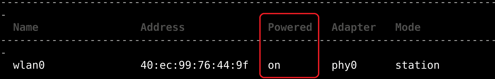
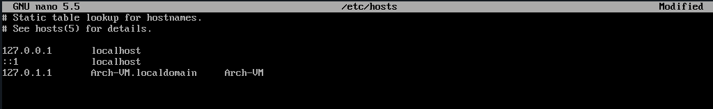
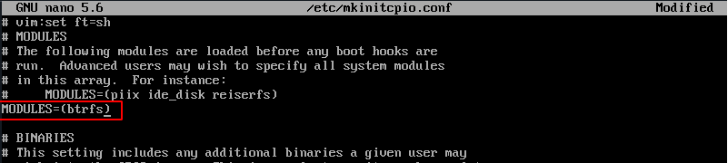

# Arch Linux Installation Guide

Note that this guide has been created through my own struggles and trial and error. So make sure to do your own research before proceeding blindly.

Here are some of the main sources that helped me put this guidance together:

- [Learn Linux TV - Full Installation Guide](https://www.youtube.com/watch?v=DPLnBPM4DhI&list=LL&index=1&t=893s)
- [Arch Wiki - Installation guide](https://wiki.archlinux.org/title/installation_guide)
- [Arch Wiki - Btrfs](https://wiki.archlinux.org/title/btrfs)
- [Arch Linux Network Manager](https://linuxhint.com/arch_linux_network_manager/)
- [How to Set up Bluetooth in Arch Linux](https://www.jeremymorgan.com/tutorials/linux/how-to-bluetooth-arch-linux/)
- etc.

## Table of Contents

- [Arch Linux Installation Guide](#arch-linux-installation-guide)
  - [Table of Contents](#table-of-contents)
  - [Check Internet Connection](#check-internet-connection)
  - [Set System Time Zone](#set-system-time-zone)
  - [Partition Management](#partition-management)
    - [Formatting and Configuring Main Drive Partition](#formatting-and-configuring-main-drive-partition)
    - [Create New GPT Partition Table](#create-new-gpt-partition-table)
    - [Create Boot Partition](#create-boot-partition)
    - [Create Swap Partition](#create-swap-partition)
    - [Create Root Partition](#create-root-partition)
    - [Write New Partition Table to Disk](#write-new-partition-table-to-disk)
    - [Format Partitions and Configure Swap](#format-partitions-and-configure-swap)
    - [Create Btrfs Subvolumes](#create-btrfs-subvolumes)
    - [Mount Boot Partition](#mount-boot-partition)
  - [Installing the Base System](#installing-the-base-system)
    - [Intel CPUs](#intel-cpus)
    - [AMD CPUs](#amd-cpus)
    - [VM CPUs](#vm-cpus)
  - [Creating fstab File](#creating-fstab-file)
  - [installing arch linux](#installing-arch-linux)
    - [Setting Timezone](#setting-timezone)
    - [setting system locale](#setting-system-locale)
    - [network configuration](#network-configuration)
    - [Setting Root User Password](#setting-root-user-password)
    - [Installing Remaining Essential Packages](#installing-remaining-essential-packages)
    - [Adding btrfs Module to mkinitcpio](#adding-btrfs-module-to-mkinitcpio)
    - [installing GRUB](#installing-grub)
    - [create a standard user](#create-a-standard-user)
    - [Configuring NetworkManager package](#configuring-networkmanager-package)
    - [finishing installation](#finishing-installation)
  - [Conclusion](#conclusion)

## Check Internet Connection

The first thing you need to make sure of is your internet connection. This connection can be wired or wireless, but keep in mind: "If you don't have a stable Internet connection, don't proceed any further."

You can check the internet connection status using one of the methods below. If you have a wired connection, there is a high chance that your system connection would be established without any problems, and all you need to do is to use the `ping` command to ensure the connection is stable.

1. Use ping command:

   ```shell
   ping google.com
   ```

   If the ping command shows that your connection is stable, then you can proceed to [Set system time zone](#set-system-time-zone). Otherwise, there are two possibilities: you have a wireless connection that needs to be configured, or your wired connection has some problems that you have to troubleshoot. If you have a wireless connection, you can continue with the rest of the guide in this section to establish your system's internet connection.

2. Check internet adaptor status:

   ```shell
   ip addr show
   ```

   This command shows the status of your internet adapters and their IP addresses. If you have a wired connection, the connection will be established automatically. If you have Wi-Fi, follow these steps to connect to Wi-Fi:

   1. First, open the Internet wireless control utility using this command:

      ```shell
      iwctl
      ```

   2. Now you can list your Wi-Fi adapters:

      ```shell
      device list
      ```

      If you can't see your Wi-Fi adapter, try to fix it before proceeding. Don’t proceed with installing Arch without an internet connection.

      Note: In some cases after running the previous command, your Wi-Fi adapter might be listed as "powered off." If you encounter this situation, exit the Internet wireless control utility by pressing "Ctrl + D" and then follow these steps. Otherwise, proceed to the third step for establishing the Wi-Fi connection:

      1. Use `journalctl` to check the systemd's logs to check the reason for the Wi-Fi adapter not working:

         ```shell
         journalctl | grep <adaptor name>
         ```

      2. If the output shows "Operation not possible due to RF-kill", then run this command to solve the problem:

         ```shell
         rfkill unblock all
         ```

      3. Now get back into the Internet wireless control utility and list the adapters:

         ```shell
         iwctl
         ```

         ```shell
         device list
         ```

      As you can see now, the Wi-Fi adapter has been "powered on."

      

      Now you can proceed with the next step to connect to Wi-Fi.

   3. Establish Wi-Fi connection:

      After getting the list of wireless adapters, write down the name of the adapter listed in the previous command's result because we'll need that name to establish the connection.

      You can follow these steps to establish the Wi-Fi connection:

      1. Scan for available Wi-Fi signals:

         ```shell
         station <adaptor name> scan
         ```

      2. List the available wireless connections:

         ```shell
         station <adaptor name> get-networks
         ```

      3. Start the connection process:

         ```shell
         station <adaptor name> connect <wireless connection name>
         ```

         After running this command, you'll be prompted for the connection password. After entering the password, wait 20 to 30 seconds for the connection to stabilize, then use `Ctrl + D` to exit `iwctl`.

         Now if you run the adapter list command again, you can see that your Wi-Fi adapter is up and has an IP address. Alternatively, you can run a `ping` command to check your internet connection:

         ```shell
         ip addr show
         ```

         ```shell
         ping -c 5 google.com
         ```

## Set System Time Zone

To set the system time zone, follow these steps:

1. Enable automatic time synchronization by running the following command:

   ```shell
   timedatectl set-ntp true
   ```

   This command enables Network Time Protocol (NTP) synchronization, ensuring that your system clock stays accurate by syncing with internet time servers.

2. Set the desired time zone. For example, to set the time zone to Asia/Tehran, run:

   ```shell
   timedatectl set-timezone Asia/Tehran
   ```

   Replace `Asia/Tehran` with your preferred time zone from the [IANA Time Zone Database](https://www.iana.org/time-zones).

## Partition Management

### Formatting and Configuring Main Drive Partition

First, identify the name of your main drive partition by running the following command:

```shell
fdisk -l
```

Note down the name of the drive you want to use, for example, "/dev/sda".

Now, open the disk manager for the chosen storage drive:

```shell
fdisk /dev/sda
```

Follow these steps for a clean installation:

### Create New GPT Partition Table

Type `g` to create a new GPT partition table.

### Create Boot Partition

Type `n` to start creating a new partition.

1. Accept the default partition number by pressing Enter.
2. Accept the default partition start sector by pressing Enter.
3. Enter `+500M` for the size of the EFI boot partition.
4. After creating the partition, set its type:
   1. Type `t`.
   2. Enter `1` as the partition type.

### Create Swap Partition

Repeat the steps for creating a new partition.

1. Accept the default partition number and start sector.
2. Enter `+8GB` for the swap partition size.
3. Set the partition type:
   1. Type `t`.
   2. Enter `19` as the partition type.

### Create Root Partition

Repeat the steps for creating a new partition.

1. Accept the default partition number and start sector.
2. Accept the default size to use the remaining space on the disk.
3. Set the partition type:
   1. Type `t`.
   2. Enter `23` as the partition type.

### Write New Partition Table to Disk

Type `p` to see the newly created partition table info. Then type `w` to write changes to the disk.

### Format Partitions and Configure Swap

Before proceeding with the installation, it's crucial to format the partitions correctly and configure the swap partition for optimal system performance. Follow these steps to format the partitions and configure the swap partition:

1. Format EFI Boot Partition:

   Format the EFI boot partition (usually `/dev/sda1`) with the FAT32 file system to make it compatible with UEFI firmware:

   ```shell
   mkfs.fat -F32 /dev/sda1
   ```

   This command formats the partition with FAT32, making it suitable for storing EFI boot files.

2. Configure Swap Partition:

   Configure the swap partition (usually `/dev/sda2`) to be used as swap space, which provides additional virtual memory when physical RAM is fully utilized:

   ```shell
   mkswap /dev/sda2
   swapon /dev/sda2
   ```

   - `mkswap /dev/sda2`: This command sets up the swap space on the specified partition.
   - `swapon /dev/sda2`: This command activates the swap space, making it available for use by the system.

3. Format Root Partition with Btrfs:

   Format the root partition (usually `/dev/sda3`) with the Btrfs file system, which offers features like snapshots, compression, and integrated RAID support:

   ```shell
   mkfs.btrfs -n 32k /dev/sda3
   ```

   - `mkfs.btrfs -n 32k /dev/sda3`: This command formats the partition with Btrfs and specifies a node size of 32KB for metadata. Btrfs is a modern file system that provides advanced features for managing data efficiently.

Ensure to replace `/dev/sda1`, `/dev/sda2`, and `/dev/sda3` with the correct partition names corresponding to your system setup.

These commands prepare the partitions for installation and ensure proper utilization of disk space and system resources.

### Create Btrfs Subvolumes

Mount the root partition to the system:

```shell
mount /dev/sda3 /mnt
```

Now, create subvolumes for Btrfs:

```shell
btrfs su cr /mnt/@
btrfs su cr /mnt/@home
btrfs su cr /mnt/@var
btrfs su cr /mnt/@opt
btrfs su cr /mnt/@tmp
btrfs su cr /mnt/@.snapshots
```

Unmount the root partition:

```shell
umount /mnt
```

Mount the subvolumes:

```shell
mount -o noatime,commit=120,compress=zstd,subvol=@ /dev/sda3 /mnt
mkdir /mnt/{boot,home,var,opt,tmp,.snapshots}
mount -o noatime,commit=120,compress=zstd,subvol=@home /dev/sda3 /mnt/home
mount -o noatime,commit=120,compress=zstd,subvol=@opt /dev/sda3 /mnt/opt
mount -o noatime,commit=120,compress=zstd,subvol=@tmp /dev/sda3 /mnt/tmp
mount -o noatime,commit=120,compress=zstd,subvol=@.snapshots /dev/sda3 /mnt/.snapshots
mount -o subvol=@var /dev/sda3 /mnt/var
```

### Mount Boot Partition

Mount the boot partition:

```shell
mount /dev/sda1 /mnt/boot
```

## Installing the Base System

Before installing the base system, ensure your system keyring is up to date:

```shell
pacman -Sy archlinux-keyring
```

Now, install the base system by choosing the appropriate command based on your CPU version:

### Intel CPUs

```shell
pacstrap /mnt base linux linux-lts linux-firmware nano intel-ucode btrfs-progs
```

### AMD CPUs

```shell
pacstrap /mnt base linux linux-lts linux-firmware nano amd-ucode btrfs-progs
```

### VM CPUs

For virtual machine CPUs, use the following command:

```shell
pacstrap /mnt base linux linux-lts linux-firmware nano btrfs-progs
```

## Creating fstab File

Now, we need to create an fstab file. This file tells our bootloader where to look for partitions.

```shell
 genfstab -U /mnt >> /mnt/etc/fstab
 cat /mnt/etc/fstab
```

The `genfstab` command generates an fstab file based on the currently mounted filesystems. The `-U` flag uses UUIDs (Universally Unique Identifiers) to identify the partitions.

## installing arch linux

To begin installing Arch Linux, you need to enter the Arch install environment. Use the following command to connect to the Arch root installer:

```shell
arch-chroot /mnt
```

### Setting Timezone

Set the timezone by creating a symbolic link to the desired timezone file and synchronizing the hardware clock:

```shell
ln -sf /usr/share/zoneinfo/Asia/Tehran /etc/localtime
hwclock --systohc
```

### setting system locale

You need to manually edit "locale.gen" file, and uncomment "" and any other locales that you want

Edit the `locale.gen` file to enable desired locales (Recommended: "en_US.UTF-8 UTF-8"), generate the locales, and set the system locale:

```shell
nano /etc/locale.gen
locale-gen
echo LANG=en_US.UTF-8 >> /etc/locale.conf
```

### network configuration

Set the hostname and edit the hosts file to configure network settings:

```shell
echo archlinux >> /etc/hostname
nano /etc/hosts
```

Add the following lines to the end of the hosts file:

```plaintext
127.0.0.1   localhost
::1         localhost
127.0.1.1   myhostname.localdomain myho:stname
```



### Setting Root User Password

Set a password for the root user:

```shell
passwd
```

### Installing Remaining Essential Packages

Install essential packages including the bootloader, network manager, development tools, and additional utilities:

```shell
pacman -S grub grub-btrfs efibootmgr base-devel linux-headers linux-lts-headers networkmanager \
network-manager-applet wpa_supplicant wireless_tools netctl networkmanager-openvpn dialog os-prober \
mtools dosfstools reflector xdg-utils xdg-user-dirs modemmanager mobile-broadband-provider-info \
usb_modeswitch rp-pppoe nm-connection-editor
```

**Package Summaries:**

- **grub:** GRUB bootloader for booting the system.
- **grub-btrfs:** Support for booting from Btrfs filesystems with GRUB.
- **efibootmgr:** Utility for managing UEFI boot entries.
- **base-devel:** Development tools necessary for building packages from AUR (Arch User Repository).
- **linux-headers:** Header files and scripts for building modules for the Linux kernel.
- **linux-lts-headers:** Header files and scripts for building modules for the LTS (Long-Term Support) Linux kernel.
- **networkmanager:** Network management daemon with support for wired and wireless networks.
- **network-manager-applet:** GTK applet for NetworkManager.
- **wpa_supplicant:** Utility for WPA/WPA2/IEEE 802.1X Supplicant.
- **wireless_tools:** Tools for configuring wireless network interfaces.
- **netctl:** Profile-based network connection tool.
- **networkmanager-openvpn:** NetworkManager VPN plugin for OpenVPN.
- **dialog:** Utility for creating dialog boxes from shell scripts.
- **os-prober:** Utility to detect other operating systems on the system.
- **mtools:** Utilities to access MS-DOS disks from Unix without mounting them.
- **dosfstools:** Utilities for making and checking MS-DOS FAT filesystems.
- **reflector:** Tool for fetching and sorting mirrors for Arch Linux.
- **xdg-utils:** Command line tools that assist applications with a variety of desktop integration tasks.
- **xdg-user-dirs:** Tool to manage well-known user directories like the Desktop directory and the Music directory.
- **modemmanager:** Mobile broadband modem management service.
- **mobile-broadband-provider-info:** Database of mobile broadband service provider settings.
- **usb_modeswitch:** Utility to handle 3G USB modems.
- **rp-pppoe:** PPPoE client for Linux.
- **nm-connection-editor:** NetworkManager GUI connection editor.

### Adding btrfs Module to mkinitcpio

Edit the `mkinitcpio.conf` file to include the btrfs module:

```shell
nano /etc/mkinitcpio.conf
```

Add `btrfs` to the `MODULES` section. Then, regenerate the initramfs:



```shell
mkinitcpio -p linux
mkinitcpio -p l
```

### installing GRUB

Install the GRUB bootloader and configure locales:

1. Install the GRUB bootloader:

   ```shell
   grub-install --target=x86_64-efi --efi-directory=/boot --bootloader-id=Arch
   ```

2. Check for the existence of locale directory:

   ```shell
   ls -l /boot/grub
   ```

3. Create the locale directory if it doesn't exist:

   ```shell
   mkdir /boot/grub/locale
   ```

4. Configure locales for GRUB:

   ```shell
   cp /usr/share/locale/en\@quot/LC_MESSAGES/grub.mo /boot/grub/locale/en.mo
   ```

5. Generate GRUB configuration file:

   ```shell
   grub-mkconfig -o /boot/grub/grub.cfg
   ```

### create a standard user

Create a standard user and assign a password:

```shell
useradd -m -g users -G wheel <username>
passwd <username>
```

- `-m` flag, creates user home directory
- `-g` flag, the group name or number of the user's initial login group
- `-G` flag, list of supplementary groups which the user is also a member of

Check if sudo package is installed and configure sudo permissions:

1. Check if sudo is installed

   ```shell
   which sudo
   ```

2. Install sudo if not installed

   ```shell
   pacman -S sudo
   ```

3. Uncomment "%wheel ALL=(ALL:ALL) ALL" to grant sudo permissions

   ```shell
   EDITOR=nano visudo
   ```

### Configuring NetworkManager package

Enable NetworkManager service and disable dhcpcd service to manage network connections:

```shell
systemctl enable NetworkManager.service
systemctl disable dhcpcd.service
```

Enable wpa_supplicant for wireless connections. If needed

```shell
systemctl enable wpa_supplicant.service
```

### finishing installation

Exit from the Arch chroot environment and unmount all mounted devices:

```shell
exit
umount -l /mnt
```

For VM installations, shutdown the system:

```shell
shutdown now
```

For device installations, reboot the system:

```shell
reboot
```

## Conclusion

Congratulations! At this point, you have successfully completed the installation of a clean and minimal Arch Linux system. However, keep in mind that this is just the initial setup, and there are additional post-installation tasks and configurations that you may need to perform to customize your system according to your preferences and requirements.

For further guidance and post-installation steps, please refer to the Arch Wiki and other reliable sources:

- [Arch Wiki - General Recommendations](https://wiki.archlinux.org/title/General_recommendations)
- [Arch Wiki - System Maintenance](https://wiki.archlinux.org/title/System_maintenance)
- [Arch Wiki - Desktop Environment](https://wiki.archlinux.org/title/Desktop_environment)
- [Arch Linux Official Forum](https://bbs.archlinux.org/)
- [r/archlinux Subreddit](https://www.reddit.com/r/archlinux/)

Alternatively, you can refer to the comprehensive post-installation guidance file that we have prepared for you. This file contains detailed instructions and recommendations to further configure and optimize your Arch Linux system.

Happy Arching!
