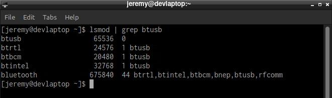
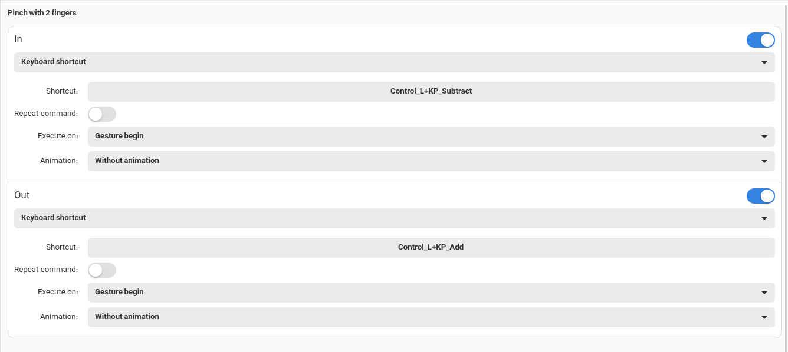

# Arch Linux Post Install Guide

Welcome to the post-installation guide for Arch Linux and EndeavourOS. Now that you've completed the installation process and booted into your new system, it's time to take the next steps to configure and customize your environment. In this guide, we'll cover essential post-installation tasks such as setting up networking, configuring users and permissions, installing additional software packages, optimizing system performance, and more.

## Table of Contents

- [Arch Linux Post Install Guide](#arch-linux-post-install-guide)
  - [Table of Contents](#table-of-contents)
  - [Connect to a Wireless Network](#connect-to-a-wireless-network)
    - [List Available Networks](#list-available-networks)
    - [Connect to a Network](#connect-to-a-network)
    - [List Connected Networks](#list-connected-networks)
    - [Check Network Devices Status](#check-network-devices-status)
  - [Install Paru Package Manager](#install-paru-package-manager)
  - [Desktop Environment Installation](#desktop-environment-installation)
    - [Update System Repositories and Packages](#update-system-repositories-and-packages)
    - [Install GPU Drivers](#install-gpu-drivers)
    - [Installing Graphical User Environment](#installing-graphical-user-environment)
    - [Install KDE Desktop Environment](#install-kde-desktop-environment)
    - [Install Additional Applications](#install-additional-applications)
    - [Enable SDDM](#enable-sddm)
    - [Optimus Manager for Nvidia](#optimus-manager-for-nvidia)
    - [Check Optimus Manager Service](#check-optimus-manager-service)
  - [First Launch in KDE Arch Linux](#first-launch-in-kde-arch-linux)
    - [Configure a VPN](#configure-a-vpn)
    - [Apply NVENC and NvFBC Patches for Nvidia Drivers](#apply-nvenc-and-nvfbc-patches-for-nvidia-drivers)
    - [Update System Packages and Applications](#update-system-packages-and-applications)
      - [Fix "Invalid or Corrupted Package (PGP Signature)" Error](#fix-invalid-or-corrupted-package-pgp-signature-error)
      - [Fix "npm: 'some file' exists in filesystem" Error](#fix-npm-some-file-exists-in-filesystem-error)
    - [Enable Multilib Repository](#enable-multilib-repository)
    - [Resolve "Exists on Filesystem" Error with Pacman](#resolve-exists-on-filesystem-error-with-pacman)
  - [Enable Bluetooth](#enable-bluetooth)
    - [Install Basic Needed Packages](#install-basic-needed-packages)
    - [Enable Bluetooth Service](#enable-bluetooth-service)
  - [Enable Firewall](#enable-firewall)
  - [Harden `/etc/sysctl.conf`](#harden-etcsysctlconf)
  - [WINE Installation](#wine-installation)
    - [Install WINE](#install-wine)
    - [Install Dependencies (Optional)](#install-dependencies-optional)
    - [Install Winetricks](#install-winetricks)
    - [Configure WINE](#configure-wine)
  - [Configure Touchpad Multi-Touch Gestures](#configure-touchpad-multi-touch-gestures)
    - [Install Required Packages](#install-required-packages)
    - [Reboot System](#reboot-system)
    - [Install Touchegg](#install-touchegg)
    - [Enable and Start Touchegg Service](#enable-and-start-touchegg-service)
    - [Again Reboot System](#again-reboot-system)
    - [Configure Touché](#configure-touché)
  - [Enable Terminal Password Feedback](#enable-terminal-password-feedback)
  - [Conclusion](#conclusion)

## Connect to a Wireless Network

To establish an internet connection via Wi-Fi, you can use NetworkManager (nmcli) to manage wireless networks.

### List Available Networks

First, list all nearby wireless networks:

```shell
nmcli device wifi list
```


### Connect to a Network

You can directly connect to a specific wireless network by providing its SSID (network name) and password:

```shell
nmcli device wifi connect <SSID> password <SSID_password>
```


### List Connected Networks

To view a list of all connected networks:

```shell
nmcli connection show
```


### Check Network Devices Status

NetworkManager provides information about the status of all network devices:

```shell
nmcli device
```


## Install Paru Package Manager

Paru is an AUR helper and pacman wrapper that allows you to install packages from both the official Arch repositories and the Arch User Repository (AUR).

1. Update System Repositories and Packages

   Before installing Paru, ensure your system repositories and packages are up to date:

   ```shell
   sudo pacman -Syu
   ```

2. Install Git

   Git is required to clone the Paru repository from the AUR. Install it using pacman:

   ```shell
   sudo pacman -S git
   ```

3. Clone Paru Repository

   Navigate to the `/opt` directory and clone the Paru repository from the AUR:

   ```shell
   cd /opt
   sudo git clone https://aur.archlinux.org/paru.git
   ```

4. Set Permissions

   Set appropriate permissions for the Paru directory to allow building and installation:

   ```shell
   sudo chown -R <username>:wheel ./paru
   ```

5. Build and Install Paru

   Navigate into the Paru directory and build the package using makepkg:

   ```shell
   cd paru
   makepkg -si
   ```

After successfully building the package, Paru will be installed on your system.

## Desktop Environment Installation

Install and configure the desktop environment on your Arch Linux system.

### Update System Repositories and Packages

Ensure your system repositories and packages are up to date:

```shell
sudo pacman -Syu
```

### Install GPU Drivers

Select and install the appropriate GPU driver based on your hardware:

- **AMD Video Cards:**

  ```shell
  sudo pacman -S xf86-video-amdgpu
  ```

- **ATI Video Cards:**

  ```shell
  sudo pacman -S xf86-video-ati
  ```

- **Intel Video Cards:**

  ```shell
  sudo pacman -S xf86-video-intel
  ```

- **Nvidia Video Cards:**

  ```shell
  pacman -S nvidia nvidia-lts lib32-nvidia-utils
  ```

  After installing the desktop environment, download and install the Nvidia driver compatible with your system from [Nvidia Unix Driver Archive](https://www.nvidia.com/en-us/drivers/unix/) or search the AUR for your system driver.

- **Virtual Machine:**

  For virtual machine installations, install the necessary packages:

  ```shell
  sudo pacman -S virtualbox-guest-utils xf86-video-vmware
  sudo systemctl enable vboxservice
  ```

### Installing Graphical User Environment

Install Xorg and the Xorg server for graphical user interface support:

```shell
sudo pacman -S xorg xorg-server
```

### Install KDE Desktop Environment

You can choose to install any desktop environment according to your preference. However, for the sake of this example, we will proceed with installing KDE Plasma.

Install the KDE Plasma desktop environment and its additional packages:

```shell
sudo pacman -S plasma-meta packagekit-qt5 ufw
```

### Install Additional Applications

Install additional KDE applications for enhanced functionality:

```shell
sudo pacman -S ark unrar dolphin dolphin-plugins kcalc kalendar kde-dev-scripts kde-dev-utils kdeconnect \
kolourpaint kdegraphics-mobipocket kdegraphics-thumbnailers knewstuff kdesdk-thumbnailers konsole partitionmanager \
yakuake deepin-screenshot kaccounts-providers kio-gdrive firefox gnome-sound-recorder gedit gedit-plugins \
noto-fonts noto-fonts-cjk noto-fonts-emoji noto-fonts-extra pulseaudio pulseaudio-alsa pulseaudio-bluetooth \
pulseaudio-equalizer pulseaudio-jack pulseaudio-lirc pulseaudio-zeroconf ntfs-3g
```

Install additional KDE applications to enhance functionality:

- **ark:** Archive manager for KDE.
- **unrar:** Tool for extracting files from RAR archives.
- **dolphin:** KDE's default file manager.
- **dolphin-plugins:** Additional plugins for Dolphin file manager.
- **kcalc:** KDE's calculator application.
- **kalendar:** Calendar application for KDE.
- **kde-dev-scripts:** Development scripts for KDE applications.
- **kde-dev-utils:** Development utilities for KDE applications.
- **kdeconnect:** Integration tool for KDE and Android smartphones.
- **kolourpaint:** Simple paint application for KDE.
- **kdegraphics-mobipocket:** Mobipocket file format support for KDE graphics applications.
- **kdegraphics-thumbnailers:** Thumbnailers for various graphics formats in KDE.
- **knewstuff:** Framework for downloading and sharing additional application data.
- **kdesdk-thumbnailers:** Thumbnailers for various software development formats in KDE.
- **konsole:** Terminal emulator for KDE.
- **partitionmanager:** Partition management tool for KDE.
- **yakuake:** Drop-down terminal emulator for KDE.
- **deepin-screenshot:** Screenshot utility for KDE.
- **kaccounts-providers:** Online accounts integration for KDE.
- **kio-gdrive:** KDE integration with Google Drive.
- **firefox:** Web browser.
- **gnome-sound-recorder:** Sound recorder utility.
- **gedit:** Text editor for GNOME.
- **gedit-plugins:** Plugins for enhancing functionality in GNOME's text editor.
- **noto-fonts:** Noto font family.
- **noto-fonts-cjk:** Noto CJK font family.
- **noto-fonts-emoji:** Noto Emoji font family.
- **noto-fonts-extra:** Additional Noto fonts.
- **pulseaudio:** Sound server for POSIX and Win32 systems.
- **pulseaudio-alsa:** ALSA configuration for PulseAudio.
- **pulseaudio-bluetooth:** Bluetooth support for PulseAudio.
- **pulseaudio-equalizer:** Equalizer for PulseAudio.
- **pulseaudio-jack:** JACK support for PulseAudio.
- **pulseaudio-lirc:** LIRC support for PulseAudio.
- **pulseaudio-zeroconf:** Zeroconf support for PulseAudio.
- **ntfs-3g:** NTFS filesystem driver for FUSE.

These applications provide various tools and utilities to enhance your KDE desktop environment.

**Note:** Add yakuake to your system startup applications

### Enable SDDM

Enable SDDM, the KDE display manager, for login management:

```shell
sudo systemctl enable sddm
```

### [Optimus Manager for Nvidia](https://discovery.endeavouros.com/nvidia/optimus-manager-for-nvidia/2021/03/)

Install and configure Optimus Manager for Nvidia graphics:

```shell
paru -S optimus-manager
```

Install Optimus Manager Qt for a graphical interface:

If using KDE Plasma, use the following instructions to build and install Optimus Manager Qt. Otherwise go to next option:

```shell
git clone https://aur.archlinux.org/optimus-manager-qt-git
cd optimus-manager-qt-git
nano PKGBUILD

# Change "_with_plasma=false" to true
# Save the file and exit
```

Then, build and install Optimus Manager Qt:

```shell
makepkg -si
```

Install Optimus Manager Qt for other DEs

```shell
paru -S optimus-manager-qt
```

Reboot your system to apply changes:

```shell
sudo reboot
```

### Check Optimus Manager Service

Check the status of the Optimus Manager service:

```shell
systemctl status optimus-manager
```

Start and enable the service if it's not running:

```shell
sudo systemctl enable --now optimus-manager
```

After completing these steps, your system should be configured with the KDE Plasma desktop environment and Nvidia Optimus Manager for graphics management.

## First Launch in KDE Arch Linux

### Configure a VPN

If you have a VPN, you can configure it using either the Network Manager plugins or othe applications and packages from official Arch repositories and the Arch User Repository (AUR).

### Apply NVENC and NvFBC Patches for Nvidia Drivers

This section is only related to those who have Nvidia GPUs.

After installing the Nvidia driver, there is a patch available to address the FBC (Frame Buffer Capture) problem. Follow these steps to apply the patch:

```shell
# Patch GitHub repository: https://github.com/keylase/nvidia-patch
cd ~/Downloads
git clone https://github.com/keylase/nvidia-patch.git
cd nvidia-patch
bash ./patch.sh
bash ./patch-fbc.sh
```

### Update System Packages and Applications

Keep your system up-to-date by running the following command to update system packages:

```shell
sudo pacman -Syu
```

Sometimes, you may encounter errors such as "invalid or corrupted package (PGP signature)" or "nodejs: 'some file' exists in filesystem" or "npm: 'some file' exists in filesystem" when installing applications from the command line. To fix these issues, use the following commands:

#### Fix "Invalid or Corrupted Package (PGP Signature)" Error

```shell
sudo pacman -S archlinux-keyring
```

#### Fix "npm: 'some file' exists in filesystem" Error

```shell
npm --global remove npm
```

### Enable Multilib Repository

To enable the multilib repository, uncomment the "multilib" header and repository in the /etc/pacman.conf file:

```shell
sudo nano /etc/pacman.conf
```


### Resolve "Exists on Filesystem" Error with Pacman

During the installation or update process of any packages, you might encounter a "exists on filesystem" error with Pacman. In such cases, use the "--overwrite" flag to install or update your packages:

```shell
sudo pacman -S --overwrite "*" <package_name>
```

## Enable Bluetooth

To enable Bluetooth functionality on your system, follow these steps:

### Install Basic Needed Packages

Install the essential packages for Bluetooth support:

```shell
pacman -S bluez bluez-utils
```

Next, check if the generic Bluetooth driver module, "btusb," is loaded. If it's not loaded, you'll need to load it manually. Run the following command to check:

```shell
lsmod | grep btusb
```



### Enable Bluetooth Service

Enable the Bluetooth service to start automatically on system boot:

```shell
sudo systemctl enable bluetooth.service
sudo systemctl start bluetooth.service
```

Alternatively, you can enable and start the service in one command:

```shell
sudo systemctl enable --now bluetooth.service
sudo systemctl start --now bluetooth.service
```

## Enable Firewall

To enable a firewall and configure basic rules for incoming and outgoing traffic, follow these steps:

```shell
sudo ufw limit 22/tcp       # Allow SSH (port 22) with rate limiting
sudo ufw allow 80/tcp       # Allow HTTP (port 80)
sudo ufw allow 443/tcp      # Allow HTTPS (port 443)
sudo ufw default deny incoming   # Deny all incoming traffic by default
sudo ufw default allow outgoing  # Allow all outgoing traffic by default
sudo ufw enable             # Enable the firewall
```

These commands configure the Uncomplicated Firewall (UFW) to restrict incoming traffic to specific ports while allowing all outgoing traffic. Additionally, SSH traffic is rate-limited to prevent brute-force attacks. Finally, the firewall is enabled to enforce these rules. Adjust these rules as needed for your specific network requirements.

## Harden `/etc/sysctl.conf`

To harden your system's network configuration and improve security, you can adjust various parameters in the `/etc/sysctl.conf` file. Before making any changes, it's advisable to review the current system settings using the `sysctl` command.

```shell
sudo sysctl -a             # Display all current kernel parameters
sudo sysctl -A             # Display all current kernel parameters (alternative)
sudo sysctl mib            # Display current MIB settings
sudo sysctl net.ipv4.conf.all.rp_filter  # Display a specific kernel parameter
sudo sysctl -a --pattern 'net.ipv4.conf.(eth|wlan)0.arp'  # Display parameters matching a pattern
```

These commands provide insight into the current kernel parameters and network-related settings. After reviewing the output, you can make appropriate changes to the `/etc/sysctl.conf` file to harden your system's security posture.

## WINE Installation

WINE (Wine Is Not an Emulator) is a compatibility layer that allows you to run Windows applications on Linux. Here's how to install WINE and configure it:

### Install WINE

```shell
sudo pacman -S wine
```

### Install Dependencies (Optional)

```shell
sudo pacman -S --asdeps --needed $(pacman -Si wine | sed -n '/^Opt/,/^Conf/p' | sed '$d' | sed 's/^Opt.*://g' | sed 's/^\s*//g' | tr '\n' ' ')
```

### Install Winetricks

```shell
sudo pacman -S winetricks
```

### Configure WINE

After installing WINE, configure it by setting the Windows version to the latest version:

```shell
winecfg
```

This command will open the WINE configuration window. In the "Applications" tab, set the "Windows version" to the latest for compatibility with modern Windows applications.

Now, you can run Windows applications on your Linux system using WINE.

## Configure Touchpad Multi-Touch Gestures

To enable multi-touch gestures on your touchpad, follow these steps:

### Install Required Packages

Install the necessary packages:

```shell
sudo pacman -S libinput xf86-input-libinput
```

### Reboot System

Reboot your system for the changes to take effect:

```shell
sudo reboot
```

### Install Touchegg

Use Paru to install Touchegg, a multi-touch gesture recognizer:

```shell
paru -S touchegg
```

### Enable and Start Touchegg Service

Enable and start the Touchegg service:

```shell
sudo systemctl enable touchegg.service
sudo systemctl start touchegg
```

### Again Reboot System

Reboot your system again:

```shell
sudo reboot
```

### Configure Touché

Finally, install Touché for configuring multi-touch gestures:

```shell
paru -S touche
```

After installation, open Touché and configure your desired multi-touch gestures to enhance your touchpad experience.




## Enable Terminal Password Feedback

To enable terminal password feedback, follow these steps:

1. **Open Terminal**:

   First, open a terminal on your system. You can do this by searching for "konsole" in the application launcher or by pressing `Ctrl + Alt + T` as a shortcut.

2. **Open visudo**:

   Type the following command in the terminal and press Enter. This will open the sudoers file using the `visudo` command, which ensures safe editing of the sudoers file.

   ```shell
   sudo visudo
   ```

3. **Find the Defaults Line**:

   Inside the sudoers file, find the line that starts with "Defaults". This line specifies various default settings for sudo.

4. **Add the pwfeedback Line**:

   Add the following line after the "Defaults" line to enable password feedback:

   ```shell
   Defaults         pwfeedback
   ```

   This line tells sudo to display asterisks (\*) when typing your password.

5. **Save and Exit**:

   After adding the line, save and exit the editor. If you're using the nano text editor, press `Ctrl + X` to exit, then press `Y` to confirm changes, and `Enter` to save.

6. **Test the Changes**:

   Close and reopen a new terminal window to apply the changes. Now, when you use sudo and are prompted for your password, you should see asterisks (\*) as you type.

## Conclusion

Congratulations! You have successfully completed the post-installation steps for your Arch Linux system. You now have a fully functional system and can start installing applications and customizing it according to your preferences.

To further enhance your experience, consider exploring the Applications Installation Guide within this document, where you'll find recommendations for essential applications and configuration settings to optimize your system for various use cases.

Enjoy exploring your new Arch Linux system and have fun customizing it to suit your needs!
