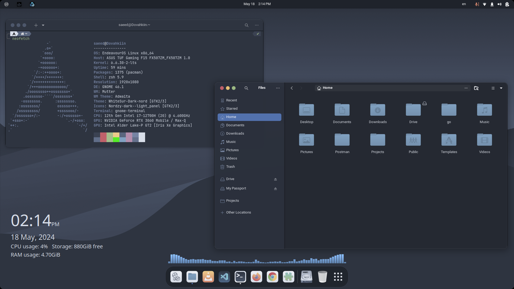
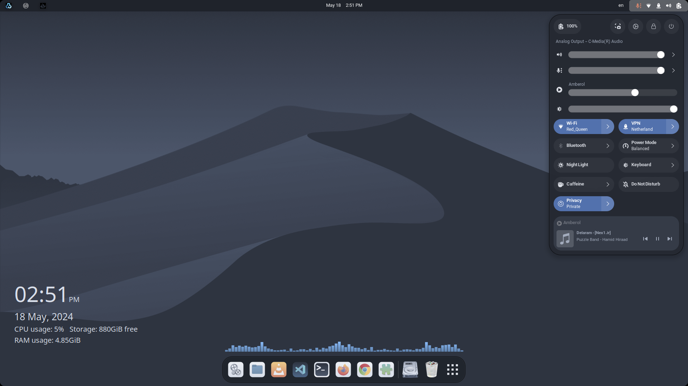
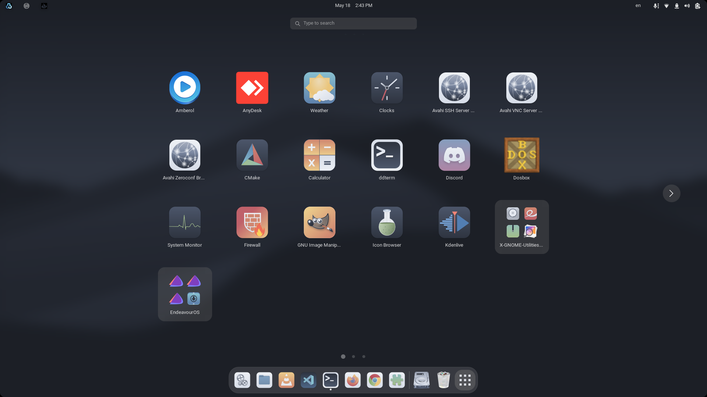
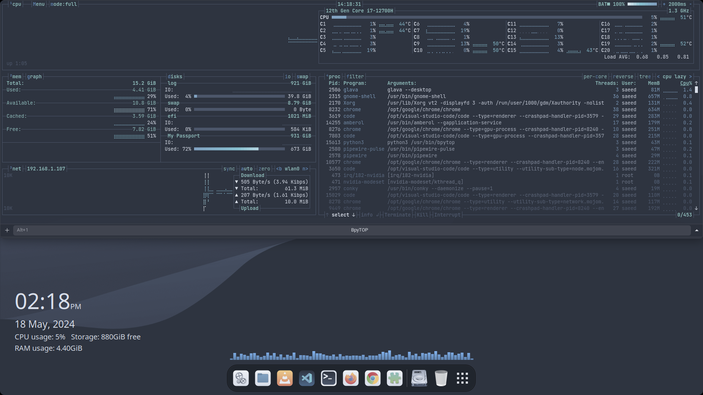
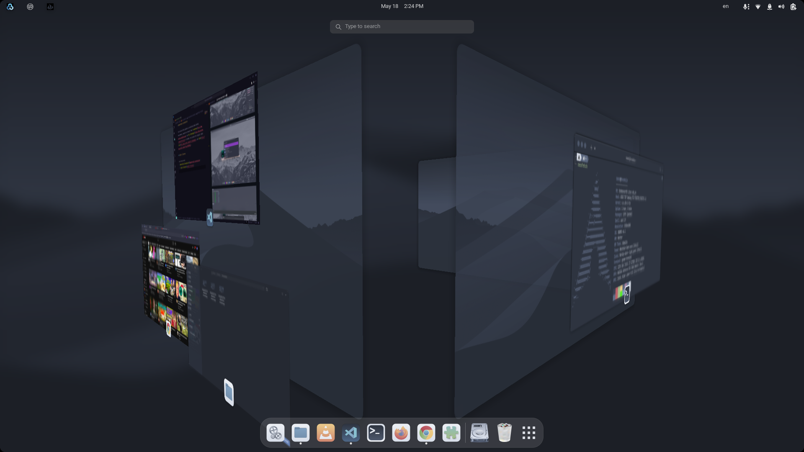
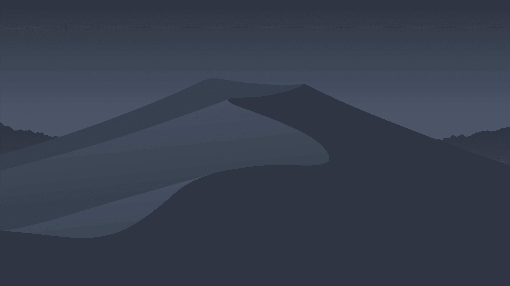
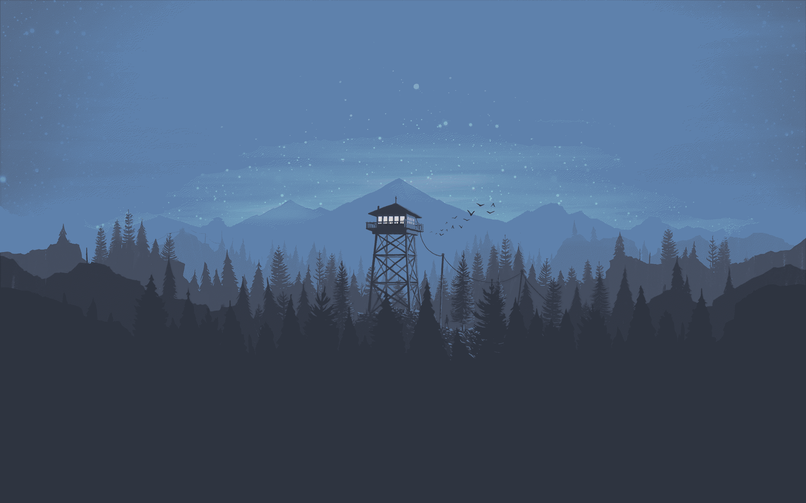

# GNOME Nordic Customization

This guide provides step-by-step instructions for customizing the GNOME desktop environment with a clean, professional Nordic theme. The techniques are inspired by tutorials from [LinuxScoop](https://www.youtube.com/@linuxscoop) and [Arc Technologies](https://www.youtube.com/@ArcTechnologies) on YouTube.

> **📝 Note:** This guide was last updated for **GNOME 46.1**. Some extensions or settings may behave differently in newer GNOME versions. Check extension compatibility before installing.

---

## Table of Contents

- [GNOME Nordic Customization](#gnome-nordic-customization)
	- [Table of Contents](#table-of-contents)
	- [Notice of Obsolescence](#notice-of-obsolescence)
	- [Final Result](#final-result)
	- [Prerequisites](#prerequisites)
		- [Required Packages](#required-packages)
		- [Recommended Packages](#recommended-packages)
	- [Part 1: Extensions](#part-1-extensions)
		- [1.1. Install GNOME Extensions Manager](#11-install-gnome-extensions-manager)
		- [1.2. Install Browser Integration](#12-install-browser-integration)
		- [1.3. Required Extensions](#13-required-extensions)
	- [Part 2: Theme Configuration](#part-2-theme-configuration)
		- [2.1. Downloading Necessary Files](#21-downloading-necessary-files)
			- [2.1.1. Nordic Theme Resources](#211-nordic-theme-resources)
			- [2.1.2. WhiteSur GTK Theme](#212-whitesur-gtk-theme)
			- [2.1.3. Nordzy Icon Theme](#213-nordzy-icon-theme)
			- [2.1.4. Sunity Cursors](#214-sunity-cursors)
			- [2.1.5. GNOME Terminal Nord Theme](#215-gnome-terminal-nord-theme)
			- [2.1.6. Background Files](#216-background-files)
		- [2.2. Install WhiteSur GTK Theme](#22-install-whitesur-gtk-theme)
		- [2.3. Install Nordzy Icon Theme](#23-install-nordzy-icon-theme)
		- [2.4. Install Sunity Cursors](#24-install-sunity-cursors)
		- [2.5. Install Fonts](#25-install-fonts)
		- [2.6. Move Backgrounds to Their Locations](#26-move-backgrounds-to-their-locations)
		- [2.7. Apply Themes](#27-apply-themes)
		- [2.8. Apply Fonts](#28-apply-fonts)
		- [2.9. Configure Window Style](#29-configure-window-style)
		- [2.10. Configure Extensions via dconf](#210-configure-extensions-via-dconf)
		- [2.11. Set Desktop Background](#211-set-desktop-background)
	- [Part 3: Glava Audio Virtualizer](#part-3-glava-audio-virtualizer)
	- [Part 4: Conky System Monitor](#part-4-conky-system-monitor)
	- [Part 5: Fix Dash to Dock Theme Issue](#part-5-fix-dash-to-dock-theme-issue)
	- [Part 6: Customize GDM Login Screen](#part-6-customize-gdm-login-screen)
	- [Part 7: GNOME Terminal Customization](#part-7-gnome-terminal-customization)
		- [7.1. Install Nord Color Scheme](#71-install-nord-color-scheme)
		- [7.2. Configure Terminal Preferences](#72-configure-terminal-preferences)
	- [Part 8: FastFetch Configuration](#part-8-fastfetch-configuration)
	- [Part 9: DDterm Customization](#part-9-ddterm-customization)
	- [Part 10: Wiggle Extension Customization](#part-10-wiggle-extension-customization)
	- [Part 11: Keyboard Layout Switching Hotkey](#part-11-keyboard-layout-switching-hotkey)
	- [Part 12: Google Chrome](#part-12-google-chrome)
		- [12.1. Applying GTK Theme](#121-applying-gtk-theme)
		- [12.2. Customizing the New Tab Page](#122-customizing-the-new-tab-page)
	- [Troubleshooting](#troubleshooting)
	- [References \& Inspiration](#references--inspiration)

---

## Notice of Obsolescence

> **⚠️ Important:** This guide was written for **GNOME 46.1**. GNOME updates (especially major version releases like 47 and 48) may break some extensions or change settings paths. Always verify extension compatibility before installing. Check the [GNOME Extensions website](https://extensions.gnome.org/) for version support.

---

## Final Result

Here is what your desktop will look like after completing this guide:











---

## Prerequisites

Before starting, ensure your system meets the following requirements and has the necessary packages installed.

### Required Packages

| Package                   | Purpose                            | Installation Command                     |
| ------------------------- | ---------------------------------- | ---------------------------------------- |
| `gnome-tweaks`            | GNOME settings configuration       | `sudo pacman -S gnome-tweaks`            |
| `gnome-shell-extensions`  | Official GNOME extensions          | `sudo pacman -S gnome-shell-extensions`  |
| `gnome-browser-connector` | Browser integration for extensions | `sudo pacman -S gnome-browser-connector` |
| `git`                     | Cloning theme repositories         | `sudo pacman -S git`                     |
| `curl` / `wget`           | Downloading files                  | `sudo pacman -S curl wget`               |
| `glava`                   | Audio visualizer                   | `sudo pacman -S glava`                   |
| `conky`                   | System monitor                     | `sudo pacman -S conky`                   |

### Recommended Packages

| Package                     | Purpose                  | Installation Command                               |
| --------------------------- | ------------------------ | -------------------------------------------------- |
| `fastfetch`                 | System information tool  | `sudo pacman -S fastfetch`                         |
| `google-chrome` / `firefox` | Browser with GTK theming | `yay -S google-chrome` or `sudo pacman -S firefox` |

> **💡 Tip:** If you are using **EndeavourOS**, most of these packages are already installed. Only `gnome-tweaks`, `gnome-shell-extensions`, and `git` may need to be added.

---

## Part 1: Extensions

GNOME Shell extensions are the primary way to customize the desktop experience. This section covers installation of the extensions manager and the specific extensions needed for this theme.

### 1.1. Install GNOME Extensions Manager

The Extensions Manager application provides a user-friendly way to browse, install, and configure extensions.

```bash
sudo pacman -S gnome-shell-extensions
```

For a more feature-rich manager, you can also install the Flatpak version:

```bash
flatpak install flathub com.mattjakeman.ExtensionManager
```

> **💡 Tip:** The Flatpak version is more up-to-date and offers a cleaner interface.

### 1.2. Install Browser Integration

To install extensions directly from the [GNOME Extensions website](https://extensions.gnome.org/), you need the browser connector:

```bash
sudo pacman -S gnome-browser-connector
```

Then install the browser extension for your preferred browser:

- **Firefox:** [GNOME Shell integration](https://addons.mozilla.org/en-US/firefox/addon/gnome-shell-integration/)
- **Chrome/Chromium:** [GNOME Shell integration](https://chromewebstore.google.com/detail/gphhapmejobijbbhgpjhcjognlahblep)

### 1.3. Required Extensions

The following extensions are required for this customization. Install them via the Extensions Manager app or from [extensions.gnome.org](https://extensions.gnome.org/).

| Extension                | Purpose                            | Link                                                                     |
| ------------------------ | ---------------------------------- | ------------------------------------------------------------------------ |
| **User Themes**          | Enables custom shell themes        | [Link](https://extensions.gnome.org/extension/19/user-themes/)           |
| **Dash to Dock**         | Adds a dock to the desktop         | [Link](https://extensions.gnome.org/extension/307/dash-to-dock/)         |
| **Blur my Shell**        | Adds blur effects to the shell     | [Link](https://extensions.gnome.org/extension/3193/blur-my-shell/)       |
| **Just Perfection**      | Fine-tune GNOME Shell behavior     | [Link](https://extensions.gnome.org/extension/3843/just-perfection/)     |
| **ddterm**               | Drop-down terminal                 | [Link](https://extensions.gnome.org/extension/3780/ddterm/)              |
| **Wiggle**               | Magnifies cursor on rapid movement | [Link](https://extensions.gnome.org/extension/6784/wiggle/)              |
| **Coverflow Alt-Tab**    | Visual alt-tab switcher            | [Link](https://extensions.gnome.org/extension/97/coverflow-alt-tab/)     |
| **AppIndicator Support** | System tray icons                  | [Link](https://extensions.gnome.org/extension/615/appindicator-support/) |
| **Caffeine**             | Prevents screen from sleeping      | [Link](https://extensions.gnome.org/extension/517/caffeine/)             |
| **Clipboard Indicator**  | Clipboard history manager          | [Link](https://extensions.gnome.org/extension/779/clipboard-indicator/)  |

> **⚠️ Note:** Some extensions may not be compatible with newer GNOME versions. Check the extension's page for version support before installing.

---

## Part 2: Theme Configuration

This section covers downloading and applying the Nordic theme, icons, cursors, and fonts.

### 2.1. Downloading Necessary Files

#### 2.1.1. Nordic Theme Resources

Download the **GNOME Customization - Nord Color Theme** pack from [pling.com](https://www.pling.com/p/1965520/). This pack contains:

- [gnome-nord-extensions](../../assets/files/gnome/gnome-nord-extensions.zip) – Extension configuration files
- [glava-config-for-screen](../../assets/files/gnome/glava-config-for-screen-1920x1080.zip) – Glava configuration (choose your resolution)
- [fonts](../../assets/files/gnome/fonts.zip) – Custom fonts

#### 2.1.2. WhiteSur GTK Theme

Clone the WhiteSur GTK theme repository:

```bash
cd ~/Downloads
git clone https://github.com/vinceliuice/WhiteSur-gtk-theme.git
```

#### 2.1.3. Nordzy Icon Theme

Clone the Nordzy icon theme repository:

```bash
cd ~/Downloads
git clone https://github.com/alvatip/Nordzy-icon.git
```

#### 2.1.4. Sunity Cursors

Clone the Sunity cursors repository:

```bash
cd ~/Downloads
git clone https://github.com/alvatip/Sunity-cursors.git
```

#### 2.1.5. GNOME Terminal Nord Theme

Clone the Nord GNOME Terminal theme:

```bash
cd ~/Downloads
git clone https://github.com/nordtheme/gnome-terminal.git
```

#### 2.1.6. Background Files

Download the following background images:

| Background              | Use               | File                                                             |
| ----------------------- | ----------------- | ---------------------------------------------------------------- |
| Desktop background      | Desktop wallpaper |        |
| Login screen background | GDM login screen  |  |
| Browser background      | Chrome new tab    |           |

---

### 2.2. Install WhiteSur GTK Theme

1. Navigate to the WhiteSur theme directory:

   ```bash
   cd ~/Downloads/WhiteSur-gtk-theme
   ```

2. Install the theme with Nordic options:

   ```bash
   ./install.sh --nord -l -c Dark -m -p 60 -P bigger --normal
   ```

**Explanation of options:**

| Option      | Purpose                            |
| ----------- | ---------------------------------- |
| `--nord`    | Use the Nord color palette         |
| `-l`        | Install libadwaita theme           |
| `-c Dark`   | Use dark variant                   |
| `-m`        | Install macOS-style window buttons |
| `-p 60`     | Set panel height to 60px           |
| `-P bigger` | Use bigger panel icons             |
| `--normal`  | Use normal (not compact) style     |

---

### 2.3. Install Nordzy Icon Theme

1. Navigate to the Nordzy icon directory:

   ```bash
   cd ~/Downloads/Nordzy-icon
   ```

2. Install the icon theme:

   ```bash
   ./install.sh -t default -c -p
   ```

**Explanation of options:**

| Option       | Purpose                    |
| ------------ | -------------------------- |
| `-t default` | Use the default icon style |
| `-c`         | Install colour variants    |
| `-p`         | Install panel icons        |

---

### 2.4. Install Sunity Cursors

1. Navigate to the Sunity cursors directory:

   ```bash
   cd ~/Downloads/Sunity-cursors
   ```

2. Install the cursor theme:

   ```bash
   ./install.sh
   ```

---

### 2.5. Install Fonts

1. Extract the fonts from the downloaded `fonts.zip` file.

2. Create the fonts directory if it doesn't exist:

   ```bash
   mkdir -p ~/.fonts
   ```

3. Move the font files to the fonts directory:

   ```bash
   mv ~/Downloads/fonts/* ~/.fonts
   ```

4. Reload the font cache:

   ```bash
   fc-cache -vf
   ```

---

### 2.6. Move Backgrounds to Their Locations

1. Move the desktop background:

   ```bash
   mv ~/Downloads/Desktop-BG.png ~/.local/share/backgrounds
   ```

2. Create a hidden directory for custom files:

   ```bash
   mkdir ~/.custom-files
   ```

3. Move the remaining background images:

   ```bash
   mv ~/Downloads/Browser-BG.png ~/.custom-files
   mv ~/Downloads/dm3kzq8i2yaa1.png ~/.custom-files
   ```

---

### 2.7. Apply Themes

1. Open **Tweaks** (from your application menu or run `gnome-tweaks`).
2. Go to the **Appearance** tab.
3. Configure the following settings:

| Setting                 | Selection                  |
| ----------------------- | -------------------------- |
| **Cursor**              | `Sunity-cursors`           |
| **Icons**               | `Nordzy-dark--light_panel` |
| **Shell**               | `WhiteSur-Dark-nord`       |
| **Legacy Applications** | `WhiteSur-Dark-nord`       |

> **💡 Tip:** If `WhiteSur-Dark-nord` does not appear in the Shell dropdown, ensure the **User Themes** extension is enabled.

---

### 2.8. Apply Fonts

1. In **Tweaks**, go to the **Fonts** tab.
2. Configure the following settings:

| Setting            | Font                             | Size |
| ------------------ | -------------------------------- | ---- |
| **Interface Text** | `SF Pro Display Regular`         | `10` |
| **Documents Text** | `SF Pro Display Regular`         | `10` |
| **Monospace Text** | `FiraCode Nerd Font Mono Retina` | `10` |

---

### 2.9. Configure Window Style

1. In **Tweaks**, go to the **Windows** tab.
2. Configure the following settings:

| Setting                | Value      |
| ---------------------- | ---------- |
| **Maximize**           | ✅ Enabled |
| **Minimize**           | ✅ Enabled |
| **Placement**          | `Left`     |
| **Center New Windows** | ✅ Enabled |

---

### 2.10. Configure Extensions via dconf

The `gnome-nord-extensions.zip` file contains pre-configured settings for the required extensions.

1. Extract the zip file:

   ```bash
   unzip ~/Downloads/gnome-nord-extensions.zip -d ~/Downloads/gnome-nord-extensions
   ```

2. Load the extension configurations:

   ```bash
   dconf load /org/gnome/shell/extensions/ < ~/Downloads/gnome-nord-extensions/gnome-nord-extensions.conf
   ```

> **⚠️ Note:** This will overwrite your current extension settings. If you have custom configurations, back them up first.

---

### 2.11. Set Desktop Background

1. Open **Settings**.
2. Go to **Appearance**.
3. Select `Desktop-BG.png` as your desktop background.

---

## Part 3: Glava Audio Virtualizer

Glava is an audio visualizer that displays colorful bars on your desktop.

1. Install Glava:

   ```bash
   sudo pacman -S glava
   ```

2. Extract the `glava-config-for-screen` file from the downloaded Nordic theme pack (choose the one matching your screen resolution).

3. Create a copy of the default Glava configuration:

   ```bash
   glava --copy-config
   ```

4. Move the custom configuration files to the Glava config directory:

   ```bash
   mv ~/Downloads/glava-config-for-screen/rc.glsl ~/.config/glava/
   mv ~/Downloads/glava-config-for-screen/bars.glsl ~/.config/glava/
   ```

5. Move the startup desktop file to autostart:

   ```bash
   mv ~/Downloads/glava-config-for-screen/glava-startup.desktop ~/.config/autostart/
   ```

6. Confirm the startup application is enabled in **Tweaks → Startup Applications**.

> **💡 Tip:** You can adjust the visualizer's appearance by editing `~/.config/glava/rc.glsl`.

---

## Part 4: Conky System Monitor

Conky displays system information directly on your desktop.

1. Install Conky:

   ```bash
   sudo pacman -S conky
   ```

2. Create the Conky configuration directory:

   ```bash
   mkdir -p ~/.config/conky
   ```

3. Generate the default configuration file:

   ```bash
   conky --print-config > ~/.config/conky/conky.conf
   ```

4. Visit the [Conky Clock GitHub repository](https://github.com/junaidrahim/conky-clock) for a stylish clock configuration.

5. Replace the contents of `~/.config/conky/conky.conf` with the configuration from the repository.

6. Remove all instances of `weight=Bold:` from the configuration file (use `sed` or a text editor).

7. Add Conky to startup applications via **Tweaks → Startup Applications**.

> **💡 Tip:** You may need to adjust the `gap_x` and `gap_y` values in the Conky config to position the display correctly.

---

## Part 5: Fix Dash to Dock Theme Issue

After applying the WhiteSur theme, the Dash to Dock may not match the theme properly. Run the following fix:

```bash
cd ~/Downloads/WhiteSur-gtk-theme
./tweaks.sh -d
```

This applies the correct styling to Dash to Dock.

---

## Part 6: Customize GDM Login Screen

Customize the GNOME Display Manager (GDM) login screen with the Nordic background.

1. Navigate to the WhiteSur theme directory:

   ```bash
   cd ~/Downloads/WhiteSur-gtk-theme
   ```

2. Apply the login screen background:

   ```bash
   sudo ./tweaks.sh -g -b ~/.custom-files/dm3kzq8i2yaa1.png
   ```

> **⚠️ Warning:** Modifying GDM requires root privileges. If you encounter issues, you can revert the changes by running `sudo ./tweaks.sh -r`.

---

## Part 7: GNOME Terminal Customization

### 7.1. Install Nord Color Scheme

1. Navigate to the GNOME Terminal Nord theme directory:

   ```bash
   cd ~/Downloads/gnome-terminal/src
   ```

2. Install the Nord color scheme:

   ```bash
   ./nord.sh
   ```

### 7.2. Configure Terminal Preferences

1. Open GNOME Terminal.
2. Go to **Preferences**.
3. Set **Nord** as the default color scheme.
4. Go to the **Colors** tab and configure:

| Setting             | Value                   |
| ------------------- | ----------------------- |
| **Highlight color** | `#2E3440` and `#646D7F` |

5. Adjust the color palette:

| Entry | Color     | Entry | Color     |
| ----- | --------- | ----- | --------- |
| 0     | `#3B4252` | 8     | `#616E88` |
| 1     | `#BF616A` | 9     | `#BF616A` |
| 2     | `#A3BE8C` | 10    | `#A3BE8C` |
| 3     | `#EBCB8B` | 11    | `#55EB28` |
| 4     | `#5A667E` | 12    | `#81A1C1` |
| 5     | `#B48EAD` | 13    | `#B48EAD` |
| 6     | `#7684A3` | 14    | `#65718C` |
| 7     | `#D8DEE9` | 15    | `#D8DEE9` |

6. Go to the **Scrolling** tab and uncheck **Show scrollbar**.

---

## Part 8: FastFetch Configuration

1. Generate the default FastFetch configuration:

   ```bash
   fastfetch --gen-config
   ```

2. Backup the default configuration:

   ```bash
   cp ~/.config/fastfetch/config.jsonc ~/.config/fastfetch/config.jsonc-backup
   ```

3. Download the custom FastFetch configuration and replace the default:

   ```bash
   cp -f ~/Downloads/fastfetch-config.jsonc ~/.config/fastfetch/config.jsonc
   ```

> **💡 Tip:** You can find a [custom FastFetch configuration](../general/fastfetch-config.jsonc) that matches the Nordic theme.

---

## Part 9: DDterm Customization

DDterm is a drop-down terminal extension for GNOME. Configure it as follows:

1. Open ddterm's preferences (right-click the ddterm icon in the top bar → **Preferences**).

2. **Behavior tab:**
   - ✅ **Hide when lose focus**

3. **Colors tab:**
   - Click **Copy profile from GNOME Terminal**

4. **Scrolling tab:**
   - ❌ Uncheck **Show scrollbar**

5. **Keyboard Shortcuts tab:**
   - Set **Toggle Terminal Window** to your preferred shortcut (e.g., `Ctrl+``)

6. **Panel Icon tab:**
   - Set **Panel Icon** to `None`

---

## Part 10: Wiggle Extension Customization

Wiggle magnifies your cursor when moved rapidly. To customize the cursor image:

1. Navigate to the Sunity cursors directory:

   ```bash
   cd ~/Downloads/Sunity-cursors
   ```

2. Open the `archives` directory and extract `Sunity-cursors-PNGs.zip`.

3. Navigate to the extracted PNG directory:

   ```bash
   cd extracted/directory/pngs/64
   ```

4. Copy the `left_ptr.png` image to your custom files directory:

   ```bash
   cp left_ptr.png ~/.custom-files/
   ```

5. Open **Extensions Manager**.
6. Find the **Wiggle** extension and open its settings.
7. In the **Cursor Image Path** field, enter the path to `left_ptr.png`:

   ```plaintext
   /home/your_username/.custom-files/left_ptr.png
   ```

---

## Part 11: Keyboard Layout Switching Hotkey

To change the keyboard layout switching shortcut:

1. Open **Tweaks**.
2. Go to the **Keyboard** tab.
3. Click **Additional Layout Options**.
4. Under **Switching to another layout**, select your preferred hotkey combination.

---

## Part 12: Google Chrome

### 12.1. Applying GTK Theme

To ensure Google Chrome follows the system GTK theme:

1. Open Google Chrome.
2. Type `chrome://flags` in the address bar and press **Enter**.
3. Search for **GTK**.
4. Enable **Use GTK theme for title bar**.
5. Restart Chrome.

### 12.2. Customizing the New Tab Page

In newer versions of Google Chrome, the homepage background cannot be changed without changing the theme. To work around this:

1. Install the [MONKNOW New Tab](https://chromewebstore.google.com/detail/monknow-new-tab-personal/lnbjajkbekhkgablenknhapphbdbldeh) extension from the Chrome Web Store.

2. After installation, you can customize the new tab page background without affecting the overall theme.


> **💡 Tip:** For Firefox, you can install the [Nord theme from the Firefox Add‑on Store](https://addons.mozilla.org/en-US/firefox/addon/nord-theme/).

---

## Troubleshooting

| Problem                                   | Solution                                                                                                                                                      |
| ----------------------------------------- | ------------------------------------------------------------------------------------------------------------------------------------------------------------- |
| **Shell theme does not appear in Tweaks** | Ensure the **User Themes** extension is enabled (Extensions Manager → User Themes → On).                                                                      |
| **Extensions fail to install**            | Check your GNOME version compatibility. Install extensions manually from [extensions.gnome.org](https://extensions.gnome.org/) using the browser integration. |
| **Dash to Dock does not match the theme** | Run the fix: `cd ~/Downloads/WhiteSur-gtk-theme && ./tweaks.sh -d`.                                                                                           |
| **GDM login screen does not change**      | Ensure you ran the command with `sudo`. If it still doesn't work, try `sudo ./tweaks.sh -g -b /path/to/background.png --gdm`.                                 |
| **Glava does not start**                  | Check that the configuration files are correctly placed in `~/.config/glava/`. Run `glava` from the terminal to see error messages.                           |
| **Conky does not display correctly**      | Adjust `gap_x` and `gap_y` values in `~/.config/conky/conky.conf`. Also ensure Conky is running: `conky &`.                                                   |
| **DDterm does not toggle with shortcut**  | Check that the shortcut is not conflicting with another application. Reassign the shortcut in ddterm preferences.                                             |
| **Wiggle cursor image does not change**   | Ensure the path to `left_ptr.png` is correct and the file exists. Restart the Wiggle extension after making changes.                                          |
| **GTK apps do not follow the theme**      | Ensure `kde-gtk-config` is installed (for KDE) or that the GTK theme is set correctly in Tweaks.                                                              |

---

## References & Inspiration

- **YouTube: [GNOME Nordic Customization by LinuxScoop](https://www.youtube.com/watch?v=zOUTasMuZl4)** – Original video that inspired this guide.
- **YouTube: [GNOME Customization by Arc Technologies](https://www.youtube.com/watch?v=gx1hEQSOAyg)** – Additional inspiration.
- **GNOME Extensions: [User Themes](https://extensions.gnome.org/extension/19/user-themes/)** – Enables custom shell themes.
- **GNOME Extensions: [Dash to Dock](https://extensions.gnome.org/extension/307/dash-to-dock/)** – Adds a dock.
- **GNOME Extensions: [Blur my Shell](https://extensions.gnome.org/extension/3193/blur-my-shell/)** – Adds blur effects.
- **GitHub: [WhiteSur GTK Theme](https://github.com/vinceliuice/WhiteSur-gtk-theme)** – The GTK theme used.
- **GitHub: [Nordzy Icon Theme](https://github.com/alvatip/Nordzy-icon)** – The icon theme used.
- **GitHub: [Sunity Cursors](https://github.com/alvatip/Sunity-cursors)** – The cursor theme used.
- **GitHub: [Nord GNOME Terminal](https://github.com/nordtheme/gnome-terminal)** – Nord theme for GNOME Terminal.

---

Your GNOME desktop is now fully customised with the Nordic theme. Enjoy the clean, professional, and visually cohesive experience!
