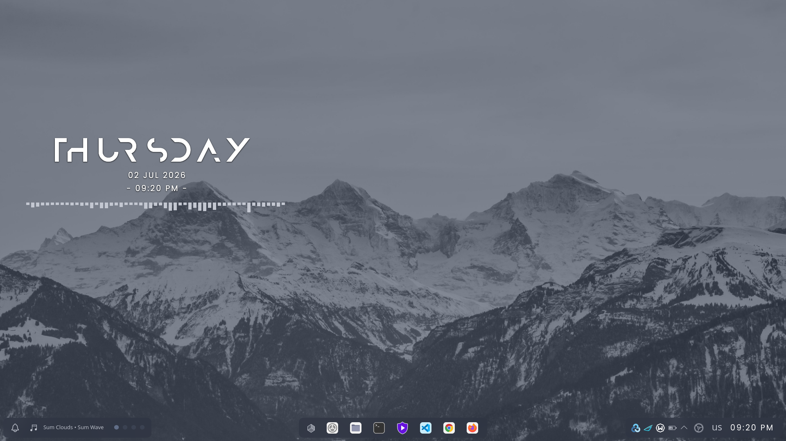
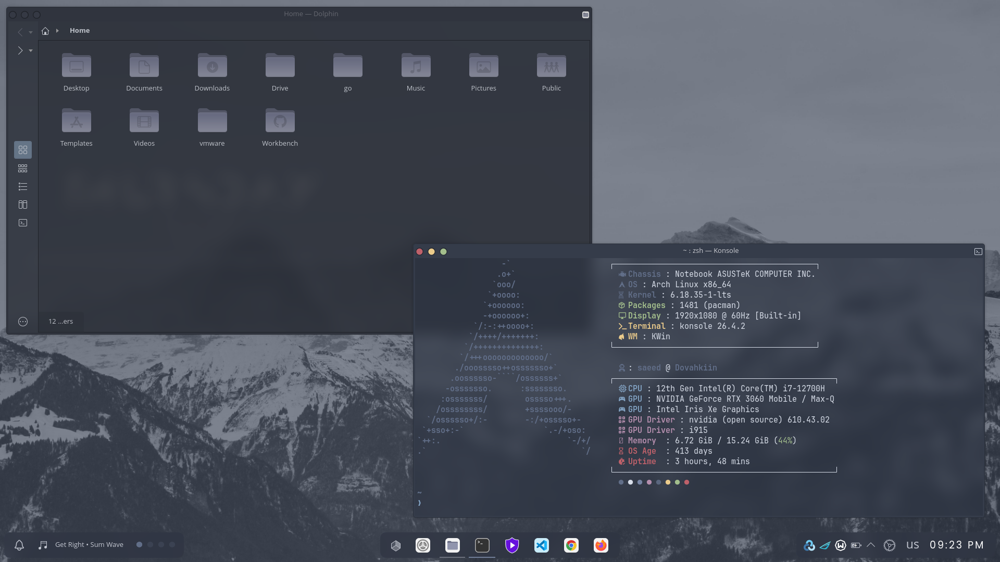
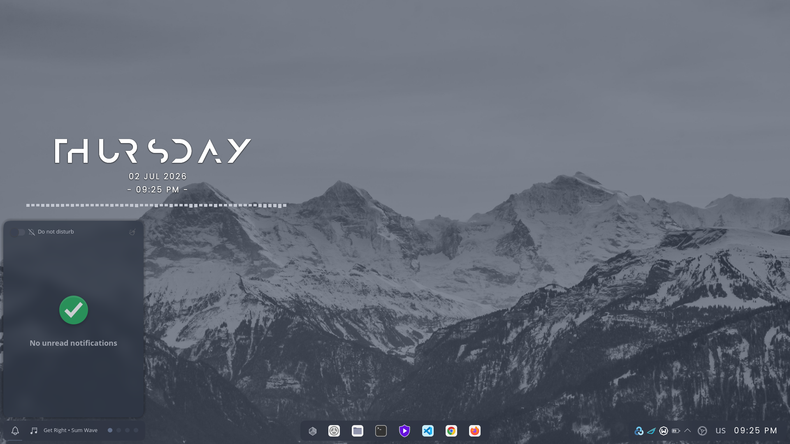
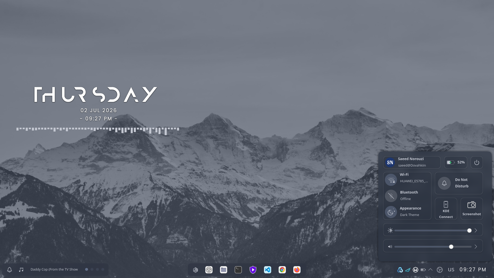
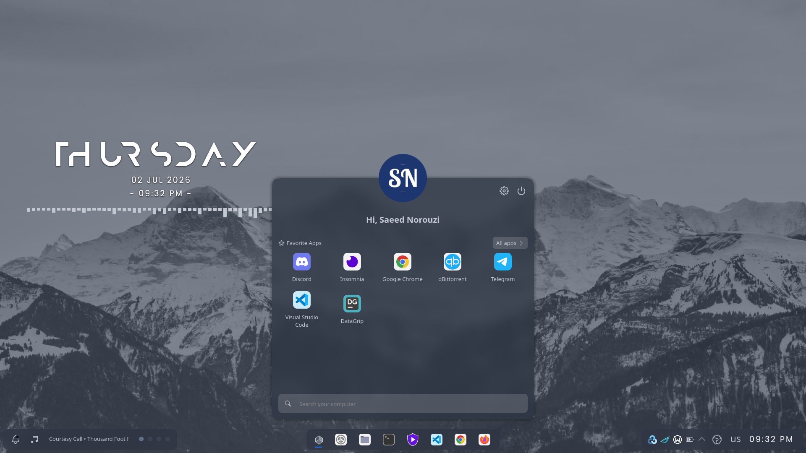
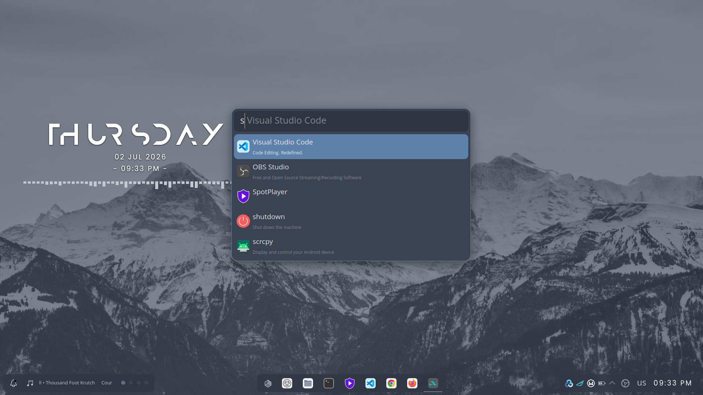
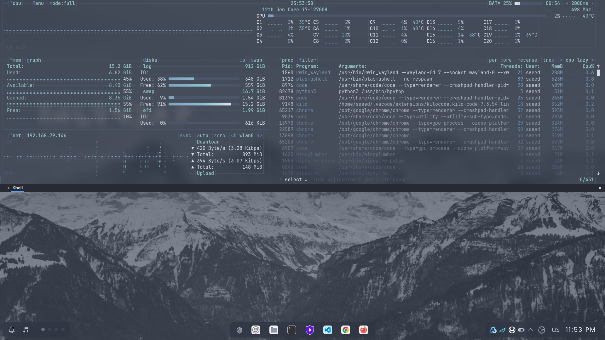
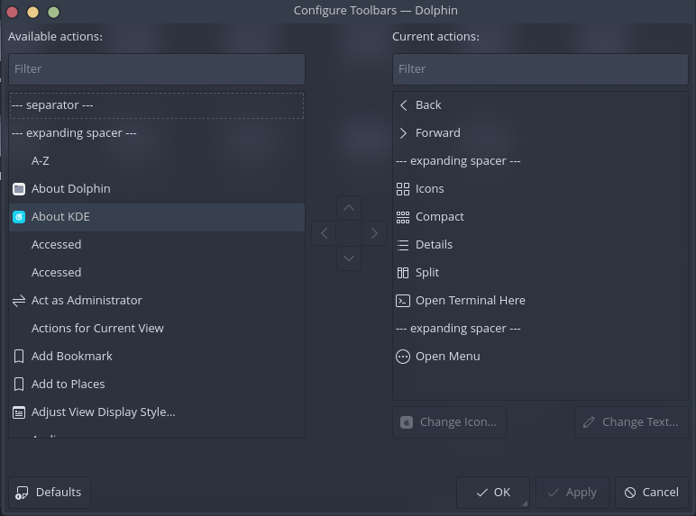

# KDE Plasma Nordic Customization

This guide provides step-by-step instructions for customizing the KDE Plasma desktop environment with a clean, professional Nordic theme. The techniques are inspired by the [LinuxScoop YouTube channel](https://www.youtube.com/@linuxscoop) and adapted for **Plasma 6**.

> **📝 Note:** This guide is actively maintained and tested on **KDE Plasma 6**. Some features from older videos may no longer work – this guide has been updated accordingly.

---

## Table of Contents

- [KDE Plasma Nordic Customization](#kde-plasma-nordic-customization)
	- [Table of Contents](#table-of-contents)
	- [Notice of Obsolescence](#notice-of-obsolescence)
	- [Final Result](#final-result)
	- [Prerequisites](#prerequisites)
		- [Required Packages](#required-packages)
		- [Recommended Packages](#recommended-packages)
	- [Part 1: Desktop Effects](#part-1-desktop-effects)
	- [How to Access Desktop Effects](#how-to-access-desktop-effects)
	- [Built-in Effects (No Installation Required)](#built-in-effects-no-installation-required)
	- [Effects That Require Manual Installation](#effects-that-require-manual-installation)
		- [Rounded Corners](#rounded-corners)
			- [Installation Steps](#installation-steps)
			- [Loading and Activating the Effect](#loading-and-activating-the-effect)
			- [Configuring the Effect](#configuring-the-effect)
			- [Uninstalling the Effect](#uninstalling-the-effect)
		- [Other Effects from KDE Store](#other-effects-from-kde-store)
	- [Part 2: Virtual Desktops \& Window Behavior](#part-2-virtual-desktops--window-behavior)
		- [Virtual Desktops](#virtual-desktops)
		- [Window Placement](#window-placement)
	- [Part 3: Task Switcher](#part-3-task-switcher)
	- [Part 4: Theme Configuration](#part-4-theme-configuration)
		- [4.1. Downloading Necessary Files](#41-downloading-necessary-files)
			- [4.1.1. Global Theme (Via KDE Store)](#411-global-theme-via-kde-store)
			- [4.1.2. Kvantum Theme (Manual Download)](#412-kvantum-theme-manual-download)
			- [4.1.3. Icon Theme](#413-icon-theme)
			- [4.1.4. Kvantum Package](#414-kvantum-package)
		- [4.2. Setting Up Directories and Moving Files](#42-setting-up-directories-and-moving-files)
		- [4.3. Applying Themes](#43-applying-themes)
			- [Step-by-Step Application](#step-by-step-application)
			- [Window Decoration Toolbar Buttons](#window-decoration-toolbar-buttons)
		- [4.4. Kvantum Configuration](#44-kvantum-configuration)
		- [4.5. Wallpaper](#45-wallpaper)
		- [4.6. Finalising Theme Changes](#46-finalising-theme-changes)
	- [Part 5: Desktop \& Panels Configuration](#part-5-desktop--panels-configuration)
		- [5.1. Installing Widgets](#51-installing-widgets)
		- [5.2. Bottom Center Panel](#52-bottom-center-panel)
		- [5.3. Bottom Right Panel](#53-bottom-right-panel)
		- [5.4. Bottom Left Panel](#54-bottom-left-panel)
		- [5.5. Desktop Widgets](#55-desktop-widgets)
	- [Part 6: Konsole Customization](#part-6-konsole-customization)
		- [Step 1: Create a New Profile](#step-1-create-a-new-profile)
		- [Step 2: Configure Appearance](#step-2-configure-appearance)
		- [Step 3: Edit the Theme (Optional)](#step-3-edit-the-theme-optional)
		- [Step 4: Apply and Test](#step-4-apply-and-test)
	- [Part 7: Yakuake Customization](#part-7-yakuake-customization)
		- [Applying the Theme](#applying-the-theme)
		- [Changing the Shortcut](#changing-the-shortcut)
	- [Part 8: Dolphin Customization](#part-8-dolphin-customization)
		- [Toolbar Configuration](#toolbar-configuration)
	- [Part 9: Google Chrome](#part-9-google-chrome)
	- [Troubleshooting](#troubleshooting)
	- [References \& Inspiration](#references--inspiration)

---

## Notice of Obsolescence

> **⚠️ Important:** Due to significant changes in **Plasma 6**, some plugins, software, and modules featured in the original YouTube videos are no longer compatible or installable. This guide has been updated to reflect the current state of KDE Plasma 6.

---

## Final Result

Here is what your desktop will look like after completing this guide:















---

## Prerequisites

Before starting, ensure your system meets the following requirements and has the necessary packages installed.

### Required Packages

| Package            | Purpose                             | Installation Command            |
| ------------------ | ----------------------------------- | ------------------------------- |
| `kvantum`          | Qt application styling              | `sudo pacman -S kvantum`        |
| `git`              | Cloning theme repositories          | `sudo pacman -S git`            |
| `curl` / `wget`    | Downloading files                   | `sudo pacman -S curl wget`      |
| `plasma-workspace` | KDE Plasma core (already installed) | –                               |
| `kde-gtk-config`   | GTK application theming             | `sudo pacman -S kde-gtk-config` |

### Recommended Packages

| Package                     | Purpose                               | Installation Command                               |
| --------------------------- | ------------------------------------- | -------------------------------------------------- |
| `google-chrome` / `firefox` | For applying browser themes           | `yay -S google-chrome` or `sudo pacman -S firefox` |
| `yakuake`                   | Drop-down terminal                    | `sudo pacman -S yakuake`                           |
| `konsole`                   | Terminal emulator (already installed) | –                                                  |

> **💡 Tip:** If you are using **EndeavourOS**, most of these packages are already installed. Only `kvantum` and `git` may need to be added.

---

## Part 1: Desktop Effects

Desktop effects enhance the visual experience of your desktop. The steps below enable a set of effects that create a smooth, elegant, and modern look.

## How to Access Desktop Effects

```plaintext
System Settings → Window Management → Desktop Effects
```

---

## Built-in Effects (No Installation Required)

Enable the following effects in the Desktop Effects settings window:

| Effect                                | Purpose                                               | Additional Settings                                         |
| ------------------------------------- | ----------------------------------------------------- | ----------------------------------------------------------- |
| **Blur**                              | Adds a subtle blur effect behind translucent windows. | Set **Blur strength** to `4` and **Noise strength** to `0`. |
| **Sheet**                             | Enhances window animations.                           | Default settings are fine.                                  |
| **Dim Inactive**                      | Visually distinguishes active windows.                | Default settings are fine.                                  |
| **Dim Screen for Administrator Mode** | Dims the screen when entering admin mode.             | Default settings are fine.                                  |
| **Slide Back**                        | Adds smooth sliding animation between desktops.       | Default settings are fine.                                  |
| **Mouse Mark**                        | Allows drawing temporary marks on the screen.         | Configure shortcut keys if needed.                          |
| **Magic Lamp**                        | Genie-like animation when minimizing windows.         | Set animation duration to **400 ms**.                       |

---

## Effects That Require Manual Installation

### Rounded Corners

The **Rounded Corners** KWin effect adds rounded corners to your windows and an optional outline, giving your desktop a modern, polished look. This effect is no longer available directly from the KDE Store for Plasma 6. It must be built and installed manually from its GitHub repository.

> **⚠️ Important:** This effect is maintained for KDE Plasma versions **5.27 to 6.6+**. The manual build process requires development tools and may need to be repeated after KWin updates unless you install the autorun script.

#### Installation Steps

**Step 1: Install Build Dependencies**

```bash
sudo pacman -S git cmake extra-cmake-modules base-devel vulkan-headers
```

**Step 2: Clone the Repository**

```bash
git clone https://github.com/matinlotfali/KDE-Rounded-Corners
cd KDE-Rounded-Corners
```

**Step 3: Build the Effect**

```bash
mkdir build
cd build
cmake ..
cmake --build . -j
```

The `-j` flag enables parallel building, which speeds up the compilation process.

**Step 4: Install the Effect**

```bash
sudo make install
```

> **⚠️ Warning:** Building for X11 requires the `-DKWIN_X11=ON` flag: `cmake .. -DKWIN_X11=ON`. The default build is for Wayland, which is the recommended configuration for Plasma 6.

#### Loading and Activating the Effect

**Step 5: Load the Effect**

To activate the effect without logging out, run the following command inside the `build` directory:

```bash
sh ../tools/load.sh
```

Alternatively, you can simply **log out and log back in** to load the effect automatically.

**Step 6: (Optional) Auto-Install After KWin Updates**

After each KWin package update, the effect may become incompatible and fail to load without a rebuild. To automate the reinstallation process, run the following command inside the `build` directory:

```bash
sh ../tools/install-autorun-test.sh
```

This script adds a `.desktop` file inside the `autorun` directory, which checks if the effect is still compatible. If it is incompatible, the script will automatically rebuild and reinstall the effect. It uses `qdbus` to show a progress bar. On Plasma 6, you may need to install `qtchooser` manually:

```bash
sudo pacman -S qt5-tools
```

#### Configuring the Effect

**Step 7: Adjust Settings**

Once the effect is loaded, you can configure it in:

```plaintext
System Settings → Workspace Behavior → Desktop Effects → Rounded Corners
```

| Setting               | Value    | Purpose                                         |
| --------------------- | -------- | ----------------------------------------------- |
| **Corner Radius**     | `10`     | Creates a subtle, modern rounded corner effect. |
| **Primary Outline**   | Disabled | Removes the outline for a cleaner look.         |
| **Secondary Outline** | Disabled | Removes the second outline for a cleaner look.  |

> **💡 Tip:** You can also exclude specific windows (e.g., maximised or tiled windows) from the effect, disable it for fullscreen applications, or adjust the outline colours for active and inactive windows.

#### Uninstalling the Effect

To fully uninstall the effect, run the following commands inside the `build` directory:

```bash
sh ../tools/unload.sh
sudo make uninstall
```

### Other Effects from KDE Store

The following effects are available from the **KDE Store**:

| Effect                             | Search Term               | Additional Settings        |
| ---------------------------------- | ------------------------- | -------------------------- |
| **Kinetic Animations 6: Maximize** | "Kinetic Animations 6"    | Default settings are fine. |
| **Geometry Change by Ftpr**        | "Geometry Change by Ftpr" | Default settings are fine. |

To install these effects:

1. Open **System Settings → Window Management → Desktop Effects**.
2. Click **Get New Effects...**.
3. Search for the effect name.
4. Click **Install** and then enable it.

---

## Part 2: Virtual Desktops & Window Behavior

### Virtual Desktops

Organise your workspace with multiple virtual desktops.

```plaintext
System Settings → Window Management → Virtual Desktops
```

| Setting                | Value | Purpose                                        |
| ---------------------- | ----- | ---------------------------------------------- |
| **Rows**               | `1`   | Arrange desktops in a single row.              |
| **Number of Desktops** | `4`   | Add four virtual desktops for task separation. |

### Window Placement

Control how new windows are positioned.

```plaintext
System Settings → Window Management → Window Behavior → Advanced
```

| Setting              | Value      | Purpose                                    |
| -------------------- | ---------- | ------------------------------------------ |
| **Window Placement** | `Centered` | New windows appear centered on the screen. |

---

## Part 3: Task Switcher

Customise the task switcher for better visual clarity.

```plaintext
System Settings → Window Management → Task Switcher → main
```

| Setting                             | Value            | Purpose                                |
| ----------------------------------- | ---------------- | -------------------------------------- |
| **Show Selected Window**            | ❌ Unchecked     | Declutters the switcher interface.     |
| **Switch Style**                    | `Thumbnail Grid` | Displays previews of open windows.     |
| **Include Show Desktop**            | ✅ Checked       | Adds the desktop as a switchable item. |
| **Only one window per application** | ✅ Checked       | Groups windows by application.         |

---

## Part 4: Theme Configuration

### 4.1. Downloading Necessary Files

#### 4.1.1. Global Theme (Via KDE Store)

1. Open **System Settings → Colors & Themes → Global Theme**.
2. Click **Get New...**.
3. Search for **Nordic Darker LAF Plasma 6 by eliverlara**.
4. Click **Install**.

> **📝 Note:** This installs the global theme but does **not** include the Kvantum application style.

#### 4.1.2. Kvantum Theme (Manual Download)

The Kvantum application style files are not included with the theme. Download them from the author's GitHub repository:

```bash
git clone https://github.com/EliverLara/Nordic.git ~/Downloads/Nordic
```

#### 4.1.3. Icon Theme

Download and install the **Colloid icon theme**:

```bash
git clone https://github.com/vinceliuice/Colloid-icon-theme.git ~/Downloads/Colloid-icon-theme
cd ~/Downloads/Colloid-icon-theme
./install.sh -s nord -t grey
```

#### 4.1.4. Kvantum Package

Install Kvantum (if not already installed):

```bash
sudo pacman -S kvantum
```

---

### 4.2. Setting Up Directories and Moving Files

Copy the Kvantum theme files to the correct location:

```bash
cp -r ~/Downloads/Nordic/kde/kvantum ~/.config/Kvantum
```

> **💡 Tip:** If the `~/.config/Kvantum` directory doesn't exist, this command will create it.

---

### 4.3. Applying Themes

#### Step-by-Step Application

| Step   | Setting             | Location                                                                    | Selection                                                                     |
| ------ | ------------------- | --------------------------------------------------------------------------- | ----------------------------------------------------------------------------- |
| **1**  | Global Theme        | System Settings → Colors & Themes → Global Theme                            | `Nordic-darker`                                                               |
| **2**  | Application Style   | System Settings → Colors & Themes → Application Style                       | `Kvantum-dark`                                                                |
| **3**  | GTK Theme           | System Settings → Colors & Themes → Application Style → Configure GNOME/GTK | Search and install `Nordic` → Select `Nordic-darker-v40`                      |
| **4**  | Plasma Style        | System Settings → Colors & Themes → Plasma Style                            | `Nordic-darker`                                                               |
| **5**  | Colors              | System Settings → Colors & Themes → Colors                                  | `Nordic-Darker`                                                               |
| **6**  | Window Decoration   | System Settings → Colors & Themes → Window Decoration                       | `Nordic`                                                                      |
| **7**  | Fonts               | System Settings → Text & Fonts → Fonts                                      | Choose your preferred font; set fixed width to `JetBrainsMono Nerd Font 10pt` |
| **8**  | Icons               | System Settings → Colors & Themes → Icons                                   | `Colloid-Grey-Nord-Dark`                                                      |
| **9**  | Cursors             | System Settings → Colors & Themes → Pointers                                | `Nordic-cursors`                                                              |
| **10** | Splash Screen       | System Settings → Colors & Themes → Splash Screen                           | `Nordic-darker`                                                               |
| **11** | Login Screen (SDDM) | System Settings → Colors & Themes → Login Screen (SDDM)                     | `Nordic-darker-Plasma-6`                                                      |

#### Window Decoration Toolbar Buttons

1. Open **System Settings → Colors & Themes → Window Decoration**.
2. Click **Configure Toolbar Buttons...**.
3. Remove:
   - More action for this window
   - On all desktops
   - Context help
4. Move **Close**, **Minimize**, and **Maximize** to the **left side** in this order:

   ```plaintest
   [Close] [Minimize] [Maximize]
   ```

---

### 4.4. Kvantum Configuration

1. Launch **Kvantum Manager** from your application menu.
2. In the Kvantum Manager, locate the theme selector.
3. Change the theme to **Nordic-bluish**.
4. Click **Apply** (or the equivalent button).

> **💡 Tip:** If `Nordic-bluish` does not appear, ensure you copied the Kvantum files correctly in Section 4.2.

---

### 4.5. Wallpaper

Set the desktop wallpaper:

1. Right‑click on the desktop → **Configure Desktop and Wallpaper**.
2. Navigate to and select `Nordic-mountain-wallpaper`.
3. Click **OK**.

> **📝 Note:** The Nordic wallpaper is included with the **Nordic-darker** global theme. It should be available in your wallpaper list.

---

### 4.6. Finalising Theme Changes

Log out and log back in, or restart your system for all changes to take effect.

```bash
# Log out via the application launcher, or use the terminal:
plasmashell --replace &
```

> **⚠️ Important:** Restarting your system is recommended to ensure all services and themes are fully applied.

---

## Part 5: Desktop & Panels Configuration

### 5.1. Installing Widgets

1. Right‑click on the desktop → **Enter Edit Mode**.
2. Click **Add or Manage Widgets...**.
3. Search for and install the following widgets from the KDE Store:

| Widget                                  | Purpose                                    | KDE Store Link                                |
| --------------------------------------- | ------------------------------------------ | --------------------------------------------- |
| **Andromeda Launcher**                  | Application launcher                       | [Link](https://store.kde.org/p/2144212)       |
| **Modern Clock**                        | Advanced clock widget                      | [Link](https://store.kde.org/p/2135653)       |
| **Dot Desktop Indicator**               | Virtual desktop indicator (replaces Ginti) | [Link](https://www.opendesktop.org/p/2353924) |
| **Spectrum Audio Emulator**             | Audio visualiser                           | [Link](https://store.kde.org/p/2201084)       |
| **KDE Control Station**                 | System control panel                       | [Link](https://www.pling.com/p/2196105)       |
| **Plasmusic Toolbar**                   | Music player controls                      | [Link](https://store.kde.org/p/2088872)       |
| **Simple Separator for panel plasma 6** | simple but working separator               | [Link](https://store.kde.org/p/2137418)       |

---

### 5.2. Bottom Center Panel

1. Right‑click on the desktop → **Enter Edit Mode**.
2. Click on the bottom panel and remove all widgets except **Icons-Only Task Manager**.
3. Configure the panel:

| Setting        | Value           |
| -------------- | --------------- |
| **Width**      | `Fit content`   |
| **Visibility** | `Dodge windows` |
| **Alignment**  | `Center`        |
| **Height**     | `49`            |

4. Add **Andromeda Launcher** to the far left side of the panel.
   - Change the icon to your preferred icon.
   - Set **Launcher Positioning** to `Horizontal Center`.
   - Enable **Floating**.
   - Enable **Use system font setting**.

5. Add **Simple Separator** between Andromeda Launcher and Icon-Only Task Manager

6. Pin your most used applications to the panel (right‑click an app in the launcher → **Add to Panel**).

---

### 5.3. Bottom Right Panel

1. Right‑click on the desktop → **Enter Edit Mode**.
2. Add an empty panel to the **bottom right** side of the screen.
3. Configure the panel:

| Setting        | Value           |
| -------------- | --------------- |
| **Width**      | `Fit content`   |
| **Visibility** | `Dodge windows` |
| **Height**     | `49`            |

4. Click **Add widget** and add the following widgets from **right to left**:

| Order | Widget                  | Configuration                                                                                                                                                                               |
| ----- | ----------------------- | ------------------------------------------------------------------------------------------------------------------------------------------------------------------------------------------- |
| 1     | **Modern Clock**        | Disable Date, Disable Day, Empty Style Character                                                                                                                                            |
| 2     | **Simple Separator**    | Default                                                                                                                                                                                     |
| 3     | **Keyboard Layout**     | Default                                                                                                                                                                                     |
| 4     | **Simple Separator**    | Default                                                                                                                                                                                     |
| 5     | **KDE Control Station** | Layout: `Control Center`; Enable: Animations, Show borders; Quick Toggles: Color Scheme Switcher, Screenshot Button; Disable: Brightness Control; Volume Control: `Thin slider`; Scale: 110 |
| 6     | **System Tray**         | Default                                                                                                                                                                                     |

---

### 5.4. Bottom Left Panel

1. Right‑click on the desktop → **Enter Edit Mode**.
2. Add an empty panel to the **bottom left** side of the screen.
3. Configure the panel:

| Setting        | Value           |
| -------------- | --------------- |
| **Width**      | `Fit content`   |
| **Visibility** | `Dodge windows` |
| **Height**     | `49`            |

4. Click **Add widget** and add the following widgets from **left to right**:

| Order | Widget                    | Configuration                                                                                                                                                                                                                                                                                                                                                               |
| ----- | ------------------------- | --------------------------------------------------------------------------------------------------------------------------------------------------------------------------------------------------------------------------------------------------------------------------------------------------------------------------------------------------------------------------- |
| 1     | **Notifications**         | Default                                                                                                                                                                                                                                                                                                                                                                     |
| 2     | **Simple Separator**      | Default                                                                                                                                                                                                                                                                                                                                                                     |
| 3     | **Plasmusic Toolbar**     | Disable: Show skip backward, Show play/pause, Show skip forward                                                                                                                                                                                                                                                                                                             |
| 4     | **Dot Desktop Indicator** | Open the widget's settings and apply the following values: <br><br> • **Inactive symbol**: `●`<br> • **Active symbol**: `●`<br> • **Font size**: `14`<br> • **Spacing**: `6`<br> • **Inactive color**: `#3b4252`<br> • **Active color**: `#616e88`<br> • **Active symbol bold**: Disabled<br> • **Dim inactive symbol**: Disabled<br> • **Mouse wheel switching**: Disabled |

> **📝 Note:** The **Dot Desktop Indicator** is the recommended replacement for the now‑deprecated **Ginti** widget. It is a lightweight, panel‑friendly virtual desktop indicator for Plasma 6, showing one dot per desktop (hollow for inactive, solid for active). The widget supports mouse‑wheel switching, configurable symbols, custom colors, and bold/dim effects.

---

### 5.5. Desktop Widgets

1. Right‑click on the desktop → **Enter Edit Mode**.
2. Click **Add or Manage Widgets...**.
3. Add the following widgets to the desktop:

- **Modern Clock** – Position as desired.
- **Spectrum Audio Emulator** – Position as desired.

---

## Part 6: Konsole Customization

### Step 1: Create a New Profile

1. Open Konsole.
2. Go to **Settings → Manage Profiles...**.
3. Click **New...** and name the profile **Nordic**.
4. Click **OK** to create the profile, then select it and click **Edit...**.

### Step 2: Configure Appearance

1. In the profile editor, navigate to the **Appearance** tab.
2. Set the font to **JetBrainsMono Nerd Font 12pt**.
3. Click **Get New...** next to the color scheme dropdown.
4. Search for and install **Nordic**.
5. Select the **Nordic** theme and click **Apply**.

### Step 3: Edit the Theme (Optional)

If you want to customise the theme further:

1. In the Appearance tab, click **Edit...** next to the theme name.
2. Enable **Blur background** and set the blur strength to **15–25** (based on your preference).
3. Adjust the colors to match the table below:

| Name       | Color  | Intense Color | Faint Color |
| ---------- | ------ | ------------- | ----------- |
| Foreground | d8dee9 | d8dee9        | d8dee9      |
| Background | 2e3440 | 2e3440        | 2e3440      |
| Color1     | 3b4252 | 616e88        | 3b4252      |
| Color2     | bf616a | bf616a        | bf616a      |
| Color3     | a3be8c | a3be8c        | a3be8c      |
| Color4     | ebcb8b | ebcb8b        | ebcb8b      |
| Color5     | 5a667e | 81a1c1        | 81a1c1      |
| Color6     | b48ead | b48ead        | b48ead      |
| Color7     | 7684a3 | 3e4556        | 88c0d0      |
| Color8     | d8dee9 | d8dee9        | d8dee9      |

### Step 4: Apply and Test

- Click **Apply** and **OK** to save all changes.
- Close and reopen Konsole for the changes to take effect.

> **💡 Tip:** To make the Nordic profile the default, right‑click the profile in **Manage Profiles** and select **Set as Default**.

---

## Part 7: Yakuake Customization

Yakuake is a drop‑down terminal that integrates seamlessly with KDE. Customise it as follows:

| Setting              | Value                                        |
| -------------------- | -------------------------------------------- |
| **Theme**            | `Yakuake Qogir Materia Dark` (by Diegons490) |
| **Height**           | `60%`                                        |
| **Shortcut Key**     | `Ctrl + `` (backtick)                        |
| **System Tray Icon** | Disable (remove from system tray)            |

### Applying the Theme

1. Open Yakuake (`F12` by default).
2. Click the **Settings** icon (gear) → **Manage Profiles...**.
3. Select the theme from the dropdown.
4. Click **Apply**.

### Changing the Shortcut

1. Open **System Settings → Shortcuts**.
2. Search for **Yakuake**.
3. Change the shortcut to `Ctrl + ``.

---

## Part 8: Dolphin Customization

Customise Dolphin, KDE's file manager, as follows:

| Feature                           | Action                                                            |
| --------------------------------- | ----------------------------------------------------------------- |
| **"Open Terminal Here" Shortcut** | Change to `Super + R` (System Settings → Shortcuts → Dolphin)     |
| **Zone Slider**                   | Right‑click on the zone slider → Uncheck **Show Zone Slider**     |
| **Toolbar Position**              | Unlock toolbar position → Move to the **left side** of the window |
| **Split Option**                  | Right‑click on toolbar → Uncheck **Split**                        |

### Toolbar Configuration

Configure the toolbar items as shown below:



---

## Part 9: Google Chrome

To ensure Google Chrome follows the Nordic theme:

1. Open Google Chrome.
2. Type `chrome://flags` in the address bar and press **Enter**.
3. Search for **GTK**.
4. Enable **Use GTK theme for title bar**.
5. Restart Chrome.

> **💡 Tip:** For Firefox, you can install the [Nord theme from the Firefox Add‑on Store](https://addons.mozilla.org/en-US/firefox/addon/nord-theme/).

---

## Troubleshooting

| Problem                                                   | Solution                                                                                                                                               |
| --------------------------------------------------------- | ------------------------------------------------------------------------------------------------------------------------------------------------------ |
| **Kvantum theme does not appear**                         | Ensure you copied the Kvantum files correctly: `ls ~/.config/Kvantum/`. If empty, re‑copy from the Nordic repository.                                  |
| **Widgets fail to install from KDE Store**                | Check your internet connection. Alternatively, download `.plasmoid` files and install them manually via **Add or Manage Widgets → Install from File**. |
| **Panel settings reset after logout**                     | Ensure you are in **Edit Mode** and click **Save** (if prompted). Some settings require a logout to persist.                                           |
| **Konsole colors do not match**                           | You may need to set the **Nordic** profile as the default. Also ensure you selected the correct theme in the Appearance tab.                           |
| **Yakuake theme not applying**                            | The theme must be installed from the KDE Store first. Search for "Yakuake Qogir Materia Dark" and install it.                                          |
| **GTK apps (e.g., Chrome, GIMP) do not follow the theme** | Ensure `kde-gtk-config` is installed and the GTK theme is set to `Nordic-darker-v40` (see Section 4.3).                                                |
| **Rounded Corners effect does not work**                  | The effect may not work on all hardware. Disable it if you experience graphical glitches.                                                              |

---

## References & Inspiration

- **YouTube: [KDE Plasma Desktop Nord Color Palette](https://www.youtube.com/watch?list=PLKopOf5__2tj0aVUX68Kyr9rNltrLTWDq&v=2GYT7BK41zk)** – Original video that inspired this guide.
- **YouTube: [How to Make KDE Plasma 6 Elegant and Professional](https://www.youtube.com/watch?v=N-Hvrlxn1aU)** – Additional inspiration for Plasma 6.
- **GitHub: [Nordic Theme by EliverLara](https://github.com/EliverLara/Nordic)** – The core theme used in this guide.
- **GitHub: [Colloid Icon Theme](https://github.com/vinceliuice/Colloid-icon-theme)** – Icon pack used in this guide.
- **KDE Store: [Andromeda Launcher](https://store.kde.org/p/2144212)** – Application launcher widget.
- **KDE Store: [Modern Clock](https://store.kde.org/p/2135653)** – Advanced clock widget.
- **KDE Store: [Dot Desktop Indicator](https://www.opendesktop.org/p/2353924)** – Desktop pager widget.

---

Your KDE Plasma desktop is now fully customized with the Nordic theme. Enjoy the clean, professional, and visually cohesive experience!
