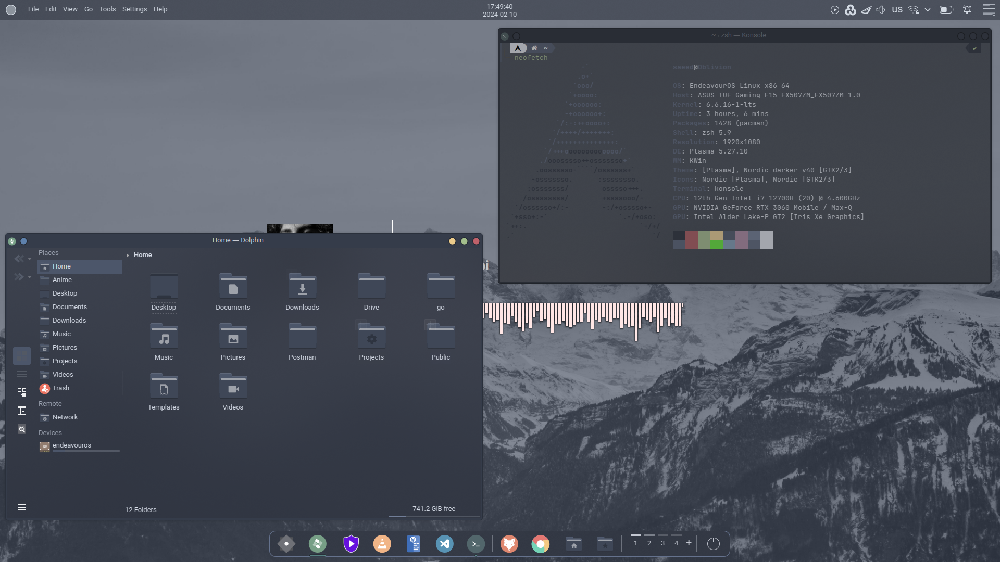
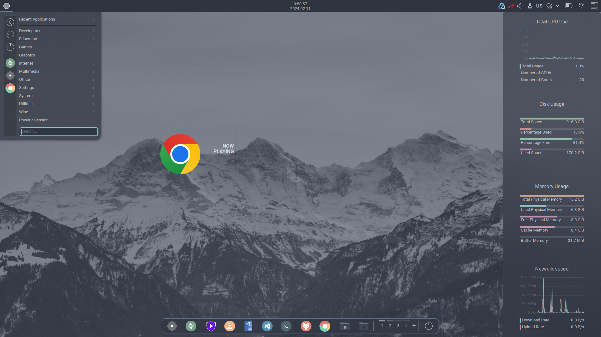
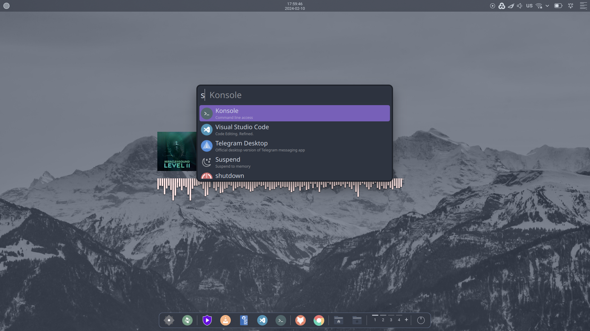
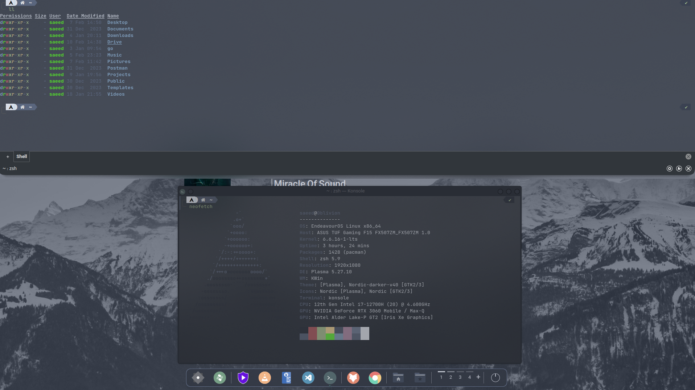
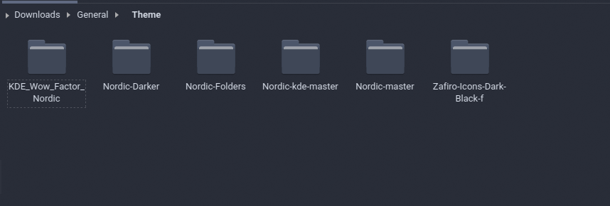
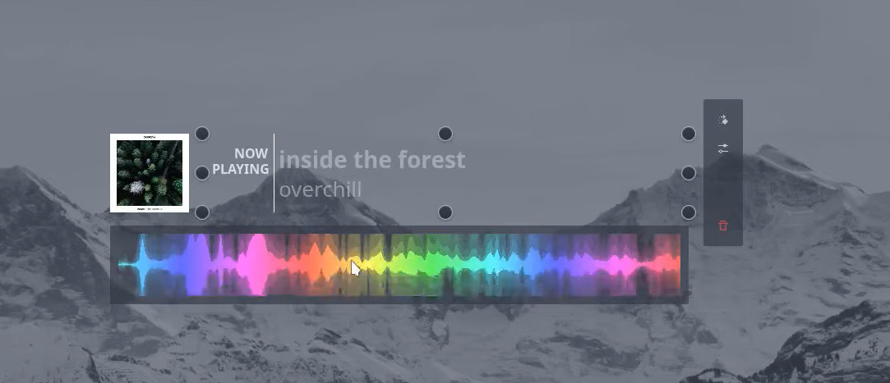
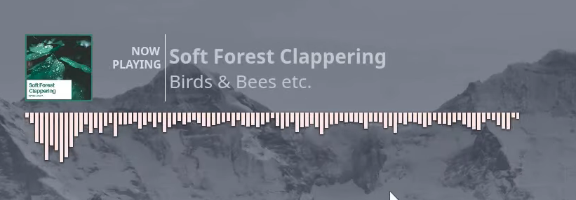
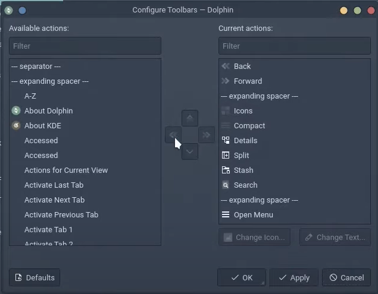

# KDE Plasma Nordic Customization (Deprecated)

This section provides guidance on customizing KDE Plasma desktop environments, drawing inspiration from a tutorial on the [LinuxScoop](https://www.youtube.com/@linuxscoop) YouTube channel. The original video can be found [here](https://www.youtube.com/watch?list=PLKopOf5__2tj0aVUX68Kyr9rNltrLTWDq&v=2GYT7BK41zk&feature=youtu.be).

Please note that as the video is 2 years old, some themes, icons, and other elements may no longer be available or may not function as intended due to updates. For this guide, I've provided links to download the older versions of these files that were confirmed to work well together.

## Notice of obsolescence

Due to the major changes in **Plasma 6**, some plugins, software and modules used in this guide can no longer be installed and used, as a result of which this guide is outdated and can no longer be implemented.

## Table of Contents

- [KDE Plasma Nordic Customization (Deprecated)](#kde-plasma-nordic-customization-deprecated)
  - [Notice of obsolescence](#notice-of-obsolescence)
  - [Table of Contents](#table-of-contents)
  - [Final Result](#final-result)
  - [Installing Plasma Customization Saver Widget](#installing-plasma-customization-saver-widget)
  - [Enhance Desktop Experience with Additional Effects](#enhance-desktop-experience-with-additional-effects)
  - [Customize Desktop Layout](#customize-desktop-layout)
  - [Customize Window Behavior](#customize-window-behavior)
  - [Customize Task Switcher](#customize-task-switcher)
  - [Enhance Desktop with KWin Scripts](#enhance-desktop-with-kwin-scripts)
  - [Install Nerd Font](#install-nerd-font)
  - [Theme Configuration](#theme-configuration)
    - [Downloading Necessary Files](#downloading-necessary-files)
    - [Extracting Downloaded Files](#extracting-downloaded-files)
    - [Setting Up Directories and Moving Files](#setting-up-directories-and-moving-files)
    - [Applying Themes](#applying-themes)
    - [Kvantum Configuration](#kvantum-configuration)
    - [Wallpaper](#wallpaper)
  - [Installing and Configuring Widgets](#installing-and-configuring-widgets)
    - [Top Panel Widgets](#top-panel-widgets)
    - [Bottom Dock Widgets](#bottom-dock-widgets)
    - [Plasmoids Desktop Center Widgets](#plasmoids-desktop-center-widgets)
    - [Installing Dependencies](#installing-dependencies)
    - [Customizing Panon Widget](#customizing-panon-widget)
      - [General Settings](#general-settings)
      - [Visual Effects](#visual-effects)
      - [Back-end Configuration](#back-end-configuration)
      - [Color Adjustment](#color-adjustment)
      - [Remove the Background](#remove-the-background)
      - [Result](#result)
  - [Installing and Configuring Latte-Dock](#installing-and-configuring-latte-dock)
    - [Installing Latte-Dock](#installing-latte-dock)
    - [Configuring Latte-Dock](#configuring-latte-dock)
  - [Login Screen (SDDM)](#login-screen-sddm)
    - [Configuring SDDM](#configuring-sddm)
    - [Screen Locking Settings](#screen-locking-settings)
  - [Konsole Customization](#konsole-customization)
  - [Yakuake Customization](#yakuake-customization)
  - [Dolphin Customization](#dolphin-customization)
  - [Google chrome](#google-chrome)
  - [Save New Desktop Configurations](#save-new-desktop-configurations)

## Final Result









## Installing Plasma Customization Saver Widget

The Plasma Customization Saver Widget is a utility designed for the KDE Plasma desktop environment that enables users to effortlessly save and restore their desktop environment configurations. This widget serves as a convenient solution for users who frequently customize their KDE Plasma desktop but want to easily revert to their preferred settings or share their configurations with others.

**Installation of Plasma Customization Saver Widget and Saving Default DE Configurations:**

To install the Plasma Customization Saver Widget:

1. **Access the KDE Plasma Widget Toolbox:** Open the KDE Plasma desktop environment and navigate to the widget toolbox.

2. **Search for the Customization Saver Widget:** In the widget toolbox, search for the "Customization Saver" widget.

3. **Install the Widget:** Once located, click on the widget to install it. Follow any on-screen prompts to complete the installation process.

4. **Add the Widget to the Taskbar:** After installation, add the Customization Saver widget to your taskbar by dragging it from the widget toolbox onto your taskbar.

5. **Save Default Desktop Configurations:** To save your default desktop configurations, simply interact with the Customization Saver widget and follow the prompts to save your current desktop layout, including themes, icons, widgets, and any other customizations you've made.

By utilizing the Plasma Customization Saver Widget, KDE Plasma users can efficiently manage and preserve their desktop environment customizations, simplifying the process of maintaining and sharing personalized configurations.

## Enhance Desktop Experience with Additional Effects

Enhancing your desktop experience involves enabling additional effects that can improve visual aesthetics and usability. These effects can range from subtle visual enhancements to functional improvements, providing a more dynamic and personalized desktop environment.

**Steps to Enable Additional Desktop Effects:**

1. **Enable "Sheet":**

   - Navigate to System Settings > Workspace Behavior > Desktop Effects.
   - Check the box next to "Sheet" to activate the effect, enhancing window animations for a smooth and elegant appearance.

2. **Enable "Dim Inactive":**

   - Navigate to System Settings > Workspace Behavior > Desktop Effects.
   - Check the box next to "Dim Inactive" to visually distinguish between active and inactive windows, improving focus and productivity.

3. **Enable "Dim Screen for Administrator Mode":**

   - Navigate to System Settings > Workspace Behavior > Desktop Effects.
   - Check the box next to "Dim Screen for Administrator Mode" to dim the screen when entering administrator mode, signaling a change in system permissions.

4. **Enable "Slide Back":**

   - Navigate to System Settings > Workspace Behavior > Desktop Effects.
   - Check the box next to "Slide Back" to add a smooth sliding animation when switching between desktops or virtual workspaces, enhancing navigation fluidity.

5. **Install and Enable "Maximize":**

   - Navigate to System Settings > Workspace Behavior > Desktop Effects.
   - Install the "Maximize" effect if not already available in the list of effects.
   - Check the box next to "Maximize" to optimize window resizing, ensuring windows expand seamlessly to fill the screen for maximum viewing space.

6. **Morphing Popups:**

   - Navigate to System Settings > Workspace Behavior > Desktop Effects.
   - Check the box next to "Wobbly Windows" to add a fun and dynamic wobbling effect to windows when moving or resizing them, enhancing visual appeal and interactivity.

7. **Enable "Scale":**
   - Navigate to System Settings > Workspace Behavior > Desktop Effects.
   - Check the box next to "Scale" to enhance window management by providing a scaled view of all open windows, facilitating easy navigation and organization.

## Customize Desktop Layout

Customizing your desktop layout allows you to optimize your workspace for productivity and organization. By adjusting the number of rows and adding additional desktops, you can tailor your desktop environment to suit your workflow and multitasking needs.

**Steps to Add and Edit Visual Desktops:**

1. **Change Rows to 1:**

   - Navigate to System Settings > Workspace Behavior > Virtual Desktops.
   - Adjust the setting for "Rows" to 1 to organize your virtual desktops in a single row, maximizing screen space and simplifying navigation.

2. **Add 4 Desktops:**
   - Navigate to System Settings > Workspace Behavior > Virtual Desktops.
   - Locate the option to add virtual desktops and increase the count to 4.
   - Adding multiple desktops allows you to compartmentalize tasks and applications, making it easier to switch between different workspaces and maintain a clutter-free desktop environment.

## Customize Window Behavior

Customizing window behavior allows you to control how windows are positioned and interact with other applications. By adjusting settings such as window placement and application permissions, you can enhance usability and streamline your desktop experience.

**Steps to Customize Window Behavior:**

1. **Change "Window Placement" to "Centered":**

   - Navigate to System Settings > Window Management > Window Behavior > Advanced.
   - Locate the option for "Window Placement" and set it to "Centered." This ensures that new windows are positioned at the center of the screen by default, providing a consistent and organized layout.

2. **Uncheck "Allow Apps to ...":**
   - Navigate to System Settings > Window Management > Window Behavior > Advanced.
   - Find the option to "Allow Apps to ..." and uncheck it. This disables the feature that allows applications to manage their own window placement, giving you more control over how windows are arranged on your desktop.

## Customize Task Switcher

The task switcher is a crucial component of your desktop environment, allowing you to seamlessly navigate between open applications and manage your workflow efficiently. By customizing task switcher settings, you can enhance visual clarity and streamline the process of switching between tasks.

**Steps to Customize Task Switcher:**

1. **Uncheck "Show Selected Window":**

   - Navigate to System Settings > Window Management > Task Switcher > main.
   - Disable the option for "Show Selected Window" to declutter the task switcher interface and focus solely on active applications.

2. **Change Switch Style to "Thumbnail Grid":**

   - Navigate to System Settings > Window Management > Task Switcher > main.
   - Select "Thumbnail Grid" as the switch style to display previews of open windows, making it easier to identify and switch between applications visually.

3. **Check "Include Show Desktop":**
   - Navigate to System Settings > Window Management > Task Switcher > main.
   - Enable the option to "Include Show Desktop" to include the desktop as a switchable item in the task switcher, providing quick access to the desktop environment alongside open applications.

## Enhance Desktop with KWin Scripts

KWin scripts are powerful tools that extend the functionality of the KDE Plasma desktop environment, allowing users to add additional features and customization options. By installing and enabling specific KWin scripts, you can enhance visual aesthetics, improve workflow efficiency, and customize your desktop experience to suit your preferences.

**Steps to Enhance Desktop with KWin Scripts:**

1. **Install and Enable "Force Blur" Script:**

   - Navigate to System Settings > Window Management > KWin Scripts.
   - Install the "Force Blur" script and enable it to add a visually appealing blur effect to windows, enhancing the overall aesthetic of your desktop.

2. **Install and Enable "Latte Window Colors" Script:**

   - Navigate to System Settings > Window Management > KWin Scripts.
   - Install the "Latte Window Colors" script and enable it to customize the color scheme of window borders and decorations, allowing for personalized visual enhancements.

3. **Install and Enable "Latte Activate Launcher Menu" Script:**

   - Navigate to System Settings > Window Management > KWin Scripts.
   - Install the "Latte Activate Launcher Menu" script and enable it to add functionality that activates the launcher menu when hovering over the desktop edge, improving accessibility and workflow efficiency.

## Install Nerd Font

Nerd Fonts are specialized fonts that include a wide range of icons and glyphs, making them ideal for developers and enthusiasts who require additional symbols in their terminal or code editor. Installing a Nerd Font like JetBrainsMono enhances the appearance and functionality of various applications by providing access to a vast library of icons and symbols.

**Steps to Install JetBrainsMono Nerd Font:**

1. **Download JetBrainsMono Nerd Font:**
   - Download the JetBrainsMono Nerd Font package from the official release page [here](https://github.com/ryanoasis/nerd-fonts/releases/download/v2.2.2/JetBrainsMono.zip) and install them on your system.

## Theme Configuration

In this section, we delve into the intricate process of customizing the visual appearance of your Linux desktop environment. From selecting and downloading the necessary files to applying themes, icons, and other elements.

### Downloading Necessary Files

To kickstart your customization journey, you'll need to download the following files:

1. **Nordic Theme by EliverLara:**

   - Explore the [EliverLara/Nordic](https://github.com/EliverLara/Nordic) theme repository to download this visually appealing theme.

2. **Nordic KDE Theme by EliverLara:**

   - Obtain the Nordic theme tailored specifically for KDE from the [EliverLara/Nordic-kde](https://github.com/EliverLara/Nordic-kde) repository.

3. **Plasma Wow-Factor Nordic Utilities by lsteam:**

   - Access the [lsteam/plasma-wow-factor-nordic](https://www.opencode.net/lsteam/plasma-wow-factor-nordic) repository to download additional utilities for enhancing the Nordic theme on Plasma desktops.

4. **Nordic Folders Theme:**

   - Download the Nordic Folders theme from its original source [here](https://www.gnome-look.org/p/1267246). Please note that an older version is provided due to recent updates affecting its functionality. You can access the older version [here](./Files/Nordic-Folders.tar.xz).

5. **Nordic Folders Icon Pack:**

   - While the Nordic Folders icon pack is no longer maintained, you can still download the older version [here](./Files/Nordic-Folders-icon-pack.tar.xz) to complement your theme.

6. **Zafiro Icons Dark Black Icon Pack:**

   - Obtain the Zafiro Icons Dark Black icon pack from its original source [here](https://www.gnome-look.org/p/1209330). Additionally, an older version is provided for compatibility purposes, accessible [here](./Files/Zafiro-Icons-Dark-Black-f.tar.xz).

### Extracting Downloaded Files

Once you've downloaded the necessary files, use a tool like Ark to extract them and prepare them for installation. Simply locate the downloaded files, right-click, and select "Extract Here" or open them directly in Ark to initiate the extraction process.

Note: After extraction, your files should resemble the provided picture to ensure proper organization and installation.



### Setting Up Directories and Moving Files

To organize and move the extracted files to their respective locations, follow these steps:

1. **Open Terminal:**

   - Open a terminal window in the same directory as the extracted files.

2. **Create Necessary Directories:**

   ```bash
   mkdir -p ~/.local/share/aurorae/themes
   mkdir -p ~/.local/share/plasma/desktoptheme
   mkdir -p ~/.local/share/icons
   ```

3. **Move Files and Directories to the Right Location:**

   1. Move Nordic Aurorae theme to the correct directory

      ```bash
      cp -r Nordic-master/kde/aurorae/nordic ~/.local/share/aurorae/themes
      ```

   2. Move Nordic Colorschemes to the correct directory and rename it to color-schemes

      ```bash
      cp -r Nordic-master/kde/colorschemes ~/.local/share/color-schemes
      ```

   3. Move Nordic Look and Feel to the correct directory

      ```bash
      cp -r Nordic-master/kde/plasma/look-and-feel ~/.local/share/plasma
      ```

   4. Move Nordic KDE theme to the correct directory and rename it to Nordic

      ```bash
      cp -r Nordic-kde-master ~/.local/share/plasma/desktoptheme/Nordic
      ```

   5. Move Nordic Kvantum theme to the correct directory and rename it to Kvantum

      ```bash
      cp -r Nordic-master/kde/kvantum ~/.config/Kvantum
      ```

   6. Install kvantum package from Arch official repository

      ```bash
      sudo pacman -S kvantum
      ```

   7. Install fonts from KDE_Wow_Factor_Nordic/fonts

      ```bash
      mkdir -p ~/.fonts
      cp ./KDE_Wow_Factor_Nordic/Fonts/* ~/.fonts
      fc-cache -vf
      ```

   8. Move Zafiro Icons Dark Black theme to the correct directory

      ```bash
      cp -r ./Zafiro-Icons-Dark-Black-f ~/.local/share/icons
      ```

   9. Move Nordic Darker theme to the correct directory

      ```bash
      cp -r ./Nordic-Darker ~/.local/share/icons
      ```

   10. Move Nordic Darker theme to the correct directory and rename it to Nordic

       ```bash
       cp -r Nordic-Folders/Nordic-Darker ~/.local/share/icons/Nordic
       ```

   11. Edit the index.theme file for the Nordic icon theme

       ```bash
       code ~/.local/share/icons/Nordic/index.theme
       ```

       In the `index.theme` file, make the following changes:

       - Change the `Name` to `Nordic`.
       - Change `Inherits`, `Papirus-Dark` option to the folder name of the copied `Nordic-Darker` theme.
       - Change `Inherits`, `zafiro` option to the folder name of the copied `Zafiro-Icons-Dark-Black-f` theme.

By following these steps, you'll successfully organize and move the necessary files to their respective locations for theme configuration.

### Applying Themes

Follow these steps to apply the Nordic theme and its variants:

1. **Global Theme:**

   - Navigate to "System Settings" > "Appearance" > "Global Theme."
   - Activate the "Nordic-darker" global theme for a sleek and dark appearance.

2. **Application Style:**

   - Go to "System Settings" > "Appearance" > "Application Style."
   - Activate the "Kvantum-dark" style.
   - Open "Configure GNOME/GTK ..." and search for "Nordic."
   - Install and activate the "Nordic-darker-v40.tar.xz" GTK theme for consistent styling across applications.

3. **Plasma Style:**

   - Visit "System Settings" > "Appearance" > "Plasma Style."
   - Activate the "Nordic" plasma style for a cohesive look.

4. **Colors:**

   - Head to "System Settings" > "Appearance" > "Colors."
   - Activate the "Nordic-Darker" color scheme to complement the overall theme.

5. **Window Decoration:**

   - Access "System Settings" > "Appearance" > "Window Decoration."
   - Activate the "Nordic" window decoration for consistent window borders.

6. **Fonts:**

   - Go to "System Settings" > "Appearance" > "Fonts."
   - Set the default fonts to those installed from the KDE_Wow_Factor_Nordic package.
   - Change the "fixed width" font to "JetBrainsMono Nerd Font 10pt" for enhanced readability.

7. **Icons:**

   - Visit "System Settings" > "Appearance" > "Icons."
   - Activate the "Nordic" icon theme for uniform icon styling.

8. **Cursors:**

   - Navigate to "System Settings" > "Appearance" > "Cursors."
   - Search for "Nordic-cursors" and install and activate them for consistent cursor appearance.

9. **Splash Screen:**
   - Go to "System Settings" > "Appearance" > "Splash Screen."
   - Activate the "Nordic-darker" splash screen for a cohesive startup experience.

### Kvantum Configuration

Follow these steps to set up the Nordic-Darker theme fot Kvantum:

1. **Open Kvantum Manager:**

   - Launch the "Kvantum Manager" application.

2. **Change Theme:**
   - Within the Kvantum Manager, locate the theme settings.
   - Change the theme to "Nordic-Darker" for a sleek and dark appearance.

### Wallpaper

To set the "mountain" image as your desktop wallpaper, follow these steps:

1. **Set Wallpaper:**
   - Download the [mountain](./Files/mountain-BG.jpg) image by clicking on the link.
   - Use your system's wallpaper settings to set the downloaded image as your wallpaper.


## Installing and Configuring Widgets

Enhance your desktop experience by installing and configuring various widgets to customize your panels, sidebars, bottom docks, and desktop center. Follow these straightforward steps to set up the widgets:

### Top Panel Widgets

- Install the following widgets, which will be used in the top panel later on:
  - Ditto Menu
  - Application Title
  - Digital Clock Lite
  - Condensed Weather
  - mcOS BS inline battery
  - Media Player Plus
  - Latte Sidebar Button

### Bottom Dock Widgets

- Install the following widgets, which will be used in the bottom dock later on:
  - Latte Separator
  - Latte Spacer
  - Folder View Text Tweak
  - Virtual Desktop Bar (manual installation required)

For manual installation of the Virtual Desktop Bar widget, follow these commands:

```shell
cd Download
git clone https://github.com/wsdfhjxc/virtual-desktop-bar.git
cd virtual-desktop-bar
./scripts/install-dependencies-arch.sh
./script/install-applet.sh
```

### Plasmoids Desktop Center Widgets

- Customize your desktop center with the following widgets:
  - AlbumArt
  - Now Playing
  - Panon

### Installing Dependencies

Before proceeding with widget installation, ensure you have the necessary dependencies installed by running the following command:

```shell
sudo pacman -S qt5-websockets python-docopt python-numpy python-pyaudio python-cffi python-websockets
```

Add the AlbumArt, Now Playing, and Panon widgets to the desktop, as shown below:



### Customizing Panon Widget

Enhance the Panon widget's appearance and functionality with these configuration adjustments:

#### General Settings

- Change the gravity to "south" for optimal placement on your desktop.

#### Visual Effects

- Install and enable the "rbn42-bar" visual effect to enhance the widget's visual appeal.

#### Back-end Configuration

- Change the back-end to "PulseAudio" for improved audio performance.
- Set the input device to "mixing all speakers" to ensure comprehensive audio output.
- Note: If Panon stops working after this change, modify the "pulseaudio.py" file as follows:

  ```shell
  code .local/share/plasma/plasmoids/panon/contents/scripts/soundcard/pulseaudio.py
  ```

  Change every instance of "collections.Iterable" to "collections.abc.Iterable".

#### Color Adjustment

- Adjust the color settings as follows:
  - Set "Hue from" to 1
  - Set "Hue to" to 1
  - Set "Saturation" to 10
  - Set "Lightness" to 100

#### Remove the Background

- Enter edit mode
- Remove the background to achieve a clean and minimalist appearance.

#### Result



## Installing and Configuring Latte-Dock

Install and configuring Latte-Dock with the following steps:

### Installing Latte-Dock

```shell
sudo pacman -S latte-dock
```

### Configuring Latte-Dock

1. **Download Frosty Layout:**

   - Download the "[frosty layout](https://store.kde.org/p/1580021/)" for Latte-Dock.

2. **Removing Bottom Panel:**

   - Remove the existing bottom panel from your desktop environment.

3. **Open Latte-Dock:**

   - Launch Latte-Dock using albert application launcher.

4. **Import and Enable Frosty Layout:**

   - Import the downloaded Frosty layout into Latte-Dock.
   - Enable the Frosty layout to apply the desired configuration.

5. **Remove and Change Widgets**

   some of the widgets that has been installed are not totally useful or has some bugs, but in order for the `frosty layout` to be applied with no problems we had to install them, and now we're going to remove or replace them

   - Remove Condensed Weather from top panel (Unneeded widget)
   - Remove Application title from top panel (Cause a bug in Global menu widget)
   - Replace Ditto Menu with Applications menu
     - change Applications menu icon to circle

## Login Screen (SDDM)

Enhance your login screen (SDDM) and screen locking settings with the following steps:

### Configuring SDDM

1. **Open SDDM Settings:**

   - Navigate to System Settings > Startup and Shutdown > Login Screen (SDDM).

2. **Install and Enable Nordic-Darker SDDM Theme:**
   - Install and enable the "Nordic-darker sddm" theme to customize the appearance of your login screen.
   - Click on "Synchronize settings..." or "Apply Plasma Settings..." to apply the changes.

### Screen Locking Settings

1. **Open Screen Locking Settings:**

   - Navigate to System Settings > Workspace Behavior > Screen Locking.

2. **Set Desktop Wallpaper as Lock Screen Wallpaper:**
   - Choose the desktop wallpaper as the lock screen wallpaper for a cohesive and unified desktop experience.

## Konsole Customization

Enhance your Konsole terminal with the following customizations:

1. **Create New Profile:**

   - Before proceeding, read [Konsole Profiles Aren't Saving - Why?](https://www.reddit.com/r/kde/comments/y45vnk/konsole_profiles_arent_saving_why/) to understand a recent bug.
   - Change the "Command" to "/bin/zsh".
   - Navigate to "Appearance":

     - Install the "Nordic konsole" theme.
     - Activate blur BG and set it to around 30.
     - Change font to "JetBrainsMono Nerd Font 10pt".
     - Adjust the colors as follows:

       | Name       | Color  | Intense color | Faint color |
       | ---------- | ------ | ------------- | ----------- |
       | Foreground | d8dee9 | d8dee9        | d8dee9      |
       | Background | 2e3440 | 2e3440        | 2e3440      |
       | Color1     | 3b4252 | 616e88        | 3b4252      |
       | Color2     | bf616a | bf616a        | bf616a      |
       | Color3     | a3be8c | a3be8c        | a3be8c      |
       | Color4     | ebcb8b | 55eb28        | ebcb8b      |
       | Color5     | 5a667e | 81a1c1        | 81a1c1      |
       | Color6     | b48ead | b48ead        | b48ead      |
       | Color7     | 7684a3 | 65718c        | 88c0d0      |
       | Color8     | d8dee9 | d8dee9        | d8dee9      |

   - Close and reopen Konsole for the changes to take effect.

2. **Install Powerlevel10k Theme:**

   ```shell
   git clone --depth=1 https://github.com/romkatv/powerlevel10k.git ${ZSH_CUSTOM:-$HOME/.oh-my-zsh/custom}/themes/powerlevel10k
   ```

   Set `ZSH_THEME="powerlevel10k/powerlevel10k"` in `~/.zshrc`.

3. **Reset Konsole and Configure Powerlevel10k Theme:**
   Reset Konsole and configure the Powerlevel10k theme.

4. **Replace Neofetch Config File:**
   Replace the Neofetch config file with the following one:

   [Neofetch Custom Config](./Files/neofetch_config.conf)

   ```shell
   cp ~/.config/neofetch/config.conf ~/.config/neofetch/config.conf-backup
   cp -f ~/Downloads/neofetch_config.conf ~/.config/neofetch/config.conf
   ```

5. If you like to change the length of the path shown in `powerlevel10k` them in
   konsole, you can change the values mentioned bellow in `~/.p10k.zsh` file

   ```shell
   nano ~/.p10k.zsh

   # Change the value of POWERLEVEL9K_DIR_MAX_LENGTH to 3
   ```

## Yakuake Customization

Elevate your Yakuake terminal experience with the following customizations:

- **Theme Adjustment:**
  Change the theme to "ROUNDED DARK" by Alexey Varfolomeev for a sleek and modern appearance.

- **Height Modification:**
  Adjust the height of the Yakuake terminal to 60% for optimized screen space utilization.

- **Shortcut Modification:**
  Change the shortcut key to Ctrl + ` for convenient and efficient access to Yakuake.

- **System Tray Removal:**
  Enhance the cleanliness of your desktop by removing the system tray from Yakuake.

## Dolphin Customization

Enhance your Dolphin file manager experience with these customization options:

- **Change "Open Terminal Here" Shortcut:**

  - Modify the shortcut for "Open Terminal Here" to `Super + R` for easier access.

- **Remove "Zone Slider":**

  - Streamline the interface by removing the "Zone Slider":
    - Right-click on the Zone Slider.
    - Uncheck "Show Zone Slider" to hide it from the interface.

- **Toolbar Position and Items:**

  - Unlock the toolbar position.
  - Change the toolbar position to the left side of the window.
  - Configure the toolbar items as shown in the image below:

  

- **Disable Split Option:**
  - Ensure a clutter-free toolbar by disabling the split option:
    - Right-click on the toolbar.
    - Uncheck "Split" to remove this option.

## Google chrome

1. **Applying theme:**

   - As for the themes make sure to enable `GTK` so the application title bar and other configs follow the system theme rules

2. **Set Background:**

   - In the new versions of the google chrome it's became much harder to change the home page background without changing application's theme. However there is a work around for this problem. Here is how to change the home page's background without changing the theme:

     1. DISABLE 'Customize Chrome Side Panel' in chrome://flags

   After disabling this feature you'll be able to change the home page's background without changing the theme

   

## Save New Desktop Configurations

Use Plasma Customization Saver Widget to save the new Desktop Configurations.
