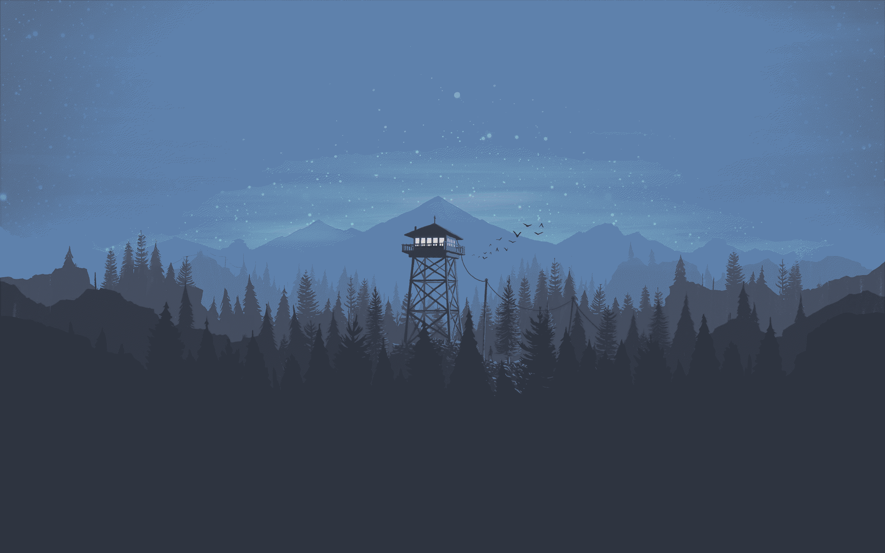

# Gnome Nordic Customization

This section offers guidance on customizing Gnome desktop environments, inspired by tutorials from [LinuxScoop](https://www.youtube.com/@linuxscoop) and [Arc Technologies](https://www.youtube.com/@ArcTechnologies) on YouTube. You can watch the original videos [here](https://www.youtube.com/watch?v=zOUTasMuZl4) and [here](https://www.youtube.com/watch?v=gx1hEQSOAyg).

## Table of Contents

- [Gnome Nordic Customization](#gnome-nordic-customization)
	- [Table of Contents](#table-of-contents)
	- [Final Result](#final-result)
	- [Requirements](#requirements)
	- [Extensions](#extensions)
	- [Theme Configuration](#theme-configuration)
		- [Downloading Necessary Files](#downloading-necessary-files)
		- [Install WhiteSur GTK Theme](#install-whitesur-gtk-theme)
		- [Install Nordzy Icon Theme](#install-nordzy-icon-theme)
		- [Install Sunity Cursors](#install-sunity-cursors)
		- [Install Fonts](#install-fonts)
		- [Move Backgrounds to their location](#move-backgrounds-to-their-location)
		- [Apply Themes](#apply-themes)
		- [Apply Fonts](#apply-fonts)
		- [Config Windows Style](#config-windows-style)
		- [Config Extensions](#config-extensions)
		- [Set Desktop Background](#set-desktop-background)
	- [Install Glava Audio Virtualizer](#install-glava-audio-virtualizer)
	- [Config Conky](#config-conky)
	- [Fix Dash to Dock Theme Issue](#fix-dash-to-dock-theme-issue)
	- [Customize GDM Login Screen](#customize-gdm-login-screen)
	- [Terminal Customization](#terminal-customization)
	- [FastFetch Config](#fastfetch-config)
	- [DDterm Customization](#ddterm-customization)
	- [Wiggle Extension](#wiggle-extension)
	- [Keyboard Switching to Another Layout Hotkey](#keyboard-switching-to-another-layout-hotkey)
	- [Google chrome](#google-chrome)

## Final Result

Neofetch & Nautilus


Desktop & Quick Settings


Applications


Drop Down Terminal


Virtual Desktops Preview


## Requirements

- Update your system

  ```bash
  sudo pacman -Syu
  ```

- Make sure you have Gnome Tweaks installed

  ```bash
  sudo pacman -S gnome-tweaks
  ```

## Extensions

- Ensure you have Gnome extensions and the browser integration extension installed. For detailed instructions, refer to the [Gnome Installation Guide](../../endeavouros/gnome_installation_guide.md#gnome-shell-extensions).

- To implement this customization, you need to install certain extensions on your system. You can find these extensions and installation instructions in the [Gnome Installation Guide](../../endeavouros/gnome_installation_guide.md#recommended-extensions).

## Theme Configuration

In this section, we delve into the intricate process of customizing the visual appearance of your Linux desktop environment. From selecting and downloading the necessary files to applying themes, icons, and other elements.

### Downloading Necessary Files

To kickstart your customization journey, you'll need to download the following files:

1. **GNOME Customization - Nord Color Theme by linuxscoop:**

   - Explore [GNOME Customization - Nord Color Theme](https://www.pling.com/p/1965520/) theme resources to download the following files.
     - gnome-nord-extensions.zip
     - glava-config-for-screen (the one that matches your resolution)
     - fonts.zip

2. **WhiteSur GTK Theme:**

   - Clone [WhiteSur GTK Theme](https://github.com/vinceliuice/WhiteSur-gtk-theme) from its github

     ```bash
     cd ~/Downloads
     git clone https://github.com/vinceliuice/WhiteSur-gtk-theme.git
     ```

3. **Nordzy Icon Theme:**

   - Clone [Nordzy Icon Theme](https://github.com/alvatip/Nordzy-icon) from its github

     ```bash
     cd ~/Downloads
     git clone https://github.com/alvatip/Nordzy-icon.git
     ```

4. **Sunity Cursors:**

   - Clone [Sunity Cursors](https://github.com/alvatip/Sunity-cursors) from its github

     ```bash
     cd ~/Downloads
     git clone https://github.com/alvatip/Sunity-cursors.git
     ```

5. **gnome terminal:**

   - Clone [gnome terminal](https://github.com/nordtheme/gnome-terminal) from its github

     ```bash
     cd ~/Downloads
     git clone https://github.com/nordtheme/gnome-terminal.git
     ```

6. **Background Files:**

   - Download these files which will be used as the background on different parts of the system
     - Desktop
       
     - Login
       
     - Browser
       

### Install WhiteSur GTK Theme

1. Open a terminal in WhiteSur GTK Theme directory

   ```bash
   cd ~/Downloads/WhiteSur-gtk-theme
   ```

2. Install the theme

   ```bash
   ./install.sh --nord -l -c Dark -m -p 60 -P bigger --normal
   ```

### Install Nordzy Icon Theme

1. Open a terminal in WhiteSur GTK Theme directory

   ```bash
   cd ~/Downloads/Nordzy-icon
   ```

2. Install the theme

   ```bash
   ./install.sh -t default -c -p
   ```

### Install Sunity Cursors

1. Open a terminal in WhiteSur GTK Theme directory

   ```bash
   cd ~/Downloads/Sunity-cursors
   ```

2. Install the theme

   ```bash
   ./install.sh
   ```

### Install Fonts

1. Extract the fonts that you have downloaded

2. Use these commands to move the `ttf` files to fonts directory and reload fonts cache

   1. Create font directory if not exists

      ```bash
      mkdir -p ~/.fonts
      ```

   2. Move font files to the fonts directory

      ```bash
      mv ~/Downloads/fonts/* ~/.fonts
      ```

   3. Reload fonts cache

      ```bash
      fc-cache -vf
      ```

### Move Backgrounds to their location

1. Move desktop background

   ```bash
   mv ~/Downloads/Desktop-BG.png ~/.local/share/backgrounds
   ```

2. Create a hidden directory for the rest of the files

   ```bash
   mkdir ~/.custom-files
   ```

3. Move the rest of the background images to the hidden directory

   ```bash
   mv ~/Downloads/Browser-BG.png ~/.custom-files
   mv ~/Downloads/dm3kzq8i2yaa1.png ~/.custom-files
   ```

### Apply Themes

1. Open **Tweaks** application
2. Go to **Appearance** tab
3. Set the **Cursor** to **Sunity-cursors**
4. Set the **Icons** to **Nordzy-dark--light_panel**
5. Set the **Shell** to **WhiteSur-Dark-nord**
6. Set the **Legacy Applications** to **WhiteSur-Dark-nord**

### Apply Fonts

1. Open **Tweaks** application
2. Go to **Fonts** tab
3. Set the **Interface Text** to **SF Pro Display Regular** and **font size 10**
4. Set the **Documents Text** to **SF Pro Display Regular** and **font size 10**
5. Set the **Monospace Text** to **FiraCode Nerd Font Mono Retina** and **font size 10**

### Config Windows Style

1. Open **Tweaks** application
2. Go to **Windows** tab
3. Enable **Maximize** and **Minimize** buttons in **Titlebar Buttons** section
4. Set The **Placement** to **Left** in **Titlebar Buttons** section
5. Enable **Center New Windows** in **Click Actions** section

### Config Extensions

1. Extract **gnome-nord-extensions.zip**
2. Run this command to load extensions data

   ```bah
   dconf load /org/gnome/shell/extensions/ < ~/Downloads/gnome-nord-extensions.conf
   ```

### Set Desktop Background

1. Open **Settings**
2. Go to **Appearance**
3. Select the **Desktop-BG.png**

## Install Glava Audio Virtualizer

1. Install glava package

   ```bash
   sudo pacman -S glava
   ```

2. Import glava configs

   1. extract **glava-config-for-screen**
   2. Run this command to create a copy from glava configs

      ```bash
      glava --copy-config
      ```

   3. Move **rc.glsl** and **bars.glsl** to **~/.config/glava** and replace the existence one
   4. Move **glava-startup.desktop** to **~/.config/autostart**
   5. Confirm startup applications in **Tweaks**

## Config Conky

1. Install conky

   ```bash
   sudo pacman -S conky
   ```

2. Open [Conky Clock Github](https://github.com/junaidrahim/conky-clock)
3. open **conky.conf** in a new tab
4. copy configs in **conky.conf** to your system conky config file

   The configuration file can be located in one of the following paths (the first one found will be used):

   - ~/.config/conky/conky.conf
   - ~/.conkyrc
   - /etc/conky/conky.conf

   If none of these files exist, you can create a default configuration file with the following command:

   ```bash
   mkdir -p ~/.config/conky && conky --print-config > ~/.config/conky/conky.conf
   ```

5. Search for **weight=Bold:** in config file and remove all of them
6. Open **Tweaks** and add conky to startup applications

## Fix Dash to Dock Theme Issue

In order to fix the dash to dock them issue follow these steps

1. open **WhiteSur-gtk-theme** directory in terminal

   ```bash
   cd ~/Downloads/WhiteSur-gtk-theme
   ```

2. Run the following command to fix the issue

   ```bash
   ./tweaks.sh -d
   ```

## Customize GDM Login Screen

1. open **WhiteSur-gtk-theme** directory in terminal

   ```bash
   cd ~/Downloads/WhiteSur-gtk-theme
   ```

2. Run the following command in order to config GDM login screen background

   ```bash
   sudo ./tweaks.sh -g -b ~/.custom-files/dm3kzq8i2yaa1.png
   ```

## Terminal Customization

1. Make sure to install [zsh](../../applications/installation_guide.md#installing-zsh) and [Oh My Zsh](../../applications/installation_guide.md#installing-oh-my-zsh)
2. Install **Powerlevel10k** theme

   ```shell
   git clone --depth=1 https://github.com/romkatv/powerlevel10k.git ${ZSH_CUSTOM:-$HOME/.oh-my-zsh/custom}/themes/powerlevel10k
   ```

   Set `ZSH_THEME="powerlevel10k/powerlevel10k"` in `~/.zshrc`.

3. Reset terminal and configure Powerlevel10k Theme
4. Install nord color scheme for terminal

   1. Open a terminal in gnome terminal src directory

      ```bash
      cd ~/Downloads/gnome-terminal/src
      ```

   2. Install the theme

      ```bash
      ./nord.sh
      ```

5. open terminal's **Preference**
6. Set **Nord** as default color scheme
7. Open **Colors** tab

   1. Change **Highlight color** to **2E3440** and **646D7F**
   2. Adjust the **Color palette** as follows

      | Name    | Color  | Name     | Color  |
      | ------- | ------ | -------- | ------ |
      | entry 0 | 3B4252 | entry 8  | 616E88 |
      | entry 1 | BF616A | entry 9  | BF616A |
      | entry 2 | A3BE8C | entry 10 | A3BE8C |
      | entry 3 | EBCB8B | entry 11 | 55EB28 |
      | entry 4 | 5A667E | entry 12 | 81A1C1 |
      | entry 5 | B48EAD | entry 13 | B48EAD |
      | entry 6 | 7684A3 | entry 14 | 65718C |
      | entry 7 | D8DEE9 | entry 15 | D8DEE9 |

8. Open **Scrolling** tab
   1. Uncheck **Show scrollbar**

## FastFetch Config

Download FastFetch [custom config](../general/fastfetch-config.jsonc)

```shell
fastfetch --gen-config

cp ~/.config/fastfetch/config.jsonc ~/.config/fastfetch/config.jsonc-backup

cp -f ~/Downloads/fastfetch-config.jsonc ~/.config/fastfetch/config.jsonc
```

## DDterm Customization

1. open ddterm's preferences
2. Got to **Behavior** tab
   1. Check **Hide when loss focus**
3. Go to **Colors** tab
   1. Click **Copy profile from Gnome Terminal**
4. Open **Scrolling** tab
   1. Uncheck **Show scrollbar**
5. Open **Keyboard Shortcuts** tab
   1. Change **Toggle Terminal Window** to your prefer keys
6. Open **Panel Icon** tab
   1. Choose **None**

## Wiggle Extension

1. Go to **Sunity-cursors** directory
2. Open **archives** directory
3. Extract **Sunity-cursors-PNGs.zip**
4. Open extracted directory and go to **extracted/directory/pngs/64**
5. Find **left_ptr.png** image and move it to **~/.custom-files** directory
6. Open **Extensions Manager** application
7. Open **wiggle** settings
8. Enter the path to **left_ptr.png** file in **Cursor Image Path** field

## Keyboard Switching to Another Layout Hotkey

1. Open **Tweaks** application
2. Go to **Keyboard** tab
3. Open **Additional Layout Options**
4. Under **Switching to another layout** you can change the hotkey

## Google chrome

1. **Applying theme:**

   - As for the themes make sure to enable `GTK` so the application title bar and other configs follow the system theme rules

2. **Set Background:**

   - In the new versions of the google chrome you can't change the home page background without changing the theme. However there is a work around for this problem. Which is to install an extension which will allow you to change and customize the look of the home page. There are several different extensions that you can install, but the one that I found the most useful is [MONKNOW New Tab](https://chromewebstore.google.com/detail/monknow-new-tab-personal/lnbjajkbekhkgablenknhapphbdbldeh)

   After installing the extension you'll be able to change the home page's background without changing the theme

   
