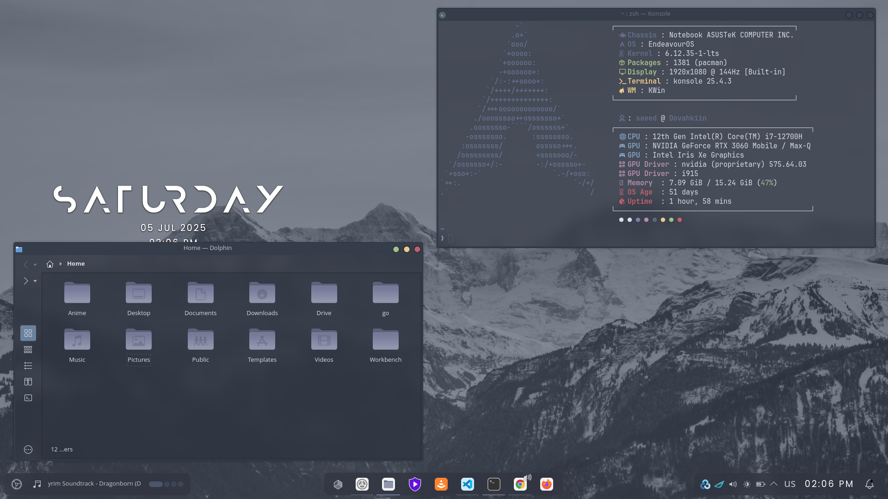
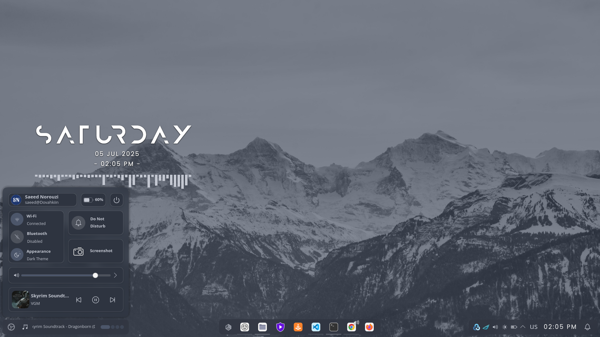

# KDE Plasma Nordic Customization

This section provides guidance on customizing KDE Plasma desktop environments, drawing inspiration from a tutorial on the [LinuxScoop](https://www.youtube.com/@linuxscoop) YouTube channel. The original video can be found [here](https://www.youtube.com/watch?list=PLKopOf5__2tj0aVUX68Kyr9rNltrLTWDq&v=2GYT7BK41zk&feature=youtu.be).

## Notice of Obsolescence for the Original Video

Due to significant changes in **Plasma 6**, some plugins, software, and modules featured in the original video are no longer compatible or installable. As a result, I have made several adjustments to this guide to achieve a sleek and visually appealing Nordic look for KDE Plasma 6.

## Table of Contents

- [KDE Plasma Nordic Customization](#kde-plasma-nordic-customization)
	- [Notice of Obsolescence for the Original Video](#notice-of-obsolescence-for-the-original-video)
	- [Table of Contents](#table-of-contents)
	- [Final Result](#final-result)
	- [Enhance Desktop Experience with Additional Effects](#enhance-desktop-experience-with-additional-effects)
	- [Customize Desktop Layout](#customize-desktop-layout)
	- [Customize Window Behavior](#customize-window-behavior)
	- [Customize Task Switcher](#customize-task-switcher)
	- [Install Fonts](#install-fonts)
		- [Install FiraCode fonts](#install-firacode-fonts)
		- [JetBrainsMono Nerd Font](#jetbrainsmono-nerd-font)
	- [Theme Configuration](#theme-configuration)
		- [Downloading Necessary Files](#downloading-necessary-files)
		- [Setting Up Directories and Moving Files](#setting-up-directories-and-moving-files)
		- [Applying Themes](#applying-themes)
		- [Kvantum Configuration](#kvantum-configuration)
		- [Wallpaper](#wallpaper)
		- [Logout and Login](#logout-and-login)
	- [Desktop \& panels Configuration](#desktop--panels-configuration)
		- [Installing and Configuring Widgets](#installing-and-configuring-widgets)
		- [Bottom Panel](#bottom-panel)
		- [Side Panel](#side-panel)
		- [Top Panel](#top-panel)
		- [Desktop](#desktop)
	- [Konsole Customization](#konsole-customization)
	- [FastFetch Custom Config](#fastfetch-custom-config)
	- [Bat Theme Configuration](#bat-theme-configuration)
	- [Yakuake Customization](#yakuake-customization)
	- [Dolphin Customization](#dolphin-customization)
	- [Google chrome](#google-chrome)

## Final Result

## Enhance Desktop Experience with Additional Effects

Enhancing your desktop experience involves enabling additional effects that can improve visual aesthetics and usability. These effects can range from subtle visual enhancements to functional improvements, providing a more dynamic and personalized desktop environment.

**Steps to Enable Additional Desktop Effects:**

1. **Enable "Sheet":**

   - Navigate to System Settings > Windows Management > Desktop Effects.
   - Check the box next to "Sheet" to activate the effect, enhancing window animations for a smooth and elegant appearance.

2. **Enable "Dim Inactive":**

   - Navigate to System Settings > Windows Management > Desktop Effects.
   - Check the box next to "Dim Inactive" to visually distinguish between active and inactive windows, improving focus and productivity.

3. **Enable "Dim Screen for Administrator Mode":**

   - Navigate to System Settings > Windows Management > Desktop Effects.
   - Check the box next to "Dim Screen for Administrator Mode" to dim the screen when entering administrator mode, signaling a change in system permissions.

4. **Enable "Slide Back":**

   - Navigate to System Settings > Windows Management > Desktop Effects.
   - Check the box next to "Slide Back" to add a smooth sliding animation when switching between desktops or virtual workspaces, enhancing navigation fluidity.

5. **Enable "Rounded Corners":**

   - This effect is not included by default and needs to be installed separately.
   - Install it from **KDE Store** or use your package manager if available.
   - Navigate to System Settings > Windows Management > Desktop Effects.
   - Search for "Rounded Corners" and enable it.
   - Open its configuration menu and disable primary and secondary outlines

6. **Enable "Maximize":**

   - Navigate to System Settings > Windows Management > Desktop Effects.
   - Check the box next to "Maximize" to enable a smooth animation when maximizing and restoring windows, making transitions more visually appealing.

7. **Enable "Mouse Mark":**

   - Navigate to System Settings > Windows Management > Desktop Effects.
   - Check the box next to "Mouse Mark" to enable drawing temporary marks on the screen using the mouse, useful for presentations or highlighting content.
   - Configure shortcut keys if needed for quick activation.

8. **Enable "Magic Lamp":**

   - Navigate to System Settings > Windows Management > Desktop Effects.
   - Check the box next to "Magic Lamp" to activate a genie-like animation when minimizing windows, adding a stylish visual effect.
   - Click the settings icon next to it and set the animation duration to **400 ms** for an optimal balance between speed and smoothness.

9. **Enable "Geometry Change by Ftpr":**

   - This effect is not included by default and needs to be installed separately.
   - Install it from **KDE Store** or use your package manager if available.
   - Navigate to System Settings > Windows Management > Desktop Effects.
   - Check the box next to "Geometry Change by Ftpr" to enable smooth animations when resizing or moving windows, improving the visual experience.

## Customize Desktop Layout

Customizing your desktop layout allows you to optimize your workspace for productivity and organization. By adjusting the number of rows and adding additional desktops, you can tailor your desktop environment to suit your workflow and multitasking needs.

**Steps to Add and Edit Visual Desktops:**

1. **Change Rows to 1:**

   - Navigate to System Settings > Windows Management > Virtual Desktops.
   - Adjust the setting for "Rows" to 1 to organize your virtual desktops in a single row, maximizing screen space and simplifying navigation.

2. **Add 4 Desktops:**
   - Navigate to System Settings > Windows Management > Virtual Desktops.
   - Locate the option to add virtual desktops and increase the count to 4.
   - Adding multiple desktops allows you to compartmentalize tasks and applications, making it easier to switch between different workspaces and maintain a clutter-free desktop environment.

## Customize Window Behavior

Customizing window behavior allows you to control how windows are positioned and interact with other applications. By adjusting settings such as window placement and application permissions, you can enhance usability and streamline your desktop experience.

**Steps to Customize Window Behavior:**

1. **Change "Window Placement" to "Centered":**

   - Navigate to System Settings > Window Management > Window Behavior > Advanced.
   - Locate the option for "Window Placement" and set it to "Centered." This ensures that new windows are positioned at the center of the screen by default, providing a consistent and organized layout.

## Customize Task Switcher

The task switcher is a crucial component of your desktop environment, allowing you to seamlessly navigate between open applications and manage your workflow efficiently. By customizing task switcher settings, you can enhance visual clarity and streamline the process of switching between tasks.

**Steps to Customize Task Switcher:**

1. **Uncheck "Show Selected Window":**

   - Navigate to System Settings > Window Management > Task Switcher > main.
   - Disable the option for "Show Selected Window" to declutter the task switcher interface and focus solely on active applications.

2. **Change Switch Style to "Thumbnail Grid":**

   - Navigate to System Settings > Window Management > Task Switcher > main.
   - Select "Thumbnail Grid" as the switch style to display previews of open windows, making it easier to identify and switch between applications visually.

3. **Check "Include Show Desktop":**

   - Navigate to System Settings > Window Management > Task Switcher > main.
   - Enable the option to "Include Show Desktop" to include the desktop as a switchable item in the task switcher, providing quick access to the desktop environment alongside open applications.

4. **Check "Only one window per application":**
   - Navigate to System Settings > Window Management > Task Switcher > main.
   - Enable the "Only one window per application" option to ensure that the task switcher includes only one window per application as a selectable item.

## Install Fonts

### Install FiraCode fonts

Fira Code is a free monospaced font containing ligatures for common programming multi-character combinations

[Download](https://github.com/tonsky/FiraCode)

### JetBrainsMono Nerd Font

Nerd Fonts are specialized fonts that include a wide range of icons and glyphs, making them ideal for developers and enthusiasts who require additional symbols in their terminal or code editor

[Download](https://www.nerdfonts.com/)

## Theme Configuration

In this section, we delve into the intricate process of customizing the visual appearance of your Linux desktop environment. From selecting and downloading the necessary files to applying themes, icons, and other elements.

### Downloading Necessary Files

**1 - Download Global Theme**:

To set up the Nordic theme, navigate to the **Global Theme** settings in your system. Click on **Get New...**, then search for and download **Nordic Darker LAF Plasma 6 by eliverlara**. This will automatically download most of the required files.

One of the essential files we need is the `Kvantum` application style from **eliverlara's Nordic Darker theme**. Unfortunately, this application style is not included with the theme's installation. To obtain it, we need to download the theme's source code from **[eliverlara's GitHub](https://github.com/EliverLara/Nordic)**, which contains the Kvantum application style files.

Since we’ll be using a custom icon set instead of the icons included with the Nordic theme, remove all Nordic icon packs from **System Settings > Colors & Themes > Icons**.

**2 - Nordic Folders Theme**:

Recent updates to the original source of this theme have introduced changes that make it incompatible with our configuration. To address this, we have provided the latest compatible version of the theme that works seamlessly with this setup.

[Download](./files/Nordic-Folders.tar.xz)

**3 - Nordic Folders Icon Pack**:

This icon pack is no longer maintained, and its GitHub repository has either been removed or made private. To ensure compatibility, we have provided the latest available version of the icon pack for use.

[Download](./files/Nordic-Folders-icon-pack.tar.gz)

**4 - Zafiro Icons Dark Black Icon Pack**:

Recent updates to the original source of this theme have introduced changes that make it incompatible with our configuration. To address this, we have provided the latest compatible version of the theme that works seamlessly with this setup.

[Download](./files/Zafiro-Icons-Dark-Black-f.tar.xz)

### Setting Up Directories and Moving Files

Open a terminal window in the same directory as the extracted files.

**1. Move Kvantum Files**:

    cp -r Nordic-master/kde/kvantum ~/.config/Kvantum

**2. Install kvantum**:

    sudo pacman -S kvantum

**3 - Move Zafiro Icons Dark Black to the icons directory**:

    cp -r ./Zafiro-Icons-Dark-Black-f ~/.local/share/icons

**4 - Move Nordic Darker to the icons directory**:

    cp -r ./Nordic-Darker ~/.local/share/icons

**5 - Move Nordic Darker to the icons directory and rename it to Nordic**:

    cp -r Nordic-Folders/Nordic-Darker ~/.local/share/icons/Nordic

**6 - Edit the index.theme file for the Nordic icon theme**:

    code ~/.local/share/icons/Nordic/index.theme

- In the `index.theme` file, make the following changes:
  - Change the `Name` to `Nordic`.
  - Change `Inherits`, `Papirus-Dark` option to the folder name of the copied `Nordic-Darker` theme.
  - Change `Inherits`, `zafiro` option to the folder name of the copied `Zafiro-Icons-Dark-Black-f` theme.

By following these steps, you'll successfully organize and move the necessary files to their respective locations for theme configuration.

### Applying Themes

Follow these steps to apply the Nordic theme and its variants:

**Step 1 - Global Theme**:

- Navigate to System Settings > Colors & Themes > Global Theme.
- Activate the `Nordic-darker` global theme for a sleek and dark appearance.
  - Check both `Appearance settings` and `Desktop and window layout`

**Step 2 - Application Style**:

- Navigate to System Settings > Colors & Themes > Application Style.
- Activate the `Kvantum-dark` style.
- Open `Configure GNOME/GTK ...` and search for `Nordic`.
- Click on install button and chose `Nordic darker`.
- activate `Nordic-darker-v40`.

**Step 3 - Plasma Style**:

- Navigate to System Settings > Colors & Themes > Plasma Style.
- Activate the `Nordic-darker` plasma style for a cohesive look.

**Step 4 - Colors**:

- Navigate to System Settings > Colors & Themes > Colors.
- Activate `Nordic-Darker` color scheme to complement the overall theme.

**Step 5 - Window Decoration**:

- Navigate to System Settings > Colors & Themes > Window Decoration.
- Activate the `Nordic` window decoration for consistent window borders.

**Step 6 - Toolbar Buttons**:

- Navigate to System Settings > Colors & Themes > Window Decoration.
- Open `Configure Toolbar Buttons...`
- Remove the option `More action for this window`
- Remove the option `On all desktops`
- Remove the option `Context help`
- Move the `close`, `minimize` and `maximize` options to the left side and put them in the mentioned order => `close`, `minimize` and `maximize`

**Step 7 - Fonts**:

- Go to System Settings > Text & Fonts > Fonts.
- Chose `Adjust All Fonts` and chose the font you prefer.
- Change the `fixed width` font to `JetBrainsMono Nerd Font 10pt` for enhanced readability.

**Step 8 - Icons**:

- Navigate to System Settings > Colors & Themes > Icons.
- Activate the `Nordic` icon theme for uniform icon styling.

**Step 9 - Cursors**:

- Install [Nordzy cursors](https://github.com/guillaumeboehm/Nordzy-cursors)

      paru -S nordzy-cursors

- Navigate to System Settings > Colors & Themes > Cursors.
- Activate the `Nordzy-cursors` for consistent cursor appearance.

**Step 10 - Splash Screen**:

- Navigate to System Settings > Colors & Themes > Splash Screen.
- Activate the "Nordic-darker" splash screen for a cohesive startup experience.

**Step 11 - Login Screen (SDDM)**:

- Navigate to System Settings > Colors & Themes > Login Screen (SDDM).
- Activate the "Nordic-darker-Plasma-6" for a cohesive startup experience.

### Kvantum Configuration

**Step 1 - Open Kvantum Manager**:

- Launch the "Kvantum Manager" application.

**Step 2 - Change Theme:**

- Within the Kvantum Manager, locate the theme settings.
- Change the theme to "Nordic-bluish" for a sleek and dark appearance.

### Wallpaper

- Change thw wallpaper to `Nordic-mountain-wallpaper`

### Logout and Login

- In order for all the changes to get effect you need to logout and log back in to your system, However it's recommended to restart your system

## Desktop & panels Configuration

### Installing and Configuring Widgets

- Right click on desktop and `Enter Edit mode`
- Click on `Add or Manage Widgets ...`
- Search and install the widgets linked bellow
  - [Window Title Applet 6](https://store.kde.org/p/2129423)
  - [KDE Modern Clock](https://store.kde.org/p/2135653)
  - [Desktop Indicator](https://store.kde.org/p/2131462)
  - [Spectrum audio Emulator](https://store.kde.org/p/2201084)
  - [KDE Control Station](https://www.pling.com/p/2196105/)

### Bottom Panel

- Right click on desktop and `Enter Edit mode`
- Click on the bottom panel and remove all widgets except `Icons-Only Task Manager`
- Change panel's width to `Fit content`
- Change panel's visibility to `Dodge windows`
- Change panel's Alignment to `Right`
- Change panel's hight to `50`
- Add `Desktop Indicator` widget to the right side of the panel
- Add `Folder View` widget next to the Desktop Indicator
- Use `Separator` widget to separate panel parts from each other

### Side Panel

- Right click on desktop and `Enter Edit mode`
- Add an empty panel to the right side of the screen
  - Change panel's width to `Fit content`
  - Change panel's visibility to `Auto hide`
  - Change panel's hight to `300`
- Click on the `Add widget` bottom
- Add the following widgets to the panel (From top to bottom)
  - Panel Spacer
    - click on panel to start the panel edit process
    - hover over Spacer and uncheck `Flexible size`
    - set the panel's size to `20`
  - Disk Usage
  - Panel Spacer
    - set the panel's size to `20`
  - Total CPU Use
    - Change display style to `Line Chart`
    - Change Opacity of the area below line to `50`
  - Panel Spacer
    - set the panel's size to `20`
  - Memory Usage
    - Change display style to `Line Chart`
    - Change Opacity of the area below line to `50`
  - Panel Spacer
    - set the panel's size to `20`
  - Network Speed
    - Change display style to `Line Chart`
    - Change Opacity of the area below line to `50`
  - Panel Spacer
    - set the panel's size to `20`

### Top Panel

- Right click on desktop and `Enter Edit mode`
- Add an empty panel to the top of the screen
  - Change panel's visibility to `Auto Hide`
  - Change panel's hight to `32`
- Click on the `Add widget` bottom
- Add the following widgets to the panel (From right to left)
  - Application luncher
    - Right click on the widget and chose `Show Alternatives...`
      - Choose `Application Dashboard`
    - Right click on the widget and chose `Configure Application Dashboard...`
      - Uncheck all options in general tab and apply
      - Change the icon to `circle` ond click `OK`
  - Window Title
    - Right click on the widget and chose `Configure Window Title...`
    - In Appearance tab
      - change the text for when the title is available to `%a`
      - Uncheck icon's visibility
      - Change the space before icon to `10`
    - In Behavior tab uncheck all select boxes and apply and OK
  - Panel Spacer
    - click on panel to start the panel edit process
    - hover over Spacer and uncheck `Flexible size`
    - set the panel's size to `10`
  - Global Menu
  - Panel Spacer
  - Digital clock
  - Panel Spacer
  - System Tray
  - Panel Spacer
    - set the panel's size to `10`
  - keyboard layout
  - Panel Spacer
    - set the panel's size to `10`
  - KDE Control Station
    - Open its configuration menu and change Icon and Items to your preference
    - Remove duplicated items that are in the control station from System Tray
  - Panel Spacer
    - set the panel's size to `10`
  - Notifications

### Desktop

- Right click on desktop and `Enter Edit mode`
- Click on `Add or Manage Widgets ...`
- Add `Modern Clock` widget to Desktop
- Add `Spectrum audio Emulator` widget to Desktop

## Konsole Customization

Enhance your Konsole terminal with the following customizations:

**Step 1 - Create a new profile**:

- Create a new profile and Change its name to **Nordic**
- Start editing the profile
- Navigate to "Appearance"

  - Change font to "JetBrainsMono Nerd Font 12pt".
  - Install and activate **Nordic konsole** theme

    - Start editing the theme

      - Activate blur BG and set it to around **15~25** based on your preference
      - Adjust the colors as follows

      | Name       | Color  | Intense color | Faint color |
      | ---------- | ------ | ------------- | ----------- |
      | Foreground | d8dee9 | d8dee9        | d8dee9      |
      | Background | 2e3440 | 2e3440        | 2e3440      |
      | Color1     | 3b4252 | 616e88        | 3b4252      |
      | Color2     | bf616a | bf616a        | bf616a      |
      | Color3     | a3be8c | a3be8c        | a3be8c      |
      | Color4     | ebcb8b | ebcb8b        | ebcb8b      |
      | Color5     | 5a667e | 81a1c1        | 81a1c1      |
      | Color6     | b48ead | b48ead        | b48ead      |
      | Color7     | 7684a3 | 3e4556        | 88c0d0      |
      | Color8     | d8dee9 | d8dee9        | d8dee9      |

  - Apply and OK all changes

- Close and reopen Konsole for the changes to take effect.

**Step 2 - Install [Oh My Posh](https://ohmyposh.dev/) Prompt Theme**:

This section draws inspiration from the video **"[We may have killed p10k, ...](https://www.youtube.com/watch?v=9U8LCjuQzdc)"** by [Dreams of Autonomy](https://www.youtube.com/@dreamsofautonomy).

    paru -S oh-my-posh

**Step 3 - Oh My Posh Configuration and setup**:

- Create Oh My Posh config file:

      mkdir ~/.config/ohmyposh
      touch ~/.config/ohmyposh/zen.toml

- Initialize Oh My Posh:

  After creating the config file, you can add the Oh My Posh initializer to your `.zshrc` file by adding the following line at the end of the file:

      eval "$(oh-my-posh init zsh --config $HOME/.config/ohmyposh/zen.toml)"

  It's important to note that after adding the Oh My Posh initializer to your `.zshrc` file, the next time you open your terminal, you may encounter a completely blank screen. This happens because the configuration file is currently empty, and Oh My Posh has no settings to render the prompt.

- Add Oh My Posh Configuration:

  To configure Oh My Posh, you can refer to its [documentation](https://ohmyposh.dev/docs) to create a fully personalized prompt. Alternatively, you can use [this configuration file](./files/ohmyposh/zen.toml) to implement a prompt that maintains consistency with the rest of the Nordic-themed customization.

## FastFetch Custom Config

Download FastFetch [custom config](../general/fastfetch-config.jsonc)

    fastfetch --gen-config

    cp ~/.config/fastfetch/config.jsonc ~/.config/fastfetch/config.jsonc-backup

    cp -f ~/Downloads/fastfetch-config.jsonc ~/.config/fastfetch/config.jsonc

## Bat Theme Configuration

Add the following line at the end of your `~/.zshrc` file in order to set the bat theme to match with the nordic theme

    # Bat (Better cat)
    export BAT_THEME=base16

## Yakuake Customization

Elevate your Yakuake terminal experience with the following customizations:

- **Theme Adjustment:**
  Change the theme to "Yakuake Qogir Materia Dark" by Diegons490 for a sleek and modern appearance.

- **Height Modification:**
  Adjust the height of the Yakuake terminal to 60% for optimized screen space utilization.

- **Shortcut Modification:**
  Change the shortcut key to Ctrl + ` for convenient and efficient access to Yakuake.

- **System Tray Removal:**
  Enhance the cleanliness of your desktop by removing the system tray from Yakuake.

  ## Dolphin Customization

  Enhance your Dolphin file manager experience with these customization options:

  - **Change "Open Terminal Here" Shortcut:**

    - Modify the shortcut for "Open Terminal Here" to `Super + R` for easier access.

  - **Remove "Zone Slider":**

    - Streamline the interface by removing the "Zone Slider":
      - Right-click on the Zone Slider.
      - Uncheck "Show Zone Slider" to hide it from the interface.

  - **Toolbar Position and Items:**

    - Unlock the toolbar position.
    - Change the toolbar position to the left side of the window.
    - Configure the toolbar items as shown in the image below:

    

  - **Disable Split Option:**
    - Ensure a clutter-free toolbar by disabling the split option:
      - Right-click on the toolbar.
      - Uncheck "Split" to remove this option.

## Google chrome

1. **Applying theme:**

   - As for the themes make sure to enable `GTK` so the application title bar and other configs follow the system theme rules
