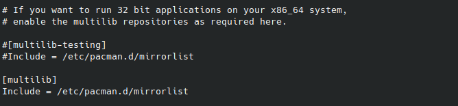
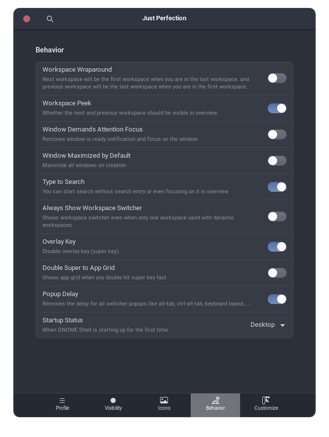
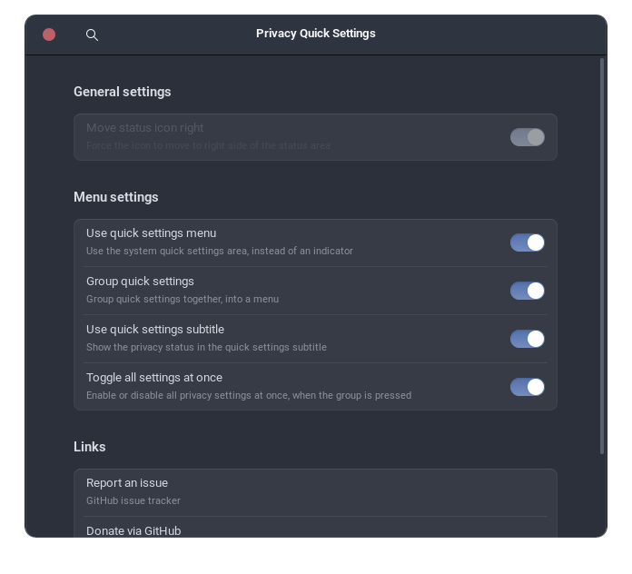

# EndeavourOS Installation Guide

Welcome to the EndeavourOS Installation Guide! In this guide, you'll learn how to install EndeavourOS, a user-friendly Arch-based Linux distribution designed for both new and experienced users. EndeavourOS provides a rolling-release model, giving you access to the latest software updates and features.

Follow along as we walk you through the installation process step by step, from preparing your system and partitioning your disk to configuring the bootloader and setting up essential system components. Whether you're a Linux enthusiast or a newcomer to the world of Arch-based distributions, this guide will help you set up a stable and efficient EndeavourOS system tailored to your needs.

Let's dive into the installation process and unleash the power of EndeavourOS on your machine!

## Table of Contents

- [EndeavourOS Installation Guide](#endeavouros-installation-guide)
  - [Table of Contents](#table-of-contents)
  - [Downloading EndeavourOS](#downloading-endeavouros)
  - [Creating Installation Media](#creating-installation-media)
    - [Using Rufus](#using-rufus)
    - [Using Balena Etcher](#using-balena-etcher)
    - [Using Linux `dd` Command](#using-linux-dd-command)
  - [Installation Process](#installation-process)
  - [Enable Multilib Repository](#enable-multilib-repository)
  - [Install Core Applications (Skip Reinstallation)](#install-core-applications-skip-reinstallation)
    - [Install Node.js and npm](#install-nodejs-and-npm)
    - [Install TypeScript and NestJS](#install-typescript-and-nestjs)
  - [Grant "wheel" Group Members "sudo" Privileges](#grant-wheel-group-members-sudo-privileges)
    - [Edit sudoers File](#edit-sudoers-file)
  - [Install Paru Package Manager](#install-paru-package-manager)
  - [Install Nvidia Drivers (if needed)](#install-nvidia-drivers-if-needed)
  - [Install AMD Drivers (if needed)](#install-amd-drivers-if-needed)
  - [Install Optimus Manager for Nvidia GPUs](#install-optimus-manager-for-nvidia-gpus)
  - [Asus Laptop Configuration](#asus-laptop-configuration)
  - [WINE Installation](#wine-installation)
    - [Install WINE](#install-wine)
    - [Install Dependencies (Optional)](#install-dependencies-optional)
    - [Install Winetricks](#install-winetricks)
    - [Configure WINE](#configure-wine)
  - [Apply NVENC and NvFBC Patches for Nvidia Drivers](#apply-nvenc-and-nvfbc-patches-for-nvidia-drivers)
  - [Enable Bluetooth](#enable-bluetooth)
    - [Install Basic Needed Packages](#install-basic-needed-packages)
    - [Enable Bluetooth Service](#enable-bluetooth-service)
    - [Install Additional Applications (Skip Reinstallation)](#install-additional-applications-skip-reinstallation)
  - [Configure Touchpad Multi-Touch Gestures](#configure-touchpad-multi-touch-gestures)
    - [Install Touchpad Required Packages](#install-touchpad-required-packages)
    - [Reboot System](#reboot-system)
    - [Install Touchegg](#install-touchegg)
    - [Enable and Start Touchegg Service](#enable-and-start-touchegg-service)
    - [Again Reboot System](#again-reboot-system)
    - [Configure Touché](#configure-touché)
  - [Gnome Shell Extensions](#gnome-shell-extensions)
    - [Extensions Requirements](#extensions-requirements)
      - [Gnome Browser Connector Installation](#gnome-browser-connector-installation)
      - [Browser Integration Extension](#browser-integration-extension)
      - [Gnome Extensions Manager Application](#gnome-extensions-manager-application)
    - [Recommended Extensions](#recommended-extensions)
      - [ddterm](#ddterm)
      - [Forge](#forge)
      - [Quick Setting Tweaker](#quick-setting-tweaker)
      - [AppIndicator](#appindicator)
      - [Desktop Cube](#desktop-cube)
      - [Rounded Window Corners](#rounded-window-corners)
      - [Blur my Shell](#blur-my-shell)
      - [Caffeine](#caffeine)
      - [Custom Hot Corners](#custom-hot-corners)
      - [Clipboard Indicator](#clipboard-indicator)
      - [Coverflow Alt-Tab](#coverflow-alt-tab)
      - [Dash to Dock](#dash-to-dock)
      - [Hide Top Bar](#hide-top-bar)
      - [Just Perfection](#just-perfection)
      - [Privacy Quick Settings](#privacy-quick-settings)
      - [Rounded Corners](#rounded-corners)
      - [User Themes](#user-themes)
      - [Wiggle](#wiggle)
      - [Compiz alike magic lamp effect](#compiz-alike-magic-lamp-effect)
  - [Conclusion](#conclusion)

## Downloading EndeavourOS

To download EndeavourOS, follow these steps:

1. Visit the official EndeavourOS website at [endeavouros.com](https://endeavouros.com/).

2. On the homepage, navigate to the "Download" section.

3. Choose the appropriate edition of EndeavourOS based on your system architecture and preferences. Options may include the offline or online installer, with various desktop environments available.

4. Click on the download link corresponding to your chosen edition.

5. Once the download is complete, you can proceed with creating installation media or directly booting into the live environment for installation.

## Creating Installation Media

To create installation media for EndeavourOS using Rufus, Balena Etcher, or the Linux `dd` command, follow these steps:

### Using Rufus

1. Download Rufus from the official website: [rufus.ie](https://rufus.ie/).
2. Insert your USB flash drive into your computer.
3. Open Rufus and select your USB flash drive under the "Device" dropdown menu.
4. Click on the "Select" button next to "Boot selection" and choose the EndeavourOS ISO file you downloaded.
5. Ensure the "Partition scheme" is set to "MBR" for BIOS or "GPT" for UEFI.
6. Leave the "File system" as "FAT32" and the "Cluster size" as default.
7. Click on "Start" to begin creating the bootable USB drive.
8. Once the process is complete, safely eject the USB flash drive.

### Using Balena Etcher

1. Download Balena Etcher from the official website: [balena.io/etcher](https://www.balena.io/etcher/).
2. Insert your USB flash drive into your computer.
3. Open Balena Etcher and click on the "Flash from file" button.
4. Select the EndeavourOS ISO file you downloaded.
5. Click on the "Select target" button and choose your USB flash drive.
6. Click on the "Flash!" button to start the flashing process.
7. Once the process is complete, safely eject the USB flash drive.

### Using Linux `dd` Command

1. Open a terminal on your Linux system.
2. Insert your USB flash drive into your computer.
3. Use the `lsblk` command to identify the device name of your USB flash drive (e.g., `/dev/sdb`).
4. Unmount the USB flash drive using the `umount` command (e.g., `sudo umount /dev/sdb`).
5. Use the `dd` command to write the EndeavourOS ISO to the USB flash drive:

   ```shell
   sudo dd if=/path/to/endeavouros.iso of=/dev/sdX bs=4M status=progress
   ```

   Replace `/path/to/endeavouros.iso` with the path to the downloaded ISO file and `/dev/sdX` with the device name of your USB flash drive identified in step 3.

6. Wait for the `dd` command to complete the writing process.
7. Once the process is complete, safely eject the USB flash drive.

Now, you have created a bootable USB flash drive with the EndeavourOS installation media, and you can use it to install EndeavourOS on your system.

## Installation Process

Once you have prepared your bootable USB flash drive with the EndeavourOS installation media, proceed to boot your system into the EndeavourOS live environment. At this point, you'll encounter a choice based on your system hardware. Upon entering the EndeavourOS boot menu, you will find two options: one for booting into the default EndeavourOS installer and the other for launching the EndeavourOS Nvidia installer. If your system features newer Nvidia GPUs, it is recommended to opt for the EndeavourOS Nvidia installer, which automatically installs the necessary Nvidia drivers. However, if your system lacks Nvidia GPUs or uses older versions, select the default option.

For the remaining installation steps, the guide linked below provides comprehensive instructions covering all available options.

**Important Notes:**

1. The linked guide may be slightly outdated, as the default desktop environment (DE) is now KDE Plasma, not Xfce. However, the overall installation steps remain consistent.

2. During the partitioning screen, choose the "Erase disk" option if you intend to install EndeavourOS on an empty drive. This option fully formats the disk and creates partitions automatically. For dual-boot installations on the same drive, select either "Manual partitioning" or "Install alongside."

3. It is advisable to format the EndeavourOS root partition as `BTRFS` during the installation. This choice enables the use of advanced features such as snapshots.

For detailed step-by-step guidance during the installation process, refer to the following comprehensive guide: [How to Install EndeavourOS: Step-by-Step Guide](https://www.debugpoint.com/endeavouros-install-guide/)

## Enable Multilib Repository

To enable the multilib repository, uncomment the "multilib" header and repository in the /etc/pacman.conf file:

```shell
sudo nano /etc/pacman.conf
```



## Install Core Applications (Skip Reinstallation)

In this section, we will install essential core applications to ensure smooth functionality of your system. These applications are crucial for various tasks and utilities.

### Install Node.js and npm

Node.js is a JavaScript runtime built on Chrome's V8 JavaScript engine, and npm is the Node.js package manager. They are essential for developing and running JavaScript applications on your system.

```shell
sudo pacman -S nodejs npm
```

### Install TypeScript and NestJS

TypeScript is a strongly typed programming language that builds on JavaScript, and NestJS is a progressive Node.js framework for building efficient, reliable, and scalable server-side applications.

To install TypeScript and NestJS CL globally, use the following command:

```shell
sudo npm install -g typescript @nestjs/cli
```

## Grant "wheel" Group Members "sudo" Privileges

In this step, we will uncomment a specific line in the sudoers file to grant members of the "wheel" group full sudo privileges. This allows users in the "wheel" group to execute commands with administrative privileges.

### Edit sudoers File

We will use the `visudo` command with the `EDITOR` environment variable set to "nano" to open the sudoers file in the Nano text editor.

```shell
sudo EDITOR=nano visudo
```

Once the sudoers file is open, locate the line that begins with "%wheel ALL=(ALL:ALL) ALL" and remove the "#" character at the beginning of the line to uncomment it.

By uncommenting this line, users in the "wheel" group will have the necessary sudo privileges to perform administrative tasks on the system. This is a common configuration to provide controlled access to administrative commands.

## Install Paru Package Manager

Paru is an AUR helper and pacman wrapper that allows you to install packages from both the official Arch repositories and the Arch User Repository (AUR).

1. Update System Repositories and Packages

   Before installing Paru, ensure your system repositories and packages are up to date:

   ```shell
   sudo pacman -Syu
   ```

2. Install Git

   Git is required to clone the Paru repository from the AUR. Install it using pacman:

   ```shell
   sudo pacman -S git
   ```

3. Clone Paru Repository

   Navigate to the `/opt` directory and clone the Paru repository from the AUR:

   ```shell
   cd /opt
   sudo git clone https://aur.archlinux.org/paru.git
   ```

4. Set Permissions

   Set appropriate permissions for the Paru directory to allow building and installation:

   ```shell
   sudo chown -R <username>:wheel ./paru
   ```

5. Build and Install Paru

   Navigate into the Paru directory and build the package using makepkg:

   ```shell
   cd paru
   makepkg -si
   ```

After successfully building the package, Paru will be installed on your system.

## Install Nvidia Drivers (if needed)

If you have one of the latest Nvidia graphics cards, the necessary drivers are installed automatically by EndeavourOS. You can verify the installed drivers by running the following command:

```shell
nvidia-smi
```

However, if you do not have the latest Nvidia graphics cards, there are three options available:

**Option 1 (Recommended):** Install Drivers from AUR

This option installs the `nvidia-470xx` driver. Please note that you should identify the appropriate driver version for your system before proceeding. To determine your required driver version, execute the following command:

```shell
lspci -k | grep -A 2 -E "(VGA|3D)"
```

The command `lspci` is used to list all PCI devices connected to the system. When combined with the `-k` option, it also displays the kernel driver currently in use by each device.

The `grep -A 2 -E "(VGA|3D)"` part is a pipeline that filters the output of `lspci -k`. It searches for lines containing either "VGA" or "3D" (indicating video graphics devices) and includes those lines along with the next two lines (specified by `-A 2`) in the output.

So, the overall command `lspci -k | grep -A 2 -E "(VGA|3D)"` lists the PCI devices with their kernel drivers, specifically focusing on VGA (Video Graphics Adapter) and 3D (Graphics Processing Unit) devices.

**Installation Steps:**

```shell
paru -S nvidia-470xx-dkms nvidia-470xx-utils lib32-nvidia-470xx-utils nvidia-470xx-settings \
opencl-nvidia-470xx lib32-opencl-nvidia-470xx
```

This command installs the Nvidia drivers from the Arch User Repository (AUR). The `-S` flag stands for "sync" and is used to install packages from repositories. The `nvidia-470xx-dkms` package installs the Nvidia drivers along with necessary utilities and settings.

After installation, verify the installed drivers:

```shell
nvidia-smi
```

Check Vulkan installation:

```shell
vulkaninfo
```

**Option 2:** Use a Third-Party [GitHub](https://github.com/Frogging-Family/nvidia-all) Script

```shell
cd /opt
sudo git clone https://github.com/Frogging-Family/nvidia-all.git
sudo chown -R <username>:wheel nvidia-all/
cd nvidia-all/
sed -i 's/dkms=""/dkms="true"/g' customization.cfg
makepkg -si
```

This command clones the necessary script from the GitHub repository into the `/opt` directory. The script is then configured to enable DKMS (Dynamic Kernel Module Support) for automatic driver module building and installation. Finally, the `makepkg -si` command builds and installs the Nvidia drivers from the script.

**Option 3:** Download and Install Nvidia Driver Manually

Note: This method is not recommended as it may lead to graphic driver issues after kernel updates.

1. **Download Nvidia Driver:**

   - Download the Nvidia driver compatible with your system from the [Nvidia Unix Driver Archive](https://www.nvidia.com/en-us/drivers/unix/).

2. **install nvidia basic drivers and utilities:**

   ```shell
   sudo pacman -S nvidia-dkms nvidia-utils lib32-nvidia-utils
   ```

   - `sudo pacman -S`: Installs packages from the Arch Linux repositories.
   - `nvidia-dkms`: Installs the Nvidia drivers with DKMS support, allowing for automatic rebuilding of kernel modules.
   - `nvidia-utils`: Installs additional utilities for Nvidia drivers.
   - `lib32-nvidia-utils`: Installs 32-bit compatibility libraries for Nvidia utilities.

3. **Navigate to Downloads Directory:**

   - Change directory to the location where the Nvidia driver was downloaded.

     ```shell
     cd ~/Downloads
     ```

4. **Execute Installation Script:**

   - Run the Nvidia driver installation script with elevated privileges.

     ```shell
     sudo sh NVIDIA-Linux-x86_64-470.141.03.run
     ```

     - `sudo sh`: Executes the script with root privileges, allowing system-level changes.
     - Replace `NVIDIA-Linux-x86_64-470.141.03.run` with the actual filename of the downloaded Nvidia driver.

Ensure you choose the appropriate option based on your hardware and preferences.

## Install AMD Drivers (if needed)

To install AMD GPU drivers on EndeavourOS, you can follow these steps:

1. **Identify Your AMD GPU:**

   - Before installing the drivers, identify the specific AMD GPU model in your system. You can use the following command to list the available GPUs:

   ```shell
    lspci -nn | grep -E 'VGA|Display'
   ```

   - Note down the exact model of your AMD GPU.

2. **Enable the Multilib Repository (if not already enabled):**

   - Edit the `/etc/pacman.conf` file:

     ```shell
     sudo nano /etc/pacman.conf
     ```

   - Uncomment the `[multilib]` section by removing the `#` symbol from the beginning of the lines.
   - Save and exit the editor.

3. **Update System Repositories:**

   - Update the system repositories to ensure you have the latest package information:

   ```shell
    sudo pacman -Syu
   ```

4. **Install Required Packages:**

   - Install the necessary packages for AMD GPU support:

   ```shell
    sudo pacman -S mesa xf86-video-amdgpu vulkan-radeon lib32-mesa lib32-vulkan-radeon
   ```

   - `mesa`: Open-source graphics library providing Vulkan and OpenGL support.
   - `xf86-video-amdgpu`: Xorg driver for AMD Radeon GPUs.
   - `vulkan-radeon`: AMD Radeon Vulkan driver.
   - `lib32-mesa`: 32-bit compatibility libraries for Mesa.
   - `lib32-vulkan-radeon`: 32-bit compatibility libraries for Vulkan.

5. **Reboot Your System:**

   - After installing the packages, reboot your system to apply the changes:

   ```shell
    sudo reboot
   ```

6. **Verify Driver Installation:**

   - After rebooting, verify that the AMD GPU drivers are correctly installed and recognized by the system:

   ```shell
    glxinfo | grep "OpenGL renderer"
   ```

   - This command should display information about the OpenGL renderer, including the AMD GPU model.

7. **Configure Display Settings (if necessary):**

   - Use your desktop environment's display settings or a tool like `xrandr` to configure display settings such as resolution, refresh rate, and multiple monitors.

8. **Additional Tweaks (if needed):**
   - Depending on your specific requirements or use case, you may need to perform additional tweaks or configurations. Refer to the EndeavourOS documentation for advanced customization options.

## Install Optimus Manager for Nvidia GPUs

**Note:**

- If you own an ASUS ROG or TUF Laptop, refer to [ASUS laptop configuration](#asus-laptop-configuration) for specific instructions.

1. **Install Optimus Manager:**
   Install Optimus Manager using the AUR helper (e.g., `paru`):

   ```shell
   paru -S optimus-manager
   ```

2. **Clone Optimus Manager Qt Git Repository:**
   Navigate to the `/opt` directory and clone the Optimus Manager Qt Git repository:

   ```shell
   cd /opt
   sudo git clone https://aur.archlinux.org/optimus-manager-qt-git
   ```

3. **Adjust Permissions:**
   Change ownership of the cloned repository to your user:

   ```shell
   sudo chown -R <username>:wheel ./optimus-manager-qt-git
   ```

4. **Modify PKGBUILD:**
   Open the `PKGBUILD` file within the `optimus-manager-qt-git` directory and modify the `_with_plasma` parameter from `false` to `true` using a text editor like nano:

   ```shell
   cd optimus-manager-qt-git
   nano PKGBUILD
   # _with_plasma=false => _with_plasma=true
   ```

5. **Build and Install Optimus Manager Qt:**
   Save the changes to the `PKGBUILD` file, exit the text editor, and proceed to build and install Optimus Manager Qt:

   ```shell
   makepkg -si
   ```

6. **Reboot Your System:**
   Reboot your system to apply the changes:

   ```shell
   sudo reboot
   ```

7. **Verify Optimus Manager Status:**
   After rebooting, check the status of Optimus Manager:

   ```shell
   sudo systemctl status optimus-manager
   ```

8. **Enable Optimus Manager Service:**
   Enable the Optimus Manager service to ensure it starts automatically on boot:

   ```shell
   sudo systemctl enable --now optimus-manager
   ```

9. **Switch Default Driver to Nvidia (if required):**
   If you want to switch the default graphics driver to Nvidia, additional steps may be required based on your system configuration. Consult the Optimus Manager documentation or related resources for detailed instructions.

## Asus Laptop Configuration

If you own an Asus ROG or TUF laptop, you can install specific utilities to enhance the functionality and control options for your device.

```shell
paru -S asusctl supergfxctl rog-control-center
```

This command installs the following utilities:

- `asusctl`: A utility for controlling various Asus laptop features such as keyboard backlight, fan speed, and power profiles.
- `supergfxctl`: A tool for managing GPU settings and performance on Asus laptops.
- `rog-control-center`: A control center application designed for Asus Republic of Gamers (ROG) laptops, providing centralized access to various system settings and features.

**Note:** Add rog-control-center to your system startup applications

## WINE Installation

WINE (Wine Is Not an Emulator) is a compatibility layer that allows you to run Windows applications on Linux. Here's how to install WINE and configure it:

### Install WINE

```shell
sudo pacman -S wine
```

### Install Dependencies (Optional)

```shell
sudo pacman -S --asdeps --needed $(pacman -Si wine | sed -n '/^Opt/,/^Conf/p' | sed '$d' | sed 's/^Opt.*://g' | sed 's/^\s*//g' | tr '\n' ' ')
```

### Install Winetricks

```shell
sudo pacman -S winetricks
```

### Configure WINE

After installing WINE, configure it by setting the Windows version to the latest version:

```shell
winecfg
```

This command will open the WINE configuration window. In the "Applications" tab, set the "Windows version" to the latest for compatibility with modern Windows applications.

Now, you can run Windows applications on your Linux system using WINE.

## Apply NVENC and NvFBC Patches for Nvidia Drivers

This section is only related to those who have Nvidia GPUs.

After installing the Nvidia driver, there is a patch available to address the FBC (Frame Buffer Capture) problem. Follow these steps to apply the patch:

```shell
# Patch GitHub repository: https://github.com/keylase/nvidia-patch
cd ~/Downloads
git clone https://github.com/keylase/nvidia-patch.git
cd nvidia-patch
sudo bash ./patch.sh
sudo bash ./patch-fbc.sh
```

## Enable Bluetooth

To enable Bluetooth functionality on your system, follow these steps:

### Install Basic Needed Packages

Install the essential packages for Bluetooth support:

```shell
pacman -S bluez bluez-utils
```

Next, check if the generic Bluetooth driver module, "btusb," is loaded. If it's not loaded, you'll need to load it manually. Run the following command to check:

```shell
lsmod | grep btusb
```


### Enable Bluetooth Service

Enable the Bluetooth service to start automatically on system boot:

```shell
sudo systemctl enable bluetooth.service
sudo systemctl start bluetooth.service
```

Alternatively, you can enable and start the service in one command:

```shell
sudo systemctl enable --now bluetooth.service
sudo systemctl start --now bluetooth.service
```

### Install Additional Applications (Skip Reinstallation)

Install additional Gnome applications for enhanced functionality:

```shell
sudo pacman -S gnome-sound-recorder android-tools vlc thunderbird
```

- **gnome-sound-recorder:** A simple sound recording application.
- **android-tools:** Command-line tools for interacting with Android devices.
- **vlc:** A popular multimedia player capable of playing various audio and video formats.
- **thunderbird:** An email client developed by Mozilla.

## Configure Touchpad Multi-Touch Gestures

To enable multi-touch gestures on your touchpad, follow these steps:

### Install Touchpad Required Packages

Install the necessary packages:

```shell
sudo pacman -S libinput xf86-input-libinput
```

### Reboot System

Reboot your system for the changes to take effect:

```shell
sudo reboot
```

### Install Touchegg

Use Paru to install Touchegg, a multi-touch gesture recognizer:

```shell
paru -S touchegg
```

### Enable and Start Touchegg Service

Enable and start the Touchegg service:

```shell
sudo systemctl enable touchegg.service
sudo systemctl start touchegg
```

### Again Reboot System

Reboot your system again:

```shell
sudo reboot
```

### Configure Touché

Finally, install Touché for configuring multi-touch gestures:

```shell
paru -S touche
```

After installation, open Touché and configure your desired multi-touch gestures to enhance your touchpad experience.


## Gnome Shell Extensions

Gnome shell extensions are small pieces of code written by third party developers that modify the way GNOME works. (If you are familiar with Chrome Extensions or Firefox Addons, GNOME Shell extensions are similar to them.)

Since extensions are created outside of the normal GNOME design and development process, they are supported by their authors, rather than by the GNOME community. Some features first implemented as extensions might find their way into future versions of GNOME.

In this section, we will install several useful and essential extensions aimed at enhancing productivity, performance, and customization within the Gnome desktop environment.

You can find a full guide of how to use gnome extensions [here](https://www.baeldung.com/linux/gnome-shell-extension) if you needed any more information

### Extensions Requirements

To effectively use and manage GNOME Shell extensions, certain requirements must be met. Here, we'll outline these requirements and how to install and activate them.

#### Gnome Browser Connector Installation

The GNOME Browser Connector is an extension compatible with browsers like Google Chrome, Firefox, Vivaldi, and Opera. It acts as a link between these browsers and the GNOME Shell, facilitating integration with the GNOME Shell and its extension repository. In simple terms, it's a native connector enabling seamless interaction between your browser and extensions available on [extensions.gnome.org](https://extensions.gnome.org/).

To install the GNOME Browser Connector, simply use the command below.

```shell
sudo pacman -S gnome-browser-connector
```

For additional information or guidance on installing the package on other Linux distributions, refer to the instructions provided in the [GNOME Wiki](https://wiki.gnome.org/Projects/GnomeShellIntegration/Installation).

#### Browser Integration Extension

To utilize the complete features of the GNOME Browser Connector and enable extension management from your browser, you must first install the GNOME Shell Integration extension. You can easily do this by opening and installing the extension for your preferred browser using one of the following links:

- [Chrome GNOME Shell integration](https://chromewebstore.google.com/detail/gphhapmejobijbbhgpjhcjognlahblep)
- [Firefox GNOME Shell integration](https://addons.mozilla.org/en-US/firefox/addon/gnome-shell-integration/)

#### Gnome Extensions Manager Application

Gnome extensions manager is a simple native application which will give you full control over all installed extensions and their setting. This application will be installed on your system by default during the OS installation process.


### Recommended Extensions

Note #1: Some of the extensions listed might become incompatible with the GNOME version at the time of installing a new operating system. Keep in mind that if any of the mentioned extensions prove incompatible, you can search the Arch Repository and Arch User Repository for a functional version or an alternative.

#### ddterm

The DDTerm extension for GNOME introduces a convenient drop-down terminal directly accessible from the desktop. It provides users with quick access to a terminal window without the need to open a separate application.

You can install this extension from the GNOME Extensions website.

- [Gnome Extensions](https://extensions.gnome.org/extension/3780/ddterm/)

Recommended config:


#### Forge

Forge is a versatile GNOME Shell extension that serves as both a tiling and window manager, offering seamless organization and navigation of your desktop environment. In addition to its tiling capabilities, Forge provides quick access to development tools and utilities, enhancing productivity for coding and software development tasks. For documentation and further information, visit the project's [GitHub repository](https://github.com/forge-ext/forge).

You can install this extension from either the GNOME Extensions website or the Arch User Repository.

- [Gnome Extensions (Recommended)](https://extensions.gnome.org/extension/4481/forge/)
- [Arch User Repository](https://aur.archlinux.org/packages/gnome-shell-extension-forge)

#### Quick Setting Tweaker

Quick Settings Tweaker is a versatile GNOME Shell extension that empowers users with advanced control over their desktop environment. In addition to customizing various aspects of your system's appearance and behavior through a convenient settings panel accessible from the top bar, Quick Settings Tweaker offers additional features. With this extension, you can add Media Controls, Notifications, Volume Mixer, and remove unnecessary buttons.

You can install this extension from the GNOME Extensions website.

- [Gnome Extensions](https://extensions.gnome.org/extension/5446/quick-settings-tweaker/)

Recommended config:


#### AppIndicator

AppIndicator Support is a GNOME Shell extension that enhances your desktop experience by enabling support for AppIndicators. With this extension, you can seamlessly integrate applications that use the AppIndicator protocol into your GNOME Shell environment.

You can install this extension from the GNOME Extensions website.

- [Gnome Extensions](https://extensions.gnome.org/extension/615/appindicator-support/)

Recommended config:


#### Desktop Cube

Desktop Cube is a dynamic GNOME Shell extension that brings a visually stunning 3D desktop experience to your Linux system. By activating Desktop Cube, you can navigate between multiple virtual desktops in a captivating cube-like fashion, adding a touch of flair to your workflow.

You can install this extension from either the GNOME Extensions website or the Arch User Repository.

- [Gnome Extensions (Recommended)](https://extensions.gnome.org/extension/4648/desktop-cube/)
- [Arch User Repository](https://aur.archlinux.org/packages/gnome-shell-extension-desktop-cube)

Recommended config:


#### Rounded Window Corners

Rounded Window Corners is a sleek GNOME Shell extension designed to add a touch of elegance to your desktop environment. By applying subtle, rounded corners to your windows, this extension offers a modern and visually pleasing aesthetic.

The version currently available on the GNOME Extensions website is incompatible with the latest version for the GNOME desktop environment. Therefore, the only option to install this extension is to opt for an alternative available through the Arch User Repository.

- [Arch User Repository](https://aur.archlinux.org/packages/gnome-shell-extension-rounded-window-corners-reborn)

Recommended config:


#### Blur my Shell

Blur My Shell is a stylish GNOME Shell extension that introduces a subtle blur effect to various elements of your desktop environment, adding a touch of sophistication to your user interface. By applying this effect to window backgrounds, menus, and notifications, Blur My Shell creates a visually pleasing and modern look.

You can install this extension from the GNOME Extensions website.

- [Gnome Extensions](https://extensions.gnome.org/extension/3193/blur-my-shell/)

#### Caffeine

Caffeine is a practical GNOME Shell extension designed to keep your system awake when you need it most. By toggling a simple switch in the top panel, you can prevent your computer from entering sleep mode or activating the screensaver, ensuring uninterrupted productivity during important tasks.

You can install this extension from the GNOME Extensions website.

- [Gnome Extensions](https://extensions.gnome.org/extension/517/caffeine/)

#### Custom Hot Corners

The Custom Hot Corners Extended extension for GNOME allows users to customize their desktop experience by enabling hot corners with various actions. Users can define specific actions to be triggered when they move their mouse cursor to different corners of the screen.

You can install this extension from the GNOME Extensions website.

- [Gnome Extensions](https://extensions.gnome.org/extension/4167/custom-hot-corners-extended/)

Recommended config:


#### Clipboard Indicator

The Clipboard Indicator extension for GNOME enhances clipboard functionality by providing a convenient indicator icon in the top panel. It allows users to easily access their clipboard history, including text snippets, images, and files, that have been copied or cut

You can install this extension from the GNOME Extensions website.

- [Gnome Extensions](https://extensions.gnome.org/extension/779/clipboard-indicator/)

Recommended config:


#### Coverflow Alt-Tab

The Coverflow Alt-Tab extension for GNOME transforms the traditional Alt-Tab application switcher into an elegant cover-flow style interface. With this extension, users can effortlessly navigate through their open applications in a visually appealing manner, making it easier to identify and switch between different windows.

You can install this extension from the GNOME Extensions website.

- [Gnome Extensions](https://extensions.gnome.org/extension/97/coverflow-alt-tab/)

#### Dash to Dock

A dock for the Gnome Shell. This extension moves the dash out of the overview transforming it in a dock for an easier launching of applications and a faster switching between windows and desktops.

You can install this extension from the GNOME Extensions website.

- [Gnome Extensions](https://extensions.gnome.org/extension/307/dash-to-dock/)

#### Hide Top Bar

The Hide Top Bar extension for GNOME offers users the ability to hide the top bar in the GNOME Shell desktop environment, providing a more immersive and clutter-free experience. By toggling this extension on, users can reclaim screen space and focus entirely on their applications or activities without the distraction of the top bar.

You can install this extension from the GNOME Extensions website.

- [Gnome Extensions](https://extensions.gnome.org/extension/545/hide-top-bar/)

Recommended config:


#### Just Perfection

The "Just Perfection" extension for GNOME is a comprehensive customization tool that offers a wide range of options to tailor your desktop experience exactly to your liking. It provides fine-grained control over various aspects of the GNOME Shell, including the top bar, activities overview, workspace management, and more.

You can install this extension from the GNOME Extensions website.

- [Gnome Extensions](https://extensions.gnome.org/extension/3843/just-perfection/)

Recommended config:




#### Privacy Quick Settings

The Privacy Settings Menu extension for GNOME enhances privacy control by providing quick access to essential privacy settings directly from the system menu. This extension streamlines the process of managing privacy preferences, allowing users to easily toggle options related to location services, usage data collection, screen lock, and more.

You can install this extension from the GNOME Extensions website.

- [Gnome Extensions](https://extensions.gnome.org/extension/4491/privacy-settings-menu/)

Recommended config:



#### Rounded Corners

The Rounded Corners extension for GNOME introduces a subtle yet visually appealing change to the desktop environment by rounding off the corners of windows and dialogs. This aesthetic enhancement softens the overall look of the desktop, giving it a more modern and polished appearance.

You can install this extension from the GNOME Extensions website.

- [Gnome Extensions](https://extensions.gnome.org/extension/1514/rounded-corners/)

#### User Themes

The User Themes extension for GNOME empowers users to personalize their desktop environment by enabling the use of custom shell themes. With this extension, users can easily install and apply custom shell themes, including modifications to the top bar, activities overview, window decorations, and more.

You can install this extension from the GNOME Extensions website.

- [Gnome Extensions](https://extensions.gnome.org/extension/19/user-themes/)

#### Wiggle

Wiggle is a GNOME 45+ port/fix for the scaling effect from Jiggle with better performance. Wiggle magnifies your cursor when the mouse is moved rapidly.

You can install this extension from the GNOME Extensions website.

- [Gnome Extensions](https://extensions.gnome.org/extension/6784/wiggle/)

#### Compiz alike magic lamp effect

The Compiz-alike Magic Lamp Effect is a GNOME Shell extension that adds a visually stunning window minimization animation inspired by the classic "Magic Lamp" effect from the Compiz window manager

You can install this extension from the GNOME Extensions website.

- [Gnome Extensions](https://extensions.gnome.org/extension/3740/compiz-alike-magic-lamp-effect/)

## Conclusion

Congratulations! You have successfully completed the installation steps for your EndeavourOS system. You now have a fully functional system and can start installing applications and customizing it according to your preferences.

To further enhance your experience, consider exploring the Applications Installation Guide within this document, where you'll find recommendations for essential applications and configuration settings to optimize your system for various use cases.

Enjoy exploring your new system and have fun customizing it to suit your needs!
