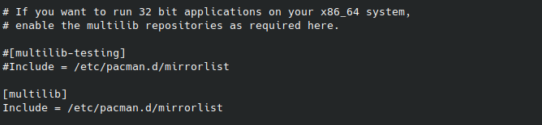
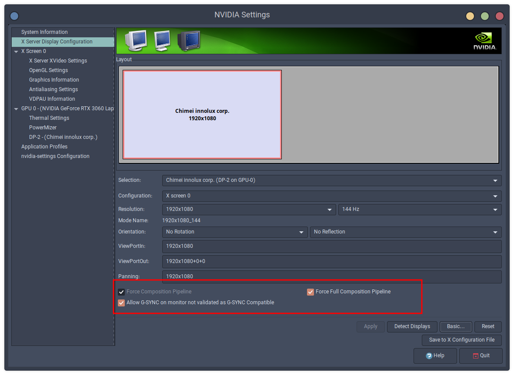
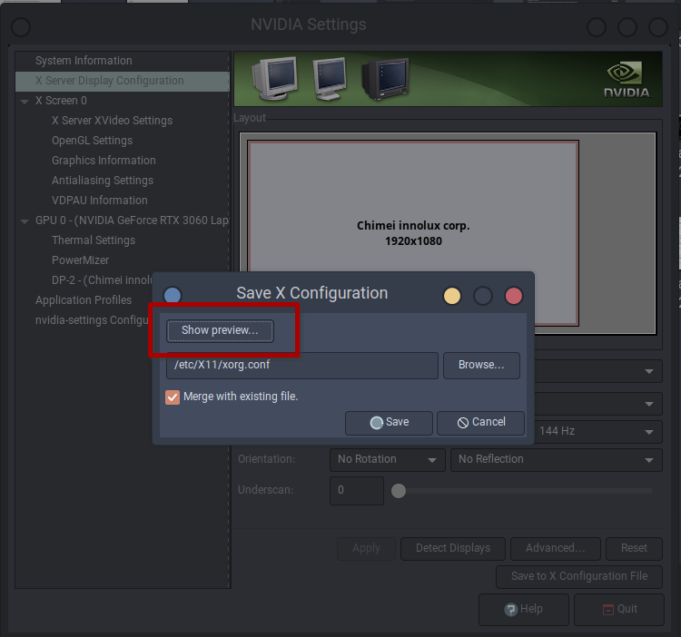
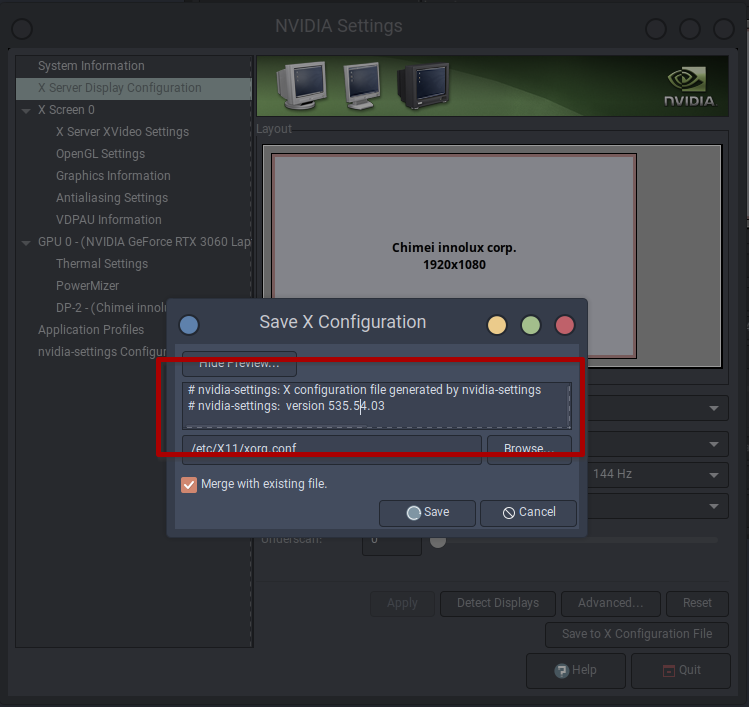
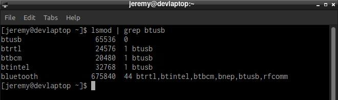
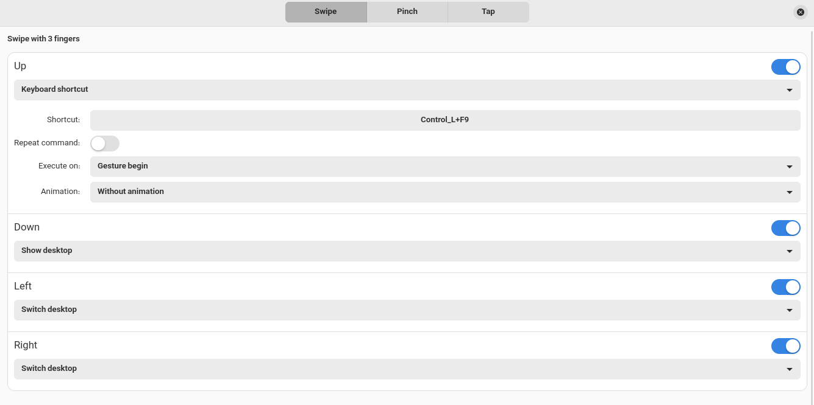
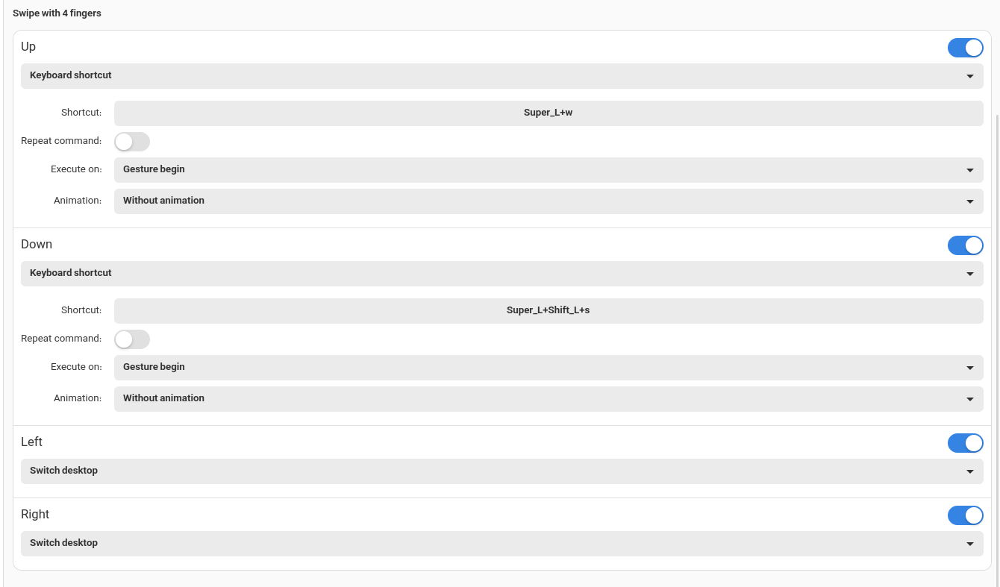
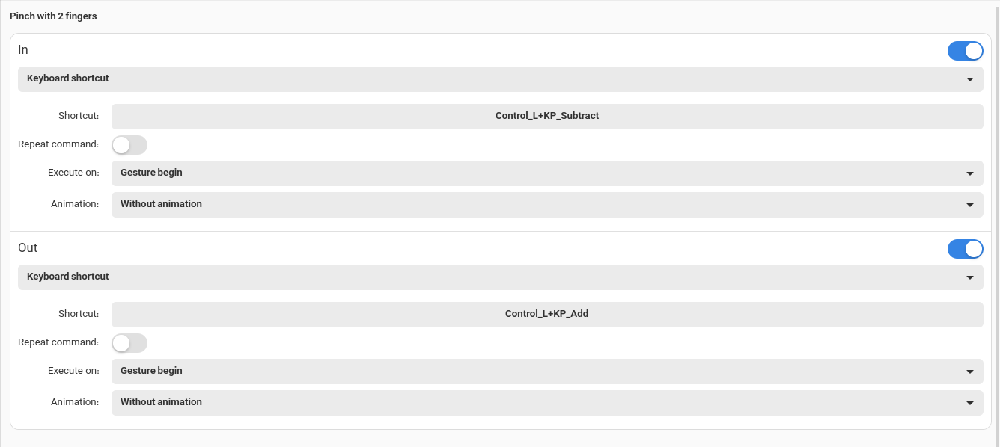

# EndeavourOS Installation Guide

Welcome to the EndeavourOS Installation Guide! In this guide, you'll learn how to install EndeavourOS, a user-friendly Arch-based Linux distribution designed for both new and experienced users. EndeavourOS provides a rolling-release model, giving you access to the latest software updates and features.

Follow along as we walk you through the installation process step by step, from preparing your system and partitioning your disk to configuring the bootloader and setting up essential system components. Whether you're a Linux enthusiast or a newcomer to the world of Arch-based distributions, this guide will help you set up a stable and efficient EndeavourOS system tailored to your needs.

Let's dive into the installation process and unleash the power of EndeavourOS on your machine!

## Table of Contents

- [EndeavourOS Installation Guide](#endeavouros-installation-guide)
  - [Table of Contents](#table-of-contents)
  - [Downloading EndeavourOS](#downloading-endeavouros)
  - [Creating Installation Media](#creating-installation-media)
    - [Using Rufus](#using-rufus)
    - [Using Balena Etcher](#using-balena-etcher)
    - [Using Linux `dd` Command](#using-linux-dd-command)
  - [Installation Process](#installation-process)
  - [Enable Multilib Repository](#enable-multilib-repository)
  - [Install Core Applications (Skip Reinstallation)](#install-core-applications-skip-reinstallation)
    - [Install Node.js and npm](#install-nodejs-and-npm)
  - [Grant "wheel" Group Members "sudo" Privileges](#grant-wheel-group-members-sudo-privileges)
    - [Edit sudoers File](#edit-sudoers-file)
  - [Install Paru Package Manager](#install-paru-package-manager)
  - [Install Nvidia Drivers (if needed)](#install-nvidia-drivers-if-needed)
  - [Install AMD Drivers (if needed)](#install-amd-drivers-if-needed)
  - [Install Optimus Manager for Nvidia GPUs](#install-optimus-manager-for-nvidia-gpus)
  - [Asus Laptop Configuration](#asus-laptop-configuration)
  - [Configure Nvidia Settings](#configure-nvidia-settings)
    - [Install Nvidia Required Packages](#install-nvidia-required-packages)
    - [Reboot Your System](#reboot-your-system)
    - [Open Nvidia X Server Settings](#open-nvidia-x-server-settings)
    - [Configure X Server Display Settings](#configure-x-server-display-settings)
    - [Handling Configuration File Errors](#handling-configuration-file-errors)
    - [Verify Configuration Settings](#verify-configuration-settings)
    - [Run Nvidia X Config](#run-nvidia-x-config)
  - [WINE Installation](#wine-installation)
    - [Install WINE](#install-wine)
    - [Install Dependencies (Optional)](#install-dependencies-optional)
    - [Install Winetricks](#install-winetricks)
    - [Configure WINE](#configure-wine)
  - [Apply NVENC and NvFBC Patches for Nvidia Drivers](#apply-nvenc-and-nvfbc-patches-for-nvidia-drivers)
  - [Enable Bluetooth](#enable-bluetooth)
    - [Install Basic Needed Packages](#install-basic-needed-packages)
    - [Enable Bluetooth Service](#enable-bluetooth-service)
    - [Install Additional Applications (Skip Reinstallation)](#install-additional-applications-skip-reinstallation)
  - [Configure Touchpad Multi-Touch Gestures](#configure-touchpad-multi-touch-gestures)
    - [Install Touchpad Required Packages](#install-touchpad-required-packages)
    - [Reboot System](#reboot-system)
    - [Install Touchegg](#install-touchegg)
    - [Enable and Start Touchegg Service](#enable-and-start-touchegg-service)
    - [Again Reboot System](#again-reboot-system)
    - [Configure Touché](#configure-touché)
  - [Conclusion](#conclusion)

## Downloading EndeavourOS

To download EndeavourOS, follow these steps:

1. Visit the official EndeavourOS website at [endeavouros.com](https://endeavouros.com/).

2. On the homepage, navigate to the "Download" section.

3. Choose the appropriate edition of EndeavourOS based on your system architecture and preferences. Options may include the offline or online installer, with various desktop environments available.

4. Click on the download link corresponding to your chosen edition.

5. Once the download is complete, you can proceed with creating installation media or directly booting into the live environment for installation.

## Creating Installation Media

To create installation media for EndeavourOS using Rufus, Balena Etcher, or the Linux `dd` command, follow these steps:

### Using Rufus

1. Download Rufus from the official website: [rufus.ie](https://rufus.ie/).
2. Insert your USB flash drive into your computer.
3. Open Rufus and select your USB flash drive under the "Device" dropdown menu.
4. Click on the "Select" button next to "Boot selection" and choose the EndeavourOS ISO file you downloaded.
5. Ensure the "Partition scheme" is set to "MBR" for BIOS or "GPT" for UEFI.
6. Leave the "File system" as "FAT32" and the "Cluster size" as default.
7. Click on "Start" to begin creating the bootable USB drive.
8. Once the process is complete, safely eject the USB flash drive.

### Using Balena Etcher

1. Download Balena Etcher from the official website: [balena.io/etcher](https://www.balena.io/etcher/).
2. Insert your USB flash drive into your computer.
3. Open Balena Etcher and click on the "Flash from file" button.
4. Select the EndeavourOS ISO file you downloaded.
5. Click on the "Select target" button and choose your USB flash drive.
6. Click on the "Flash!" button to start the flashing process.
7. Once the process is complete, safely eject the USB flash drive.

### Using Linux `dd` Command

1. Open a terminal on your Linux system.
2. Insert your USB flash drive into your computer.
3. Use the `lsblk` command to identify the device name of your USB flash drive (e.g., `/dev/sdb`).
4. Unmount the USB flash drive using the `umount` command (e.g., `sudo umount /dev/sdb`).
5. Use the `dd` command to write the EndeavourOS ISO to the USB flash drive:

   ```bash
   sudo dd if=/path/to/endeavouros.iso of=/dev/sdX bs=4M status=progress
   ```

   Replace `/path/to/endeavouros.iso` with the path to the downloaded ISO file and `/dev/sdX` with the device name of your USB flash drive identified in step 3.

6. Wait for the `dd` command to complete the writing process.
7. Once the process is complete, safely eject the USB flash drive.

Now, you have created a bootable USB flash drive with the EndeavourOS installation media, and you can use it to install EndeavourOS on your system.

## Installation Process

Once you have prepared your bootable USB flash drive with the EndeavourOS installation media, proceed to boot your system into the EndeavourOS live environment. At this point, you'll encounter a choice based on your system hardware. Upon entering the EndeavourOS boot menu, you will find two options: one for booting into the default EndeavourOS installer and the other for launching the EndeavourOS Nvidia installer. If your system features newer Nvidia GPUs, it is recommended to opt for the EndeavourOS Nvidia installer, which automatically installs the necessary Nvidia drivers. However, if your system lacks Nvidia GPUs or uses older versions, select the default option.

For the remaining installation steps, the guide linked below provides comprehensive instructions covering all available options.

**Important Notes:**

1. The linked guide may be slightly outdated, as the default desktop environment (DE) is now KDE Plasma, not Xfce. However, the overall installation steps remain consistent.

2. During the partitioning screen, choose the "Erase disk" option if you intend to install EndeavourOS on an empty drive. This option fully formats the disk and creates partitions automatically. For dual-boot installations on the same drive, select either "Manual partitioning" or "Install alongside."

3. It is advisable to format the EndeavourOS root partition as `BTRFS` during the installation. This choice enables the use of advanced features such as snapshots.

4. During the installation process, in the application selection window, you can deselect the options listed below. We will install third-party applications to replace these.
   1. Gwanview
   2. Haruna

For detailed step-by-step guidance during the installation process, refer to the following comprehensive guide: [How to Install EndeavourOS: Step-by-Step Guide](https://www.debugpoint.com/endeavouros-install-guide/)

## Enable Multilib Repository

To enable the multilib repository, uncomment the "multilib" header and repository in the /etc/pacman.conf file:

```bash
sudo nano /etc/pacman.conf
```



## Install Core Applications (Skip Reinstallation)

In this section, we will install essential core applications to ensure smooth functionality of your system. These applications are crucial for various tasks and utilities.

### Install Node.js and npm

Node.js is a JavaScript runtime built on Chrome's V8 JavaScript engine, and npm is the Node.js package manager. They are essential for developing and running JavaScript applications on your system.

```bash
sudo pacman -S nodejs npm
```

## Grant "wheel" Group Members "sudo" Privileges

In this step, we will uncomment a specific line in the sudoers file to grant members of the "wheel" group full sudo privileges. This allows users in the "wheel" group to execute commands with administrative privileges.

### Edit sudoers File

We will use the `visudo` command with the `EDITOR` environment variable set to "nano" to open the sudoers file in the Nano text editor.

```bash
sudo EDITOR=nano visudo
```

Once the sudoers file is open, locate the line that begins with "%wheel ALL=(ALL:ALL) ALL" and remove the "#" character at the beginning of the line to uncomment it.

By uncommenting this line, users in the "wheel" group will have the necessary sudo privileges to perform administrative tasks on the system. This is a common configuration to provide controlled access to administrative commands.

## Install Paru Package Manager

Paru is an AUR helper and pacman wrapper that allows you to install packages from both the official Arch repositories and the Arch User Repository (AUR).

1. Update System Repositories and Packages

   Before installing Paru, ensure your system repositories and packages are up to date:

   ```bash
   sudo pacman -Syu
   ```

2. Clone Paru Repository

   Navigate to the `/opt` directory and clone the Paru repository from the AUR:

   ```bash
   cd /opt
   sudo git clone https://aur.archlinux.org/paru.git
   ```

3. Set Permissions

   Set appropriate permissions for the Paru directory to allow building and installation:

   ```bash
   sudo chown -R <username>:wheel ./paru
   ```

4. Build and Install Paru

   Navigate into the Paru directory and build the package using makepkg:

   ```bash
   cd paru
   makepkg -si
   ```

After successfully building the package, Paru will be installed on your system.

## Install Nvidia Drivers (if needed)

If you have one of the latest Nvidia graphics cards, the necessary drivers are installed automatically by EndeavourOS. You can verify the installed drivers by running the following command:

```bash
nvidia-smi
```

However, if you do not have the latest Nvidia graphics cards, there are three options available:

**Option 1 (Recommended):** Install Drivers from AUR

This option installs the `nvidia-470xx` driver. Please note that you should identify the appropriate driver version for your system before proceeding. To determine your required driver version, execute the following command:

```bash
lspci -k | grep -A 2 -E "(VGA|3D)"
```

The command `lspci` is used to list all PCI devices connected to the system. When combined with the `-k` option, it also displays the kernel driver currently in use by each device.

The `grep -A 2 -E "(VGA|3D)"` part is a pipeline that filters the output of `lspci -k`. It searches for lines containing either "VGA" or "3D" (indicating video graphics devices) and includes those lines along with the next two lines (specified by `-A 2`) in the output.

So, the overall command `lspci -k | grep -A 2 -E "(VGA|3D)"` lists the PCI devices with their kernel drivers, specifically focusing on VGA (Video Graphics Adapter) and 3D (Graphics Processing Unit) devices.

**Installation Steps:**

```bash
paru -S nvidia-470xx-dkms nvidia-470xx-utils lib32-nvidia-470xx-utils nvidia-470xx-settings \
opencl-nvidia-470xx lib32-opencl-nvidia-470xx
```

This command installs the Nvidia drivers from the Arch User Repository (AUR). The `-S` flag stands for "sync" and is used to install packages from repositories. The `nvidia-470xx-dkms` package installs the Nvidia drivers along with necessary utilities and settings.

After installation, verify the installed drivers:

```bash
nvidia-smi
```

Check Vulkan installation:

```bash
vulkaninfo
```

**Option 2:** Use a Third-Party [GitHub](https://github.com/Frogging-Family/nvidia-all) Script

```bash
cd /opt
sudo git clone https://github.com/Frogging-Family/nvidia-all.git
sudo chown -R <username>:wheel nvidia-all/
cd nvidia-all/
sed -i 's/dkms=""/dkms="true"/g' customization.cfg
makepkg -si
```

This command clones the necessary script from the GitHub repository into the `/opt` directory. The script is then configured to enable DKMS (Dynamic Kernel Module Support) for automatic driver module building and installation. Finally, the `makepkg -si` command builds and installs the Nvidia drivers from the script.

**Option 3:** Download and Install Nvidia Driver Manually

Note: This method is not recommended as it may lead to graphic driver issues after kernel updates.

1. **Download Nvidia Driver:**

   - Download the Nvidia driver compatible with your system from the [Nvidia Unix Driver Archive](https://www.nvidia.com/en-us/drivers/unix/).

2. **install nvidia basic drivers and utilities:**

   ```bash
   sudo pacman -S nvidia-dkms nvidia-utils lib32-nvidia-utils
   ```

   - `sudo pacman -S`: Installs packages from the Arch Linux repositories.
   - `nvidia-dkms`: Installs the Nvidia drivers with DKMS support, allowing for automatic rebuilding of kernel modules.
   - `nvidia-utils`: Installs additional utilities for Nvidia drivers.
   - `lib32-nvidia-utils`: Installs 32-bit compatibility libraries for Nvidia utilities.

3. **Navigate to Downloads Directory:**

   - Change directory to the location where the Nvidia driver was downloaded.

     ```bash
     cd ~/Downloads
     ```

4. **Execute Installation Script:**

   - Run the Nvidia driver installation script with elevated privileges.

     ```bash
     sudo sh NVIDIA-Linux-x86_64-470.141.03.run
     ```

     - `sudo sh`: Executes the script with root privileges, allowing system-level changes.
     - Replace `NVIDIA-Linux-x86_64-470.141.03.run` with the actual filename of the downloaded Nvidia driver.

Ensure you choose the appropriate option based on your hardware and preferences.

## Install AMD Drivers (if needed)

To install AMD GPU drivers on EndeavourOS, you can follow these steps:

1. **Identify Your AMD GPU:**

   - Before installing the drivers, identify the specific AMD GPU model in your system. You can use the following command to list the available GPUs:

   ```bash
    lspci -nn | grep -E 'VGA|Display'
   ```

   - Note down the exact model of your AMD GPU.

2. **Enable the Multilib Repository (if not already enabled):**

   - Edit the `/etc/pacman.conf` file:

     ```bash
     sudo nano /etc/pacman.conf
     ```

   - Uncomment the `[multilib]` section by removing the `#` symbol from the beginning of the lines.
   - Save and exit the editor.

3. **Update System Repositories:**

   - Update the system repositories to ensure you have the latest package information:

   ```bash
    sudo pacman -Syu
   ```

4. **Install Required Packages:**

   - Install the necessary packages for AMD GPU support:

   ```bash
    sudo pacman -S mesa xf86-video-amdgpu vulkan-radeon lib32-mesa lib32-vulkan-radeon
   ```

   - `mesa`: Open-source graphics library providing Vulkan and OpenGL support.
   - `xf86-video-amdgpu`: Xorg driver for AMD Radeon GPUs.
   - `vulkan-radeon`: AMD Radeon Vulkan driver.
   - `lib32-mesa`: 32-bit compatibility libraries for Mesa.
   - `lib32-vulkan-radeon`: 32-bit compatibility libraries for Vulkan.

5. **Reboot Your System:**

   - After installing the packages, reboot your system to apply the changes:

   ```bash
    sudo reboot
   ```

6. **Verify Driver Installation:**

   - After rebooting, verify that the AMD GPU drivers are correctly installed and recognized by the system:

   ```bash
    glxinfo | grep "OpenGL renderer"
   ```

   - This command should display information about the OpenGL renderer, including the AMD GPU model.

7. **Configure Display Settings (if necessary):**

   - Use your desktop environment's display settings or a tool like `xrandr` to configure display settings such as resolution, refresh rate, and multiple monitors.

8. **Additional Tweaks (if needed):**
   - Depending on your specific requirements or use case, you may need to perform additional tweaks or configurations. Refer to the EndeavourOS documentation for advanced customization options.

## Install Optimus Manager for Nvidia GPUs

**Note:**

- If you own an ASUS ROG or TUF Laptop, refer to [ASUS laptop configuration](#asus-laptop-configuration) for specific instructions.

1. **Install Optimus Manager:**
   Install Optimus Manager using the AUR helper (e.g., `paru`):

   ```bash
   paru -S optimus-manager
   ```

2. **Clone Optimus Manager Qt Git Repository:**
   Navigate to the `/opt` directory and clone the Optimus Manager Qt Git repository:

   ```bash
   cd /opt
   sudo git clone https://aur.archlinux.org/optimus-manager-qt-git
   ```

3. **Adjust Permissions:**
   Change ownership of the cloned repository to your user:

   ```bash
   sudo chown -R <username>:wheel ./optimus-manager-qt-git
   ```

4. **Modify PKGBUILD:**
   Open the `PKGBUILD` file within the `optimus-manager-qt-git` directory and modify the `_with_plasma` parameter from `false` to `true` using a text editor like nano:

   ```bash
   cd optimus-manager-qt-git
   nano PKGBUILD
   # _with_plasma=false => _with_plasma=true
   ```

5. **Build and Install Optimus Manager Qt:**
   Save the changes to the `PKGBUILD` file, exit the text editor, and proceed to build and install Optimus Manager Qt:

   ```bash
   makepkg -si
   ```

6. **Reboot Your System:**
   Reboot your system to apply the changes:

   ```bash
   sudo reboot
   ```

7. **Verify Optimus Manager Status:**
   After rebooting, check the status of Optimus Manager:

   ```bash
   sudo systemctl status optimus-manager
   ```

8. **Enable Optimus Manager Service:**
   Enable the Optimus Manager service to ensure it starts automatically on boot:

   ```bash
   sudo systemctl enable --now optimus-manager
   ```

9. **Switch Default Driver to Nvidia (if required):**
   If you want to switch the default graphics driver to Nvidia, additional steps may be required based on your system configuration. Consult the Optimus Manager documentation or related resources for detailed instructions.

## Asus Laptop Configuration

If you own an Asus ROG or TUF laptop, you can install specific utilities to enhance the functionality and control options for your device.

```bash
paru -S asusctl supergfxctl rog-control-center
```

This command installs the following utilities:

- `asusctl`: A utility for controlling various Asus laptop features such as keyboard backlight, fan speed, and power profiles.
- `supergfxctl`: A tool for managing GPU settings and performance on Asus laptops.
- `rog-control-center`: A control center application designed for Asus Republic of Gamers (ROG) laptops, providing centralized access to various system settings and features.

**Note:** Add rog-control-center to your system startup applications

## Configure Nvidia Settings

After installing Nvidia drivers and utilities like Optimus or ROG Control Center, you'll need to configure the Nvidia X Server Settings to optimize your graphics settings.

### Install Nvidia Required Packages

First, install the necessary packages:

```bash
sudo pacman -S xorg-server-devel nvidia-settings
```

These packages include `xorg-server-devel`, which provides development files for Xorg server, and `nvidia-settings`, which is the Nvidia X Server Settings application.

### Reboot Your System

After installing the packages, reboot your system to ensure the changes take effect:

```bash
sudo reboot
```

### Open Nvidia X Server Settings

Once logged back into your system, open the Nvidia X Server Settings application with root access:

```bash
sudo nvidia-settings
```

### Configure X Server Display Settings

Navigate to the `X Server Display Configuration` section within the Nvidia X Server Settings application. Ensure the following options are checked:



After checking the options, click on "Apply" and then "Save to X Configuration File".

Reboot your system to apply the new configurations:

```bash
sudo reboot
```

### Handling Configuration File Errors

If you encounter an error stating that the configurations couldn't be written to `/etc/X11/xorg.conf`, follow these steps:

- Click on the "Show Preview" option within the Nvidia X Server Settings application.

  

- Select and copy the contents of the preview window.

  

Use a terminal to create the `xorg.conf` file:

```bash
sudo nano /etc/X11/xorg.conf
```

Paste the copied contents into the newly created file, then save and exit.

Reboot your system to apply the new configurations:

```bash
sudo reboot
```

### Verify Configuration Settings

After logging back into your system, reopen the Nvidia X Server Settings application and ensure that the previously mentioned options remain checked. If not, re-check them, save the changes, and reboot your system.

### Run Nvidia X Config

Finally, run the following command to finalize the Nvidia X configuration:

```bash
sudo nvidia-xconfig
```

This command generates an initial Xorg configuration file based on your system's Nvidia settings.

## WINE Installation

WINE (Wine Is Not an Emulator) is a compatibility layer that allows you to run Windows applications on Linux. Here's how to install WINE and configure it:

### Install WINE

```bash
sudo pacman -S wine
```

### Install Dependencies (Optional)

```bash
sudo pacman -S --asdeps --needed $(pacman -Si wine | sed -n '/^Opt/,/^Conf/p' | sed '$d' | sed 's/^Opt.*://g' | sed 's/^\s*//g' | tr '\n' ' ')
```

### Install Winetricks

```bash
sudo pacman -S winetricks
```

### Configure WINE

After installing WINE, configure it by setting the Windows version to the latest version:

```bash
winecfg
```

This command will open the WINE configuration window. In the "Applications" tab, set the "Windows version" to the latest for compatibility with modern Windows applications.

Now, you can run Windows applications on your Linux system using WINE.

## Apply NVENC and NvFBC Patches for Nvidia Drivers

This section is only related to those who have Nvidia GPUs.

After installing the Nvidia driver, there is a patch available to address the FBC (Frame Buffer Capture) problem. Follow these steps to apply the patch:

```bash
# Patch GitHub repository: https://github.com/keylase/nvidia-patch
cd ~/Downloads
git clone https://github.com/keylase/nvidia-patch.git
cd nvidia-patch
sudo bash ./patch.sh
sudo bash ./patch-fbc.sh
```

## Enable Bluetooth

To enable Bluetooth functionality on your system, follow these steps:

### Install Basic Needed Packages

Install the essential packages for Bluetooth support:

```bash
pacman -S bluez bluez-utils
```

Next, check if the generic Bluetooth driver module, "btusb," is loaded. If it's not loaded, you'll need to load it manually. Run the following command to check:

```bash
lsmod | grep btusb
```



### Enable Bluetooth Service

Enable the Bluetooth service to start automatically on system boot:

```bash
sudo systemctl enable bluetooth.service
sudo systemctl start bluetooth.service
```

Alternatively, you can enable and start the service in one command:

```bash
sudo systemctl enable --now bluetooth.service
sudo systemctl start --now bluetooth.service
```

### Install Additional Applications (Skip Reinstallation)

Install additional KDE applications for enhanced functionality:

```bash
sudo pacman -S partitionmanager kolourpaint yakuake kaccounts-providers \
android-tools thunderbird kio-gdrive kdesdk-thumbnailers
```

- **partitionmanager:** A graphical utility for managing disk partitions.
- **kolourpaint:** A simple painting application similar to Microsoft Paint.
- **yakuake:** A drop-down terminal emulator for KDE.
- **kaccounts-providers:** Authentication providers for KDE applications.
- **android-tools:** Command-line tools for interacting with Android devices.
- **thunderbird:** An email client developed by Mozilla.
- **kio-gdrive:** A KIO slave for accessing Google Drive files in KDE applications.
- **kdesdk-thumbnailers:** Thumbnail generators for source code files in KDE applications.

**Note:** Add yakuake to your system startup applications

## Configure Touchpad Multi-Touch Gestures

To enable multi-touch gestures on your touchpad, follow these steps:

### Install Touchpad Required Packages

Install the necessary packages:

```bash
sudo pacman -S libinput xf86-input-libinput
```

### Reboot System

Reboot your system for the changes to take effect:

```bash
sudo reboot
```

### Install Touchegg

Use Paru to install Touchegg, a multi-touch gesture recognizer:

```bash
paru -S touchegg
```

### Enable and Start Touchegg Service

Enable and start the Touchegg service:

```bash
sudo systemctl enable touchegg.service
sudo systemctl start touchegg
```

### Again Reboot System

Reboot your system again:

```bash
sudo reboot
```

### Configure Touché

Finally, install Touché for configuring multi-touch gestures:

```bash
paru -S touche
```

After installation, open Touché and configure your desired multi-touch gestures to enhance your touchpad experience.







## Conclusion

Congratulations! You have successfully completed the installation steps for your EndeavourOS system. You now have a fully functional system and can start installing applications and customizing it according to your preferences.

To further enhance your experience, consider exploring the Applications Installation Guide within this document, where you'll find recommendations for essential applications and configuration settings to optimize your system for various use cases.
